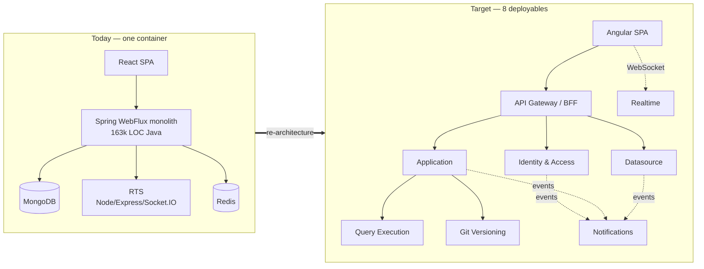

# Appsmith Re-Architecture — Monolith (Java) → Microservices (.NET 10)

## The one-paragraph version

Appsmith is a low-code platform: users drag widgets onto a canvas, connect them to datasources, write queries and JS, and publish an internal tool. Today that is a **Spring WebFlux reactive Java monolith (~163k LOC)** over **MongoDB**, plus a separate Node.js "RTS" process and a **React SPA (~708k LOC)**, all packed into **one Docker container** by supervisord. We are replacing it with **8 deployables on .NET 10** — an API Gateway/BFF plus 7 domain services — each owning its own **PostgreSQL** database, communicating synchronously over REST where a user is waiting and asynchronously over RabbitMQ everywhere else, with **Redis** for locks, sessions, and the SignalR backplane, fronted by a new **Angular** client.

