# Executive Summary

[← Index](../README.md)

---

## 1. What Appsmith is

A **low-code internal-tools platform**. A user:

1. creates a **Workspace** (the tenancy/permission boundary),
2. creates an **Application** inside it,
3. drags **Widgets** onto a **Page** canvas — the canvas is stored as a single JSON tree called the **DSL**,
4. creates a **Datasource** (a Postgres DB, a REST API, S3, Google Sheets, an LLM — 25 connector types),
5. writes **Actions** (queries) against that datasource, and **JS Objects** for logic,
6. binds widget properties to action results with `{{ }}` mustache expressions,
7. hits **Publish** — which snapshots the draft into a "published" copy — and shares a **View mode** URL,
8. optionally connects the app to **Git**, so the whole application serialises to files and versions like code.

Everything else in the system (themes, custom JS libraries, forking, templates, import/export, snapshots, invites) is in service of those eight steps.

## 2. What exists today

| | |
|---|---|
| **Backend** | Spring Boot 3 **WebFlux** (fully reactive, `Mono`/`Flux`), Java 17+, Maven multi-module. ~163,000 LOC across 2,143 files |
| **Database** | **MongoDB** (Spring Data Reactive), ~24 collections, Mongock migrations (83 changelog classes) |
| **Cache/coordination** | **Redis** — session store, distributed locks, plugin-install pub/sub, generic cache |
| **Connectors** | 25 Maven modules implementing a `PluginExecutor` SPI, loaded **in-process** via PF4J classloaders |
| **Second backend** | **RTS** — a Node/Express/Socket.IO service (`app/client/packages/rts`) for JS AST parsing, DSL migration, some git ops, and presence sockets |
| **Frontend** | **React 18 + Redux + Redux-Saga**, ~708,000 LOC, 82 widget types, a Web Worker evaluation engine |
| **Deployment** | **One Docker container.** supervisord runs Caddy + Java + RTS + embedded Mongo + embedded Postgres (the latter only as the *mock* database for sample data) |
| **Auth** | Spring Security cookie session (Redis-backed) + CSRF token; login is an HTML form POST, not a JSON API call |
| **Message broker** | **None.** Zero Kafka/RabbitMQ/AMQP/SQS anywhere in the codebase |

Full detail: [System Overview](../01-current-system/01-system-overview.md), [Runtime Topology](../01-current-system/02-runtime-topology.md).

## 3. What we are building

**8 deployables on .NET 10** — one edge layer plus seven domain services — each with its **own PostgreSQL database**, no cross-database reads, ever.

| # | Service | One-line purpose |
|---|---|---|
| 0 | **API Gateway / BFF** | Single public entry point, auth enforcement, page-load composition |
| 1 | **Identity & Access** | AuthN, users, workspaces, memberships, RBAC source of truth |
| 2 | **Application** | Apps, pages, DSL/layouts, actions, JS objects, themes, publish, fork/import/export |
| 3 | **Datasource** | Connection configs, per-environment storage, plugin catalog |
| 4 | **Query Execution** | Runs all 25 connector types in isolated workers; connection pooling |
| 5 | **Git Versioning** | Commit/push/pull/merge, SSH deploy keys, artifact ⇄ file serialisation |
| 6 | **Realtime Collaboration** | SignalR presence/cursors/version-push, Redis backplane |
| 7 | **Notifications & Telemetry** | Email with retry+DLQ, product alerts, usage events |

Plus a new **Angular** client replacing the React SPA.

Full detail with bounded contexts and per-service databases: [Service Inventory](../02-target-architecture/01-service-inventory.md).

## 4. The four decisions that shape everything else

These are the load-bearing choices. If you disagree with one, raise it before Phase A — reversing them later is expensive.

### D1 — Application, Page, Action, Theme stay in **one** service
The obvious decomposition (a Page service, an Action service, a Theme service) would manufacture cross-service joins that **do not exist today**. Pages, actions and themes are edited together, published together, forked together, and deleted together. Keeping them in one service means **Publish stays a single local database transaction** — which is actually *better* than today, where publish is five unguarded writes that can leave an app half-published.

### D2 — Datasource **config** and query **execution** are separate services
Editing a connection string is low-risk CRUD. Executing a user-authored query against a live third-party system — or running arbitrary user JS — is high-risk, unbounded-latency work. Today they share a JVM with no sandbox: one runaway plugin degrades the whole platform. Splitting them, and running connectors in resource-capped worker pools, is the single biggest **reliability improvement** in this programme.

### D3 — Authorization is **replicated**, not called
Today every document carries its own inline ACL (`policyMap`), so a permission check costs **zero** extra lookups. A central "permission service" called on every read would turn every 0-hop check into a network round trip on the hottest path in the system. Instead: Identity & Access owns the truth, publishes change events, and every service keeps a **local authorization projection**. Revocations that must be instant (removing a user from a workspace) additionally kill that user's sessions at the gateway. See [Security & AuthZ](../02-target-architecture/06-security-and-authz.md).

### D4 — Keep the **cookie session** at the edge
Today's client relies on a Redis-backed session cookie plus CSRF token with `withCredentials: true` everywhere. An Angular SPA behind a single gateway origin does not need bearer tokens; keeping cookie semantics avoids putting a token-refresh state machine and a token-storage XSS surface into a client rewrite that is already large. Internal service-to-service calls use short-lived signed tokens minted by the gateway.

## 5. What this is *not*

- **Not a Java-to-C# transliteration.** The React client and the Java server are references for *behaviour and contract*, not for structure. Copying WebFlux's `Mono` chains into C# would produce bad C#.
- **Not a strangler-fig retrofit of the existing monolith.** There is no production installed base to preserve compatibility with (deployment today is "here's a docker-compose"). We build the new system alongside, migrate data once, and cut over. See [Decomposition Strategy](../03-execution/01-decomposition-strategy.md) for why.
- **Not carrying over the CE/EE split.** The Java code doubles nearly every class (`FooServiceImpl extends FooServiceCEImpl`) purely as a build-time seam for the commercial edition. The new system has no such licensing split and must not reproduce it.
- **Not designing multi-tenancy above Workspace.** `Tenant` and `Organization` are two near-duplicate collections mid-migration in the Java code. The target collapses them into a single `Instance` row; **Workspace remains the isolation boundary**.

## 6. The honest risks

| Risk | Why it's real | Mitigation |
|---|---|---|
| **The client is the biggest chunk of work, not the backend** | 708k LOC of React vs 163k LOC of Java. 82 widgets, a custom layout engine, and a Web Worker expression evaluator that is genuinely novel | Size and staff the Angular work as its own programme; see [Angular Frontend](../02-target-architecture/08-angular-frontend.md). Do **not** treat it as "the UI bit at the end" |
| **The DSL and evaluation engine are product, not plumbing** | The `{{ }}` binding evaluator, dependency graph and 82 widget property schemas *are* the product's differentiation | Treat the DSL JSON as a **frozen contract** across the rewrite. Port widget schemas mechanically; rewrite only the rendering shell |
| **Eventual-consistency window on permission revocation** | A revoked user may keep access for the projection-lag duration | Gateway-level session kill for hard revocations; bounded lag SLO; audit on the event stream |
| **Connector fidelity** | 25 connectors with years of accumulated edge-case behaviour (auth modes, pagination, type coercion) | Golden-file contract tests captured from the Java plugins *before* rewriting each connector. Port connectors in traffic-frequency order |
| **New infrastructure the team hasn't run** | RabbitMQ and a message-outbox are net-new — the current system has no broker at all | Phase A ships the shared `BuildingBlocks.Messaging` package and a working walking skeleton before any domain service depends on it |
| **Losing behaviour nobody wrote down** | Migration logic in 83 Mongock changelogs and DSL version migrations encodes years of fixes | Behaviour capture via characterisation tests against the running Java system, not by reading code alone |

## 7. Shape of the plan

```mermaid
gantt
    title Build sequencing (dependency order, not calendar commitment)
    dateFormat X
    axisFormat %s
    section Foundation
    Phase A — Identity, BuildingBlocks, Gateway skeleton   :a, 0, 3
    section Core domain
    Phase B — Application Service                          :b1, 3, 5
    Phase B — Datasource Service                           :b2, 3, 4
    section Execution & versioning
    Phase C — Query Execution + connector workers          :c, 8, 5
    Phase D — Git Versioning                               :d, 8, 3
    section Edges
    Phase E — Realtime Collaboration                       :e, 11, 2
    Phase F — Notifications & Telemetry                    :f, 13, 2
    Phase G — Gateway BFF hardening + cutover              :g, 13, 3
    section Client
    Angular client (parallel, full duration)               :cl, 3, 13
```

Detail, entry/exit criteria and team shapes: [Roadmap & Sequencing](../03-execution/02-roadmap-and-sequencing.md).

---

[← Index](../README.md) · [Next: Java → .NET Primer →](02-java-to-dotnet-primer.md)
