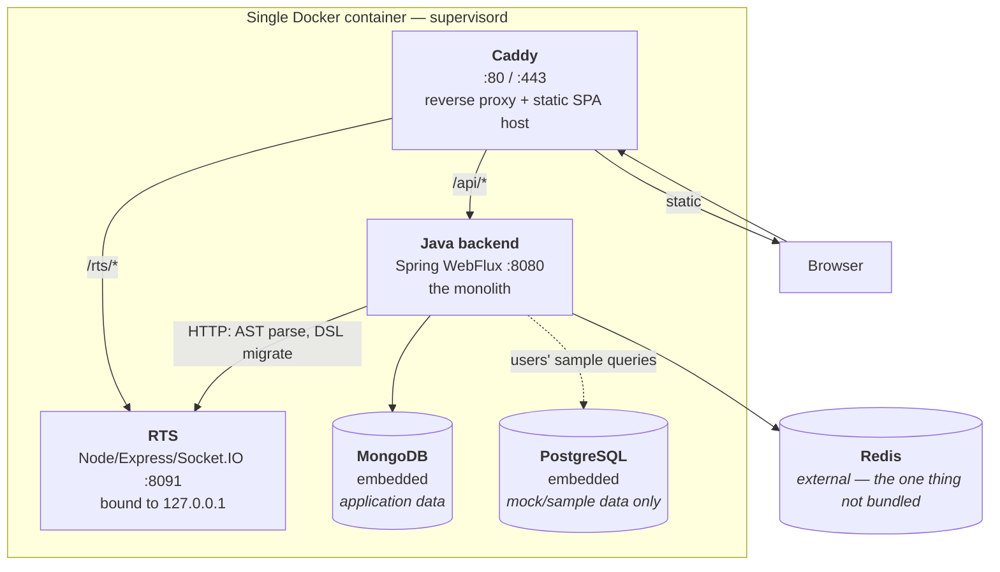
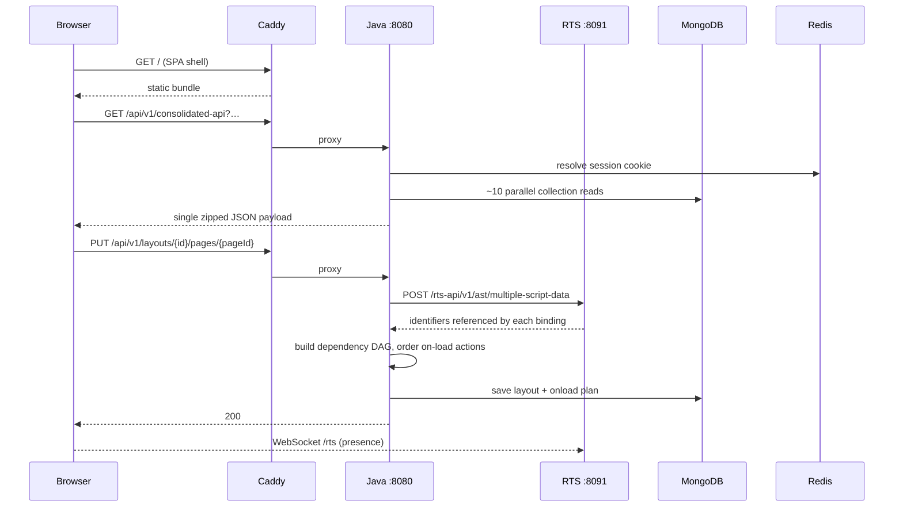

# Current System — Runtime Topology

[← Index](../README.md) · [← System Overview](01-system-overview.md)

---

## 1. Everything runs in one container

The root `Dockerfile` builds a single image that bundles the React SPA build output, the RTS `dist/`, the Spring Boot jar, an embedded MongoDB binary, and an embedded PostgreSQL — all started as sibling processes by **supervisord**.

Supervisord program definitions live in `deploy/docker/fs/opt/appsmith/templates/supervisord/`:
`backend.conf`, `editor.conf`, `rts.conf`, `mongodb.conf`, `postgres.conf`, `redis.conf`.

**Implication for the target:** there is no live production topology whose compatibility must be preserved. The deployment contract today is "here is a docker-compose that works." That gives the re-architecture unusual freedom — see [Decomposition Strategy](../03-execution/01-decomposition-strategy.md).

## 2. The four processes

### 2.1 Caddy (edge)
Terminates TLS, serves the SPA build, reverse-proxies `/api/*` to Java and `/rts/*` to RTS. Reconfigured at runtime by `caddy-reconfigure.mjs`. In the target this role is taken by the **API Gateway (YARP)** plus a static host/CDN for the Angular build.

### 2.2 Java backend — the monolith
Spring Boot 3, WebFlux on Reactor Netty. Fully reactive, no servlet container. Holds: all 26 controllers, all domain logic, all 25 connectors loaded in-process via PF4J, JGit operations, the scheduled jobs, and the email sender.

### 2.3 RTS (`app/client/packages/rts`)
Self-described in its own `package.json` as *"Realtime component microservice for Appsmith."* **It is already a separate deployable.** Node 24 + Express + Socket.IO. Binds to `127.0.0.1:8091` by default.

Routes: `ast_routes`, `dsl_routes`, `git_routes`, `health_check_routes`. Plus Socket.IO namespaces for app-level and page-level presence.

Its most important job: the **Java server cannot parse JavaScript**, so to find which entities a `{{ ... }}` binding depends on, `AstServiceCEImpl` makes an HTTP call to RTS at `/rts-api/v1/ast/multiple-script-data`. This is on the critical path for every layout save.

RTS uses `simple-git` and has a `mongodb` dependency — but the Mongo usage is confined to its offline `ctl/` backup/restore CLI, not the running request path. Its runtime is pure protocol translation with **no Redis backplane**, meaning it cannot currently be scaled horizontally with correct presence semantics.

### 2.4 Data stores

| Store | Role today | Notes |
|---|---|---|
| **MongoDB** | *All* application data. ~24 collections | Embedded binary in the container by default; `APPSMITH_DB_URL` can point elsewhere. Requires a replica set (`rs.initiate()` in the entrypoint) for change streams/transactions |
| **PostgreSQL** | **Only the mock/sample database** users query in tutorials | Embedded by default; `APPSMITH_ENABLE_EMBEDDED_DB=0` points at a cloud mock instance. It is *not* the application store today. `entrypoint.sh` does contain a `postgresql:` branch for `APPSMITH_DB_URL` — a forward-looking hook, not the shipped path in this checkout |
| **Redis** | Not bundled — supplied via `APPSMITH_REDIS_URL` | Four distinct uses, below |

### 2.5 Redis is doing four different jobs

| Use | Where |
|---|---|
| **Session store** | Spring Session Data Redis — the login cookie resolves to a Redis-held session (`configurations/RedisConfig.java`) |
| **Distributed locks** | `@DistributedLock` from the `reactive-caching` module, used by scheduled jobs; plus a **separate Redis URL just for git locking** (`appsmith.redis.git.url`) keyed on `baseArtifactId` |
| **Pub/sub** | Broadcasting plugin-install events across pods (`configurations/RedisListenerConfig.java`) |
| **Generic cache** | `@Cache`/`@CacheEvict` on `CacheableRepositoryHelper` — notably caching a user's permission-group set, the organization record, and basePageId→baseApplicationId lookups |

That a *dedicated Redis URL was carved out just for git locking* tells you git concurrency was painful enough to isolate. Carry that lesson forward.

## 3. Request paths

## 4. Scheduled work

All jobs are in-process Spring `@Scheduled` timers. **No Quartz, no external scheduler, no job queue.**

| Job | File | Cadence | Cross-pod safety |
|---|---|---|---|
| `pingSchedule` | `solutions/ce/ScheduledTaskCEImpl.java` | 6h | Redis `@DistributedLock` |
| `pingStats` (DAU/WAU/MAU → Segment) | `solutions/ce/ScheduledTaskCEImpl.java` | 24h | Redis lock |
| `fetchFeatures` (remote feature flags) | `solutions/ce/ScheduledTaskCEImpl.java` | 1h | Redis lock |
| `updateRemotePlugins` | `solutions/ce/PluginScheduledTaskCEImpl.java` | 2h | Redis lock |
| Release-notes refresh | `solutions/ce/ReleaseNotesServiceCEImpl.java` | 2h | **none** — in-memory cache per pod |
| `cleanUpOldLogs` | `cron/CleanUpOldLogs.java` | weekly | **none** — deletes local files, assumes local disk |

`cleanUpOldLogs` will not translate to a stateless container. Log retention belongs to the platform (log shipper / retention policy), not to application code.

## 5. Scaling characteristics today

| Component | Scales? | Blocker |
|---|---|---|
| Java monolith | Horizontally, mostly | Shares one Mongo; in-process connection pools mean a datasource's pool is per-pod, not global; PF4J plugins per-pod |
| RTS | **No** | Socket.IO presence is per-instance in memory, no backplane |
| Scheduled jobs | Yes, via Redis lock | Except the two jobs with no lock |
| Connection pools | **No** | `DatasourceContextServiceCEImpl` holds a per-pod in-memory map. N pods = N pools per datasource |
| Git operations | Serialised by Redis lock per artifact | Requires shared disk or per-pod re-clone |
| Assets | Bounded by Mongo document size | `byte[]` in Mongo, capped at 16MB/doc |

## 6. What the target changes

| Today | Target | Why |
|---|---|---|
| 1 container, 4 processes | 8 services + Angular static host | Independent deploy, scale, and failure isolation |
| MongoDB, shared by everything | PostgreSQL, one database per service | Explicit ownership; relational integrity where the model is relational |
| Connectors in-process, no sandbox | Per-connector-family worker processes with CPU/mem/time caps | The largest reliability gain available |
| Presence with no backplane | SignalR + Redis backplane | Horizontal scale for realtime |
| Email fire-and-forget, errors swallowed | Broker + retry + DLQ | Delivery is currently unobservable |
| No broker | RabbitMQ + MassTransit + transactional outbox | Required for the authorization projections and async side effects |
| In-process `@Scheduled` | Hosted `BackgroundService` per owning service, plus platform cron | Same purpose, correct home |
| Assets as `byte[]` in the DB | Object storage (S3-compatible) with URLs in Postgres | Databases are not blob stores |

---

[← System Overview](01-system-overview.md) · [Next: Domain Model & Database →](03-domain-model-and-db.md)
