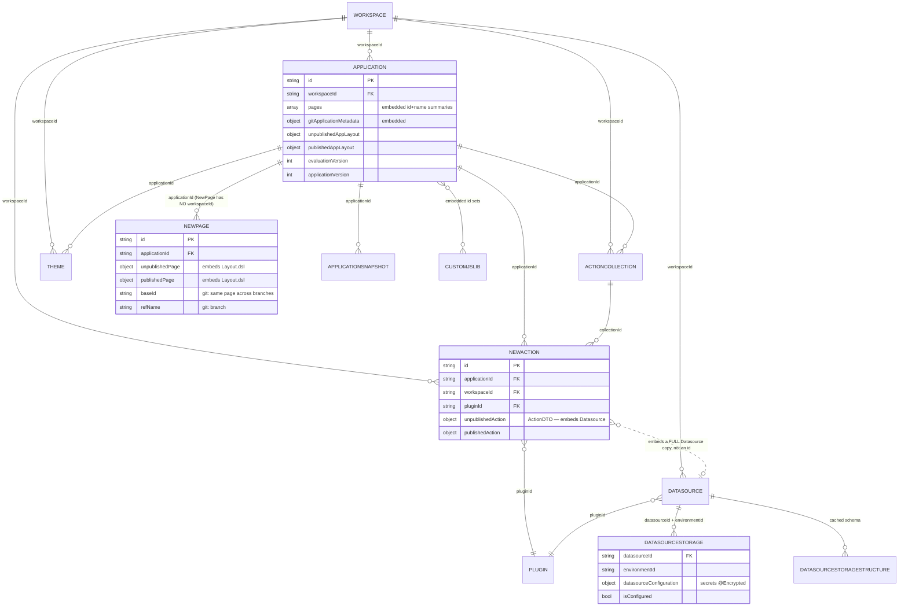
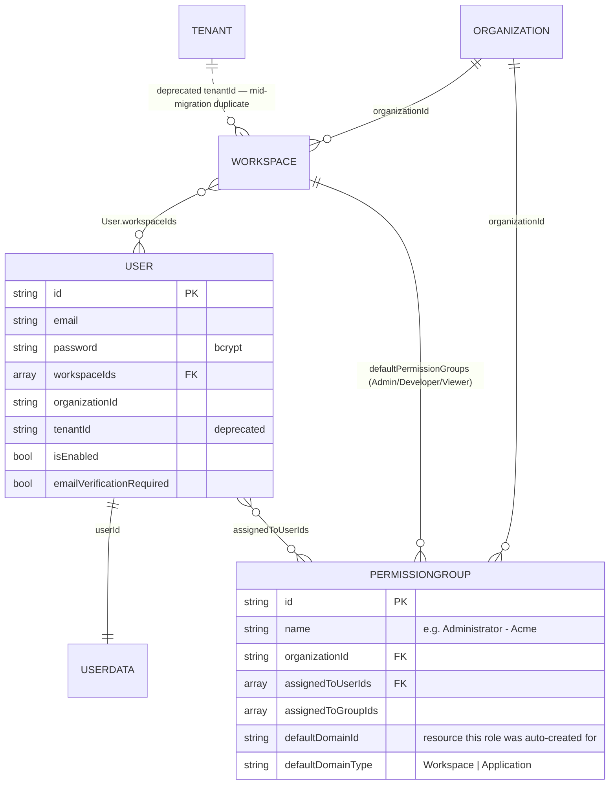
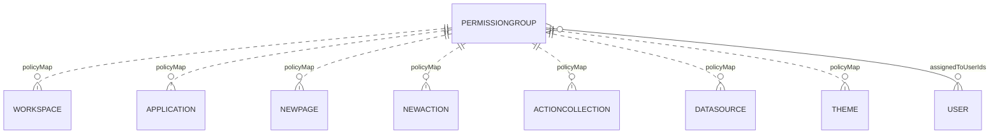
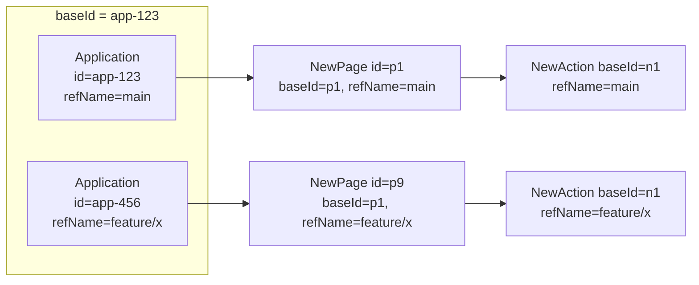

# Current System — Domain Model & Database

[← Index](../README.md) · [← Runtime Topology](02-runtime-topology.md)

---

## 1. The store

**MongoDB**, accessed through Spring Data MongoDB **Reactive**, migrated with **Mongock** (83 changelog classes under `migrations/db/ce/`).

Two base classes are on almost everything:

```java
// appsmith-interfaces/src/main/java/com/appsmith/external/models/BaseDomain.java
public abstract class BaseDomain {
    @Id String id;                          // Mongo ObjectId as a string
    Instant createdAt, updatedAt;
    String createdBy, modifiedBy;
    Instant deletedAt;                      // soft delete — null means alive
    Map<String, Policy> policyMap;          // ← the inline ACL, on EVERY document
    Set<String> userPermissions;            // @Transient — computed per request, never stored
}
```

```java
// RefAwareDomain extends GitSyncedDomain extends BaseDomain
public abstract class RefAwareDomain extends GitSyncedDomain {
    String baseId;        // the "same" entity across branches
    String refName;       // branch name
    RefType refType;      // branch | tag
    String branchName;    // deprecated alias of refName
}
```

Three consequences worth holding onto:

1. **Soft delete everywhere.** `deletedAt != null` means gone. Every query must filter it. In Postgres this becomes a `deleted_at` column plus a partial index / global query filter.
2. **The ACL is inline.** Every document carries its own permission map — see [Permissions & ACL](04-permissions-and-acl.md). This is the single hardest thing to split.
3. **Git branching is modelled by row duplication.** A branched entity is a *separate document* with the same `baseId` and a different `refName`. An application with 5 branches has 5× the pages, actions, and collections. See [Git Versioning](07-git-versioning.md).

## 2. Collections

| Collection | Purpose | Key references |
|---|---|---|
| `user` | Identity + credentials | `workspaceIds: Set<String>`, `organizationId`, deprecated `tenantId` |
| `userData` | Profile extras, preferences, recently-used, favourites, git profile | `userId` |
| `organization` / `tenant` | Instance-level config (two near-duplicate collections, mid-migration) | — |
| `workspace` | Tenancy + permission boundary | `organizationId`, `defaultPermissionGroups` |
| `permissionGroup` | A role. Holds its member list | `organizationId`, `assignedToUserIds`, `assignedToGroupIds`, `defaultDomainId`/`defaultDomainType` |
| `application` | The app. Embeds page summaries and git metadata | `workspaceId`; embeds `pages`/`publishedPages` (id+name only), `gitApplicationMetadata`, `unpublished/publishedCustomJSLibs` |
| `newPage` | A page. **Embeds the Layout/DSL inline** | `applicationId` — **no `workspaceId`** |
| `newAction` | A query/API call. Embeds a **full copy of the Datasource** | `applicationId`, `workspaceId`, `pluginId`, `collectionId` |
| `actionCollection` | A JS Object — a bundle of JS functions | `applicationId`, `workspaceId`, `pageId` |
| `datasource` | Connection identity + which plugin | `workspaceId`, `pluginId` |
| `datasourceStorage` | The actual config, **per environment** | `datasourceId` + `environmentId`; `workspaceId`/`pluginId`/`name` are `@Transient`, hydrated at read time |
| `datasourceStorageStructure` | Cached schema introspection | `datasourceId`, `environmentId` |
| `plugin` | Connector catalog. **Global, no workspace** | `packageName` |
| `theme` | Styling. System themes + per-app customisations | `applicationId`, `workspaceId` |
| `customJSLib` | An imported JS library | referenced from `application` |
| `applicationSnapshot` | Point-in-time app backup (autosave before risky ops) | `applicationId` |
| `asset` | Images/logos as raw `byte[]` **in the database** | — |
| `config` | Instance key/value settings | `name` |
| `sequence` | Name-suffix counters ("Untitled query 3") | — |
| `usagePulse` | Anonymous activity beacons | — |
| `passwordResetToken`, `emailVerificationToken` | Short-lived auth tokens | `email` |
| `gitDeployKeys` | SSH keypairs for git remotes | `email` |

**Not collections, despite looking like entities:**
- `Layout` — embedded inside `PageDTO` inside `NewPage`.
- `GitArtifactMetadata` — embedded on `Application`.
- `Policy` — embedded in `policyMap` on every document.
- `ApplicationPage` — a `{pageId, name, isDefault}` summary embedded on `Application`.

Do not carve services around embedded documents.

## 3. Entity relationship diagrams

### 3.1 The editing domain



### 3.2 Identity, workspace, tenancy



### 3.3 The permission fan-out (the hard part)



Every dashed line is *not* a foreign key — it is a set of permission-group IDs **copied inline** into each document's `policyMap`. See [Permissions & ACL](04-permissions-and-acl.md).

## 4. The draft/published duplication

This is the model's most distinctive feature and it must survive the port.

| Entity | Draft field | Published field |
|---|---|---|
| `Application` | `pages`, `unpublishedAppLayout`, `unpublishedApplicationDetail`, `unpublishedCustomJSLibs` | `publishedPages`, `publishedAppLayout`, `publishedApplicationDetail`, `publishedCustomJSLibs` |
| `NewPage` | `unpublishedPage` (contains `Layout.dsl`) | `publishedPage` (contains `Layout.publishedDsl`) |
| `NewAction` | `unpublishedAction` | `publishedAction` |
| `ActionCollection` | `unpublishedCollection` | `publishedCollection` |
| `Theme` | separate rows, linked from `ApplicationDetail` | |

**Publish = copy draft → published, per entity.** Nothing is versioned; there is exactly one published state at a time (`ApplicationSnapshot` is a separate, coarse backup mechanism, not a version history).

In the target Postgres model this becomes two rows in a `page_versions`-style table, or two JSONB columns on one row — [Database per Service §3](../02-target-architecture/03-database-per-service.md) makes the call and explains why.

## 5. Git branching multiplies rows

When an application is connected to git and a branch is created, Appsmith **duplicates the entire entity tree** for that branch:



`baseId` is the stable cross-branch identity; `id` is per-branch. The client always addresses entities by *branched* id (note every endpoint parameter named `branchedApplicationId`, `branchedPageId`), while git metadata and some caches key on `baseId`.

This replaced an older `DefaultResources` embedded-object approach — useful precedent: **this team has already executed a field-level entity migration on live data without downtime.**

## 6. There are no joins — and that is good news

An exhaustive search across the server module for `$lookup`, `LookupOperation`, and `Aggregation.newAggregation` found **two** uses, both operating on a single collection (copying `unpublishedX` → `publishedX` at publish time).

**There are zero genuine cross-collection joins in this system.** What happens instead is parallel fetch-by-id + stitch in application code:

- `ConsolidatedAPIServiceCEImpl.getAllFetchableMonos` — ~10 collections, `Mono.zip`ped, per page load.
- `ApplicationPageServiceCEImpl.deleteApplicationResources` — chains archival across ActionCollection → NewAction → NewPage → Theme → UserData favourites → Application with `.then(...)`.

**Why this matters enormously:** database-per-service is normally a wrenching change because you must find and eliminate joins. Here there are none to eliminate. The composition pattern the target needs *already exists and already works* — it just runs in one process instead of across a network. The real cost moves to **resilience**: those `.then()` chains become network calls that can partially fail, which is what sagas are for.

## 7. Denormalisation already in the model

The target will need replicated data. Precedents already exist here — extend them rather than inventing new ones.

| Pattern | Where | Character |
|---|---|---|
| **Hydrate on read** | `DatasourceStorage` marks `name`/`pluginId`/`workspaceId` `@Transient` and fills them from `Datasource` when read | Not stored — computed. Cheapest form |
| **Stored full copy** | `ActionDTO.datasource` embeds the *entire* `Datasource` object inside every action | A real replica that already needs explicit sync-on-update today. Closest analogue to a cross-service replica |
| **Summary embed** | `Application.pages` = `[{pageId, name, isDefault}]` | Avoids a page-list query to render the app shell |
| **Cross-branch key** | `RefAwareDomain.baseId` stored on every git-synced row | Avoids a branch-mapping join |
| **Cached role set** | `CacheableRepositoryHelper.getPermissionGroupsOfUser` in Redis, keyed `email + organizationId` | Already an authorization projection, just cache-shaped |

## 8. Known inconsistencies to fix, not carry forward

| Issue | Detail | Target treatment |
|---|---|---|
| `NewPage` has no `workspaceId` | Every workspace-scoped check on a page needs a hop through `Application` | Page lives inside Application Service; workspace scope enforced at the application row |
| `Tenant` and `Organization` coexist | Two near-duplicate collections mid-migration; `tenantId` deprecated but still populated | Collapse to a single `Instance` row |
| `policies` and `policyMap` coexist | `Set<Policy>` deprecated in favour of `Map<String,Policy>`; both still on `BaseDomain` | One representation only |
| `deleted` boolean and `deletedAt` coexist | `deleted` is `@Deprecated(forRemoval)`, kept only so git diffs don't churn | Single `deleted_at timestamptz` |
| Assets as `byte[]` in the DB | 16MB document cap, bloats backups | Object storage + URL |
| Environments are half-built in CE | `DatasourceStorage` is keyed by `environmentId`, but CE only ever has one | Keep the key; the model is right, only the UI is gated |

---

[← Runtime Topology](02-runtime-topology.md) · [Next: Permissions & ACL →](04-permissions-and-acl.md)
