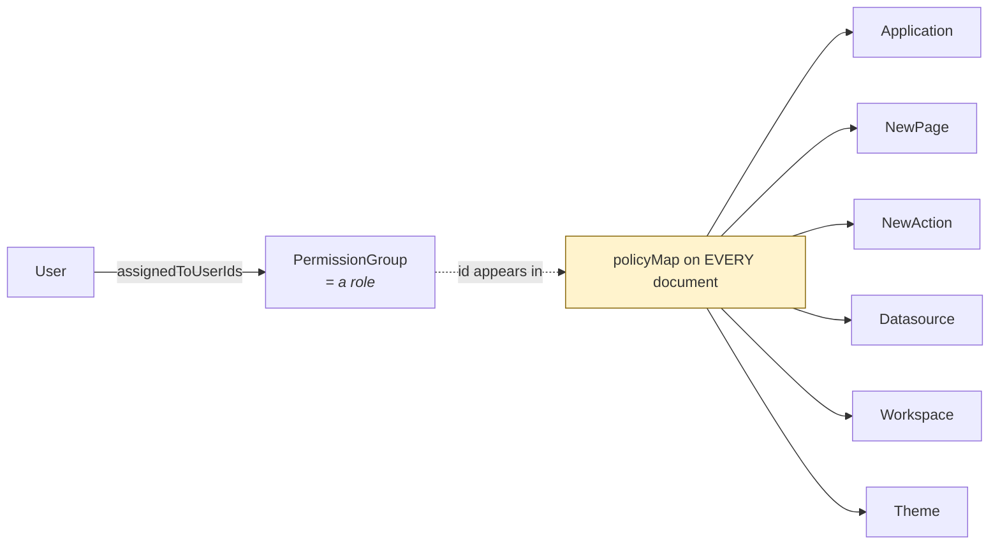
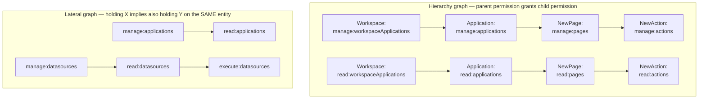

# Current System — Permissions & Access Control

[← Index](../README.md) · [← Domain Model](03-domain-model-and-db.md)

---

> **Read this before designing any service boundary.** The permission model is the strongest coupling in the system, and the decision about how to split it (D3 in the [Executive Summary](../00-orientation/01-executive-summary.md)) determines the latency profile of the entire target architecture.

---

## 1. The model in one picture



Two mechanisms, both mandatory:

**A. Inline ACL on every document.** `BaseDomain.policyMap : Map<String, Policy>` where

```java
class Policy {
    String permission;              // e.g. "read:applications"
    Set<String> permissionGroups;   // permission-group IDs that hold it
}
```

So an `Application` document literally contains `{"read:applications": {permissionGroups: ["pg-1","pg-7"]}, "manage:applications": {...}}`.

**B. Centralised reverse index.** `PermissionGroup.assignedToUserIds` — who is in the role.

## 2. How a permission check actually happens

```mermaid
sequenceDiagram
    participant Req as Request
    participant Cache as Redis cache
    participant PG as permissionGroup collection
    participant Repo as BaseAppsmithRepository
    participant Mongo as MongoDB

    Req->>Cache: getPermissionGroupsOfUser(email+orgId)
    alt cache hit
        Cache-->>Req: Set&lt;permissionGroupId&gt;
    else miss
        Cache->>PG: find groups where assignedToUserIds contains userId
        PG-->>Cache: ids
        Cache-->>Req: Set&lt;permissionGroupId&gt; (cached)
    end
    Req->>Repo: findById(appId, READ_APPLICATIONS)
    Repo->>Mongo: { _id: appId,<br/>  "policyMap.read:applications.permissionGroups": { $in: [...userGroups] },<br/>  deletedAt: null }
    Mongo-->>Repo: document or empty
    Repo-->>Req: Application (or 404 — never 403)
```

Three properties that matter:

1. **The authorization filter is part of the data query.** `BaseAppsmithRepositoryCEImpl` appends the `policyMap.<permission>.permissionGroups $in userGroups` criterion to every read. There is no separate authorization call — **the check costs zero extra round trips.**
2. **Unauthorised looks identical to not-found.** The query simply returns nothing. This is deliberate (no resource-existence leak) and the target must preserve it.
3. **The user's role set is cached in Redis**, keyed `email + organizationId` (`CacheableRepositoryHelperCEImpl`), and evicted on membership change. This is already an authorization projection in all but name.

## 3. The permission vocabulary

`acl/AclPermission.java` is a Java enum where each value carries a string and a target type:

```java
READ_APPLICATIONS("read:applications", Application.class),
MANAGE_APPLICATIONS("manage:applications", Application.class),
PUBLISH_APPLICATIONS("publish:applications", Application.class),
EXECUTE_ACTIONS("execute:actions", NewAction.class),
WORKSPACE_CREATE_APPLICATION("create:applications", Workspace.class),
...
```

Grouped by target entity:

| Target | Permissions |
|---|---|
| `Config` (instance) | `manageInstanceConfiguration`, `readInstanceConfiguration` |
| `Workspace` | `manage`, `read`, `delete`, `create:applications`, `create:datasources`, plus workspace-level *composite* grants over applications and datasources (`manage:workspaceApplications`, `read:workspaceDatasources`, `publish:workspaceApplications`, …) |
| `Application` | `manage`, `read`, `publish`, `export`, `delete`, `makePublic`, `create:pages`, `delete:applicationPages`, `connectToGit`, `manageProtectedBranches`, `manageDefaultBranches`, `manageAutoCommit` |
| `NewPage` | `manage`, `read`, `delete`, `create:pageActions` |
| `NewAction` | `manage`, `read`, `execute`, `delete` |
| `Datasource` | `manage`, `read`, `execute`, `delete`, `create:datasourceActions` |
| `Theme` | `read`, `manage` |
| `PermissionGroup` | `manage`, `assign`, `unassign`, `read:permissionGroupMembers` |
| `User` | `read:users`, `manage:users`, `resetPassword:users` |
| `Organization` | `manage:organizations` |

**Composite workspace permissions** (`WORKSPACE_MANAGE_APPLICATIONS` etc.) exist so that a workspace-level grant can cascade down without enumerating every child. That cascade is computed, not stored — which brings us to the policy graph.

## 4. The policy graph: how permissions cascade

`acl/ce/PolicyGeneratorCE.java` builds **two directed acyclic graphs** (using JGraphT) at startup:



- **Hierarchy graph** — a permission on a parent generates the corresponding permission on children. Grant `manage:workspaceApplications` on a Workspace and every Application, Page and Action beneath it gets `manage` written into its own `policyMap`.
- **Lateral graph** — within one entity, holding a stronger permission implies weaker ones. `manage:applications` implies `read:applications`, so both are written.
- Indirect lateral edges are transitively closed at startup (`addLateralEdgesForAllIndirectRelationships`).

**The graph is evaluated at write time, not read time.** When a permission changes, `PolicySolution` walks the graphs and **rewrites `policyMap` on every affected document** — potentially thousands of rows for a workspace-level change. Reads then stay a single indexed query.

This is a classic **write-amplified, read-optimised ACL**. Understanding that trade-off is the whole game for the target design.

## 5. Roles created automatically

`WorkspaceServiceCEImpl.generateDefaultPermissionGroups` creates three permission groups per workspace, named after the workspace (`"Administrator - Acme"`, `"Developer - Acme"`, `"App Viewer - Acme"`), backed by `acl/AppsmithRole.java`:

| Role | Can |
|---|---|
| **Administrator** | Everything in the workspace, including deleting it and managing members |
| **Developer** | Create/edit/publish applications and datasources; cannot manage the workspace or members |
| **App Viewer** | Read and execute published applications only |
| *Instance Administrator* | `manage:organizations` — instance-level configuration |

`PermissionGroup.defaultDomainId` / `defaultDomainType` records which resource a group was auto-created for, which is how "delete the workspace ⇒ delete its three roles" works.

## 6. Public (anonymous) applications

`Application.changeAccess` toggles public visibility by adding the **anonymous user's** permission group to the application's `policyMap` (and cascading down to pages/actions/datasources via the same graph). `CacheableRepositoryHelper.getPermissionGroupsOfAnonymousUser()` pre-fills that group's ID at startup.

The Spring Security chain then `permitAll()`s the relevant read/execute routes (`GET /api/v1/applications/**`, `GET /api/v1/pages/**`, `POST /api/v1/actions/execute`, `GET /api/v1/consolidated-api/view`, …) so an unauthenticated request can reach the repository, where the ordinary `policyMap` filter does the real work.

**This is elegant and must be preserved:** anonymous access is not a special code path, it's just another permission group.

## 7. Why this is the hardest thing to decompose

Today:

| Property | Value |
|---|---|
| Cost of an authorization check | **0 extra round trips** — it's a clause in the query you were already making |
| Cost of a permission change | High — rewrite `policyMap` on every descendant document |
| Consistency | **Strong** — the ACL and the data are the same document |

If Application, Datasource and Action become separate services and a separate "Permission Service" owns the ACL, you have exactly two options:

**Option A — synchronous check per read.** Every resource read becomes: call Permission Service, then query own DB. This converts the system's *most frequent operation* from 0 hops to 1+ network hop, and makes the Permission Service a hard availability dependency for literally everything.

**Option B — replicate the ACL into each owning service.** Identity & Access owns the truth and publishes change events; each service maintains a local authorization projection and keeps its zero-hop query filter exactly as it works today.

**The target chooses B.** Reasons:

1. It preserves the current performance characteristic rather than regressing the hottest path.
2. It is the *same shape* as what the code already does — `policyMap` is a replica, just an implicit one inside the same document. Making it an explicit, event-fed projection is a clarification, not an invention.
3. The Redis `permissionGroupsForUser` cache is already an eventually-consistent authorization projection in production today, with the same staleness characteristics. The window is not new.

**The cost of B** is an eventual-consistency window on revocation. Mitigation: hard revocations (removing a user from a workspace, disabling an account) *also* invalidate that user's sessions at the gateway immediately — a synchronous fast path layered on top of the async stream, not a replacement for it. Full design: [Security & AuthZ](../02-target-architecture/06-security-and-authz.md).

## 8. Things to fix, not carry forward

| Issue | Detail |
|---|---|
| `policies : Set<Policy>` and `policyMap : Map<String,Policy>` both exist | The Set form is `@Deprecated(forRemoval)` but still read/written for git-diff stability. Target has one representation |
| Permission strings are stringly-typed | `"read:applications"` as a raw string in documents and queries. Target uses a typed permission enum persisted as a small int or a constrained text domain |
| Write amplification is unbounded | A workspace-level grant change rewrites every descendant document with no batching or progress tracking. Target does this as an idempotent, resumable background projection update |
| No audit trail | Nothing records *who* changed a grant and *when*. The event stream in the target gives this for free |
| Composite workspace permissions duplicate the hierarchy graph | `WORKSPACE_MANAGE_APPLICATIONS` exists *and* the hierarchy graph exists; they encode overlapping intent. Target keeps only the graph |

---

[← Domain Model](03-domain-model-and-db.md) · [Next: Golden Paths →](05-golden-paths.md)
