# Current System — Golden Paths

[← Index](../README.md) · [← Permissions & ACL](04-permissions-and-acl.md)

---

Thirteen end-to-end flows, traced to source. These are the flows you must be able to reproduce; they are the acceptance criteria for the re-architecture. The target-side versions of the same flows are in [Target Golden Paths](../02-target-architecture/07-target-golden-paths.md).

| # | Flow | Primary source |
|---|---|---|
| [1](#1-signup) | Signup | `solutions/ce/UserSignupCEImpl.java` |
| [2](#2-login) | Login | `configurations/SecurityConfig.java`, `authentication/handlers/` |
| [3](#3-create-a-workspace) | Create a workspace | `services/ce/WorkspaceServiceCEImpl.java` |
| [4](#4-create-an-application) | Create an application | `services/ce/ApplicationPageServiceCEImpl.java` |
| [5](#5-open-the-editor-the-consolidated-api) | Open the editor | `services/ce/ConsolidatedAPIServiceCEImpl.java` |
| [6](#6-edit-the-canvas--save-layout) | Edit the canvas / save layout | `services/ce/UpdateLayoutServiceCEImpl.java`, `onload/`, `services/ce/AstServiceCEImpl.java` |
| [7](#7-create-a-datasource--test-connection) | Create a datasource + test | `datasources/base/DatasourceServiceCEImpl.java` |
| [8](#8-create-and-run-a-query) | Create and run a query | `solutions/ce/ActionExecutionSolutionCEImpl.java` |
| [9](#9-publish--deploy) | Publish / deploy | `services/ce/ApplicationPageServiceCEImpl.java` |
| [10](#10-view-a-published-app-including-anonymous) | View a published app | `ConsolidatedAPIController`, `SecurityConfig` |
| [11](#11-git-connect-commit-push) | Git connect / commit / push | `git/common/CommonGitServiceCEImpl.java`, `appsmith-git` |
| [12](#12-invite-a-user-to-a-workspace) | Invite a user | `solutions/ce/UserAndAccessManagementServiceCEImpl.java` |
| [13](#13-fork--import--export-an-application) | Fork / import / export | `fork/`, `imports/`, `exports/` |

---

## 1. Signup

`POST /api/v1/users` — **form-encoded**, not JSON.

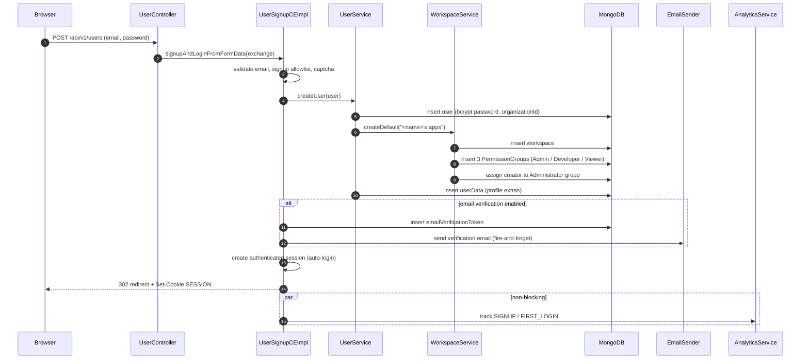

Notes:
- Signing up **creates a workspace and three roles as a side effect**. That cross-context write is why Identity & Access owns workspaces and roles in the target, not just users.
- The first user on a fresh instance goes through `signupAndLoginSuper`, which additionally grants instance-admin.
- Email is fire-and-forget; failure is logged and swallowed.

## 2. Login

`POST /api/v1/login` — **an HTML form POST**, handled entirely by the Spring Security filter chain. There is no login controller.

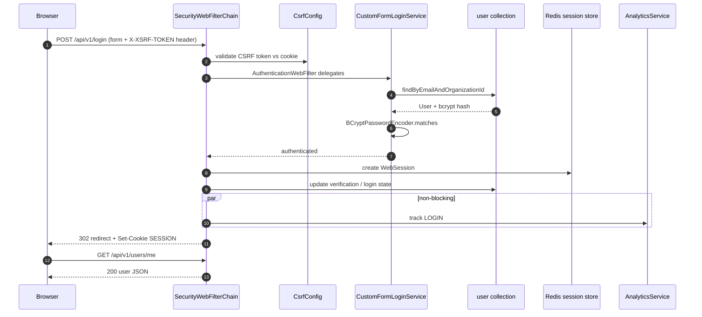

Notes:
- **Cookie session, not a bearer token.** Login returns a redirect, not a payload; the client then fetches `/users/me` separately.
- Sessions live in Redis (Spring Session), so any pod can serve any request.
- OAuth2/OIDC login goes through `oauth2Login` in the same chain, handlers under `authentication/handlers/`.
- Every client call sets `withCredentials: true` and carries the `XSRF-TOKEN`.

## 3. Create a workspace

`POST /api/v1/workspaces` → `WorkspaceServiceCEImpl.createDefault`.

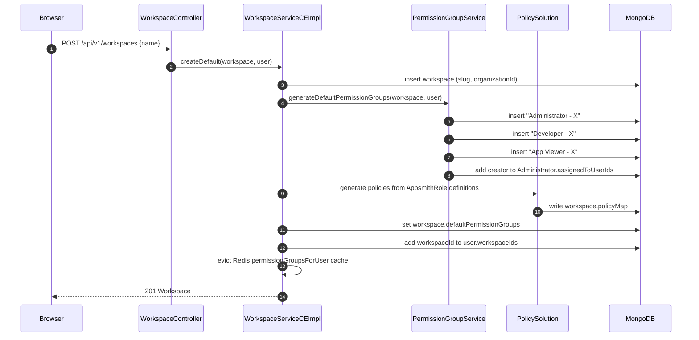

**This flow touches user, workspace, permissionGroup and the ACL** — all Identity & Access data in the target, so it stays a single local transaction.

## 4. Create an application

`POST /api/v1/applications` → `ApplicationPageServiceCEImpl.createApplication`.

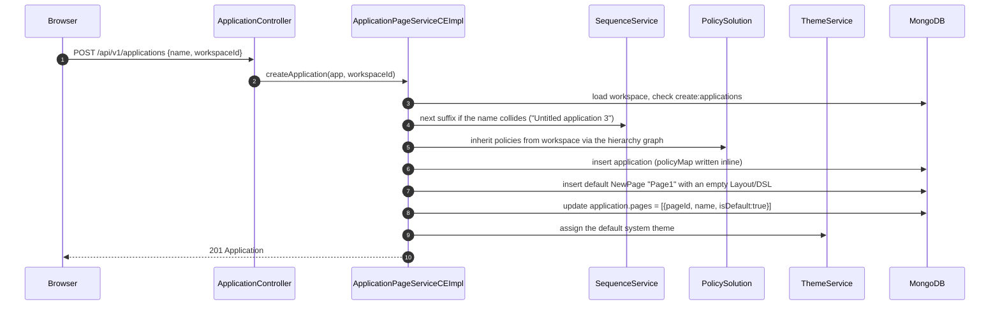

Notes:
- Policies are **materialised onto the new document at creation time** from the workspace's policies through the hierarchy graph — not looked up later.
- The default page carries an empty DSL; the canvas is populated client-side on first edit.

## 5. Open the editor (the consolidated API)

`GET /api/v1/consolidated-api/edit?...` — the single most important endpoint in the system and the direct precedent for the target BFF.

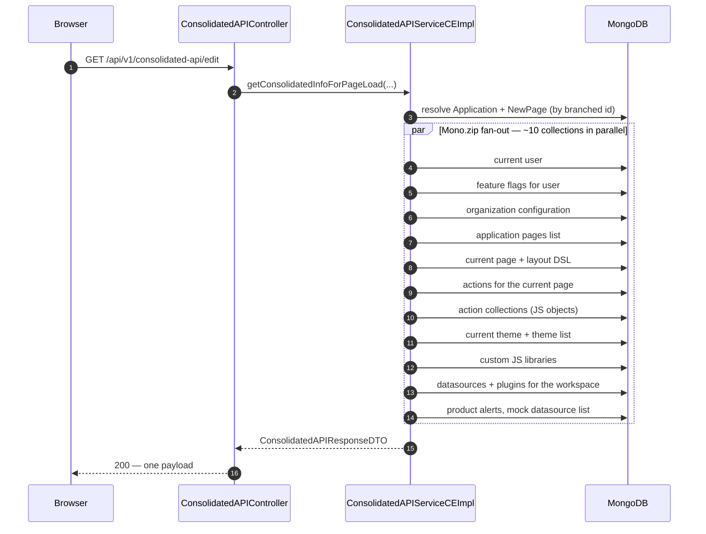

Notes:
- **Each slice carries its own status code** (`toResponseDTO` / `getErrorResponseMono`). A failure in one fetch degrades that section, not the whole response. The target BFF must keep this partial-failure semantic.
- A `/view` variant serves published apps and is on the `permitAll` list so anonymous users can load public applications.

## 6. Edit the canvas / save layout

`PUT /api/v1/layouts/{layoutId}/pages/{branchedPageId}` — the flow that crosses into RTS.

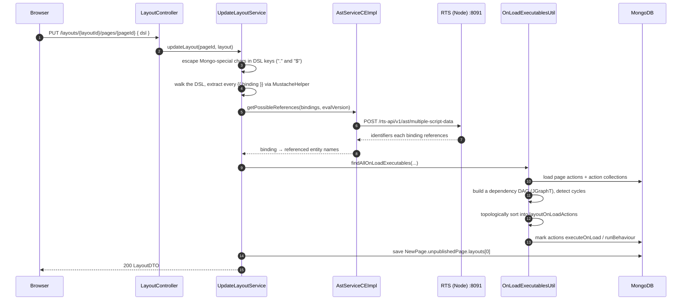

Notes:
- **The Java server cannot parse JavaScript.** Binding analysis is delegated over HTTP to RTS. If RTS is unreachable, `AstServiceCEImpl` falls back to `MustacheHelper.getPossibleParentsOld` — a degraded regex path (the "slim container" mode).
- `layoutOnLoadActions` is a `List<Set<DslExecutableDTO>>`: the outer list is execution *waves*, the inner set is actions that can run in parallel within a wave. This is the on-page-load query plan.
- DSL keys are escaped because `.` and `$` are illegal in Mongo field names, then unescaped on read. **This entire class of problem disappears in Postgres JSONB.**

## 7. Create a datasource + test connection

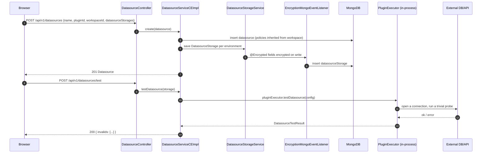

Notes:
- `Datasource` (identity) and `DatasourceStorage` (config, keyed by `environmentId`) are separate collections. CE only ever uses one environment, but the key is already modelled.
- Secrets are encrypted at rest by a Mongo event listener driven by the `@Encrypted` annotation on `DBAuth`, `BasicAuth`, `OAuth2`, `ApiKeyAuth`, `SSHPrivateKey`, `UploadedFile`.
- **Test runs the real plugin inside the API process.** A hung connection attempt occupies a server thread.

## 8. Create and run a query

The hottest and riskiest path. `POST /api/v1/actions/execute` — **multipart/form-data**, not JSON, because parameters can carry file blobs.

```mermaid
sequenceDiagram
    autonumber
    participant B as Browser
    participant AC as ActionController
    participant AES as ActionExecutionSolutionCEImpl
    participant NA as NewAction / Datasource / DatasourceStorage
    participant AV as AuthenticationValidator
    participant DCS as DatasourceContextService (pool)
    participant PE as PluginExecutor (same JVM)
    participant Ext as External system
    participant An as AnalyticsService

    B->>AC: POST /actions/execute (multipart: dto, params, blobs)
    AC->>AES: executeAction(partFlux, environmentId, headers)
    AES->>AES: parse parts → ExecuteActionDTO (actionId, params, viewMode)
    AES->>NA: findById(actionId, EXECUTE_ACTIONS or MANAGE_ACTIONS)
    Note over AES,NA: edit mode requires manage;<br/>view mode requires execute
    AES->>NA: resolve the true environmentId
    AES->>NA: getValidActionForExecution → ActionDTO (+ embedded datasource)
    AES->>NA: getCachedDatasourceStorage(datasourceId, environmentId)
    AES->>AV: refresh the OAuth2 token if expired
    AES->>AES: substitute {{ params }} into actionConfiguration
    AES->>DCS: getDatasourceContext(storage, plugin)
    alt connection cached
        DCS-->>AES: pooled connection
    else not cached
        DCS->>PE: datasourceCreate(config)
        PE-->>DCS: new connection, cached in an in-process map
    end
    AES->>PE: executeParameterized(connection, dsConfig, actionConfig)
    PE->>Ext: run the query / HTTP call
    Ext-->>PE: rows / response
    PE-->>AES: ActionExecutionResult (+ requestParams for the UI)
    alt StaleConnectionException
        AES->>DCS: evict the cached context, retry once
    end
    par non-blocking
        AES->>An: EXECUTE_ACTION event (duration, size, status)
    end
    AES-->>B: 200 ActionExecutionResult
```

Critical facts:
- **The result is never persisted.** No execution history, no audit table. Query-execution observability is a genuine gap.
- **Connections are pooled per `(datasourceId, environmentId)` in an in-process map** — N server pods means N pools per datasource.
- **All 25 plugins run in the API process.** No sandbox, no CPU/memory cap, no platform-enforced timeout.
- `StaleConnectionException` triggers exactly one pool-eviction-and-retry.

## 9. Publish / deploy

`POST /api/v1/applications/publish/{branchedApplicationId}`.

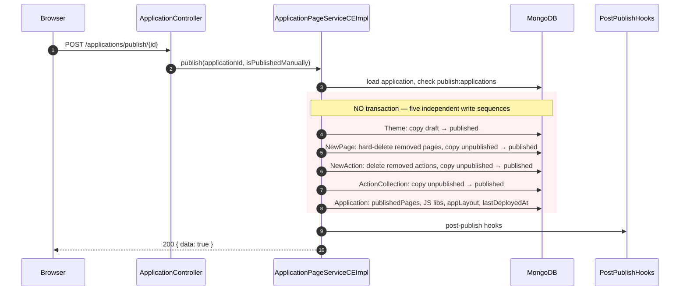

**A mid-sequence failure leaves the app partially published, today.** Exactly one unrelated `@Transactional` exists in the whole server module. Because Pages, Actions, Collections, Themes and Applications all land in one service — and one Postgres database — in the target, **publish becomes atomic for free**. That is an improvement, not just parity.

## 10. View a published app (including anonymous)

```mermaid
sequenceDiagram
    autonumber
    participant B as Browser (maybe not logged in)
    participant F as SecurityWebFilterChain
    participant CC as ConsolidatedAPIController
    participant Repo as Repositories
    participant M as MongoDB

    B->>F: GET /api/v1/consolidated-api/view?applicationId=…
    F->>F: route is on the permitAll list → allowed unauthenticated
    F->>F: bind the anonymous user principal
    CC->>Repo: fetch published application / pages / actions
    Repo->>M: query with policyMap."read:applications".permissionGroups $in [anonymousGroupId]
    alt app was made public
        M-->>Repo: documents
        Repo-->>B: 200 published payload
    else app is private
        M-->>Repo: empty
        Repo-->>B: 404 (never 403 — no existence leak)
    end
    B->>F: POST /api/v1/actions/execute (viewMode=true)
    F->>F: also permitAll; execute:actions enforced via policyMap
```

Making an app public (`PUT /applications/{id}/changeAccess`) simply adds the anonymous permission group into the `policyMap` of the application and everything beneath it. **Anonymous access is not a special code path.**

## 11. Git connect, commit, push

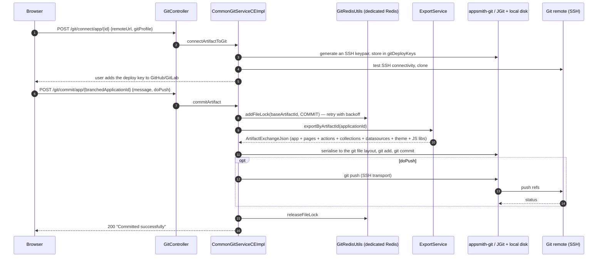

Notes:
- **Synchronous, in the request thread.** A large app or a slow remote holds an HTTP request open.
- Concurrency is guarded by a Redis lock keyed on `baseArtifactId`, on a *dedicated Redis connection* (`appsmith.redis.git.url`). Push reuses the commit's lock rather than re-acquiring it.
- The working copy lives on **local disk**, which is why multi-pod git is fragile today.
- `appsmith-git` has zero dependencies back into `appsmith-server` — the cleanest boundary in the codebase.

Full detail: [Git Versioning](07-git-versioning.md).

## 12. Invite a user to a workspace

`POST /api/v1/users/invite`.

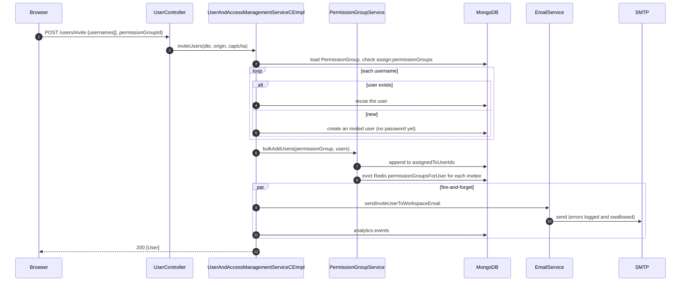

Adding a user to a permission group **does not rewrite any `policyMap`** — the group's id is already in the resources' policy maps. Only the user→group index and the Redis cache change. This is why membership changes are cheap and *grant* changes are expensive.

## 13. Fork / import / export an application

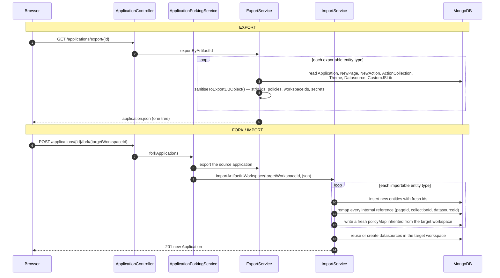

Notes:
- Export **strips secrets** — datasource configurations arrive unconfigured (`isConfigured: false`) and must be re-entered. Git works the same way.
- Every entity type implements a paired `*ExportableService` / `*ImportableService`. The id-remapping table is the fiddly part and where most import bugs live.
- No transaction. A failed import leaves orphans.

---

## What these flows tell you about the decomposition

| Observation | Consequence for the target |
|---|---|
| Signup, workspace-create and invite all touch user + workspace + permission group together | One **Identity & Access** service. Non-negotiable |
| Editor load already fans out to ~10 sources with per-slice error handling | The **BFF** is a generalisation of existing code, not a new idea |
| Layout save requires JS parsing the Java server can't do | Binding analysis is a **real capability**, not glue. It stays server-side, inside Application Service |
| Publish touches 5 entity types with no transaction | Keeping them in one service makes publish **atomic** — a genuine win |
| Query execution loads action + datasource + storage + plugin + pooled connection | Execution needs a **local replica** of datasource config, or every query pays a network hop |
| Git export needs the whole application tree *plus* datasource configs | Git Service is called *by* Application Service, which assembles the artifact first |
| Fork/import remap ids across every entity type | An **orchestrated saga inside Application Service**, with one compensating call to Datasource Service |
| Email is fire-and-forget and unobservable | Notifications becomes a **broker consumer with retry + DLQ** |

---

[← Permissions & ACL](04-permissions-and-acl.md) · [Next: Plugin & Execution Engine →](06-plugin-execution-engine.md)
