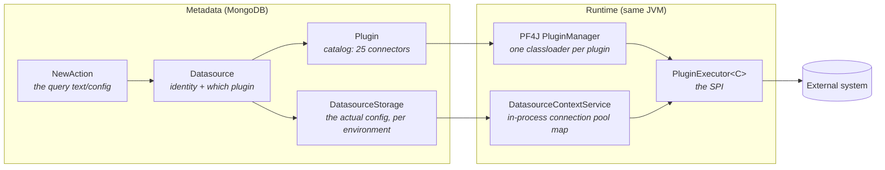
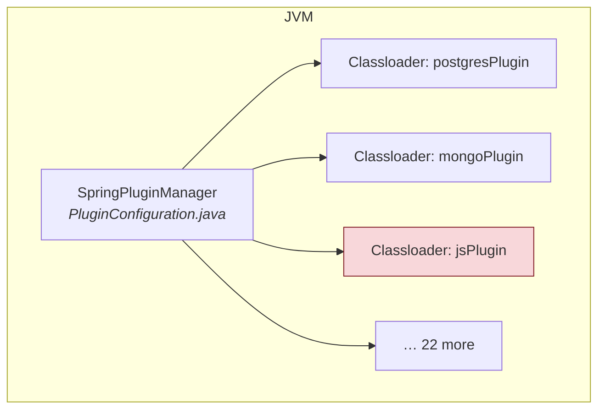
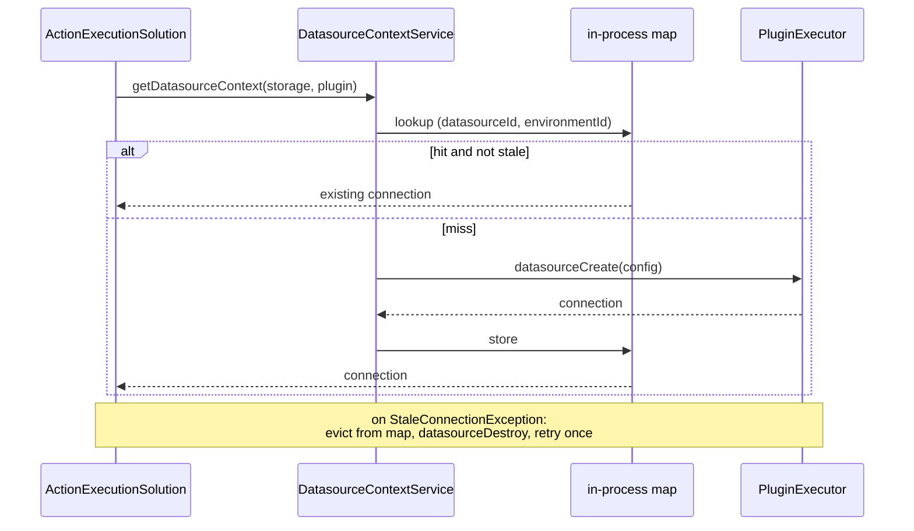
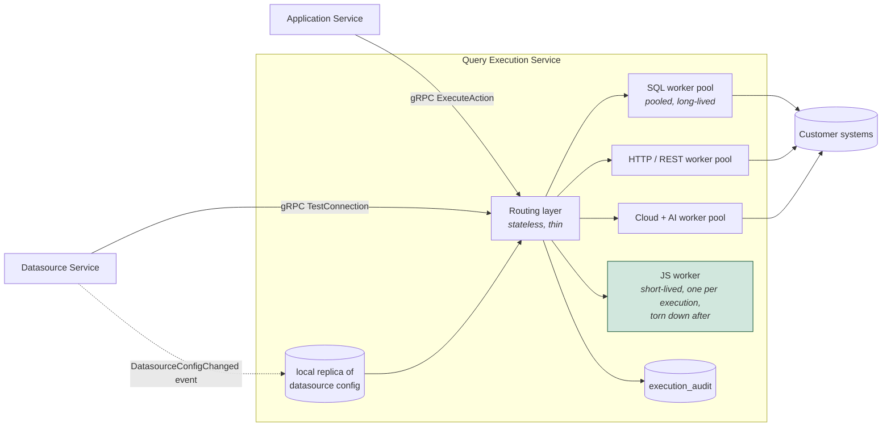

# Current System — Plugin & Query Execution Engine

[← Index](../README.md) · [← Golden Paths](05-golden-paths.md)

---

> This is the subsystem the original HLD omitted entirely, and it is arguably the most architecturally significant thing in Appsmith. A "datasource CRUD service" is a small fraction of what needs to be decomposed here.

---

## 1. The four moving parts



| Concept | Collection / class | Holds |
|---|---|---|
| **Plugin** | `plugin` collection + a Maven module under `appsmith-plugins/` | Connector identity, `packageName`, form schema for the UI, template queries |
| **Datasource** | `datasource` | Name, `workspaceId`, `pluginId`. *No credentials.* |
| **DatasourceStorage** | `datasourceStorage` | The `DatasourceConfiguration` — host, port, auth, SSL — **keyed by `(datasourceId, environmentId)`**, secrets encrypted |
| **Action** | `newAction` | The query body/config, plus an **embedded full copy of the Datasource** |

The `Datasource` / `DatasourceStorage` split is deliberate and worth keeping: one datasource, multiple environment configurations. CE only ever creates the default environment, but the model already supports dev/staging/prod.

## 2. The plugin SPI

`appsmith-interfaces/src/main/java/com/appsmith/external/plugins/PluginExecutor.java`:

```java
public interface PluginExecutor<C> extends ExtensionPoint, CrudTemplateService {
    Mono<ActionExecutionResult> execute(C connection,
                                        DatasourceConfiguration dsConfig,
                                        ActionConfiguration actionConfig);

    Mono<C> datasourceCreate(DatasourceConfiguration dsConfig);   // open a connection
    void datasourceDestroy(C connection);                          // close it
    Set<String> validateDatasource(DatasourceConfiguration c);     // config sanity
    Mono<DatasourceTestResult> testDatasource(DatasourceConfiguration c);
    Mono<DatasourceStructure> getStructure(C conn, DatasourceConfiguration c);  // schema introspection
    Mono<TriggerResultDTO> trigger(...);                           // dynamic dropdowns in the UI
}
```

`C` is the connection type, and it differs per plugin: a JDBC `Connection` pool for Postgres/MySQL, a `WebClient` for REST, an SDK client for S3/Sheets/OpenAI. Many methods have `default` implementations, so a simple connector overrides very few.

**This interface is the contract to preserve.** The .NET equivalent (`IConnectorExecutor<TConnection>`) should be a near-mechanical translation — the shape is right; only the isolation model changes.

## 3. The 25 connectors

| Family | Plugins |
|---|---|
| **Relational** | `postgresPlugin`, `mysqlPlugin`, `mssqlPlugin`, `oraclePlugin`, `redshiftPlugin`, `snowflakePlugin`, `databricksPlugin` |
| **NoSQL / document** | `mongoPlugin`, `arangoDBPlugin`, `dynamoPlugin`, `firestorePlugin`, `elasticSearchPlugin`, `redisPlugin` |
| **HTTP** | `restApiPlugin`, `graphqlPlugin`, `saasPlugin` |
| **Cloud / storage** | `amazons3Plugin`, `googleSheetsPlugin`, `awsLambdaPlugin` |
| **AI** | `openAiPlugin`, `anthropicPlugin`, `googleAiPlugin`, `appsmithAiPlugin` |
| **Other** | `smtpPlugin`, **`jsPlugin`** |

`jsPlugin` is the odd one out and the dangerous one: it executes **arbitrary user-authored JavaScript** rather than a parameterised query. Every other connector at least confines itself to a protocol.

## 4. Loading: PF4J, in-process



- `configurations/PluginConfiguration.java` creates a `SpringPluginManager`.
- `helpers/PluginExecutorHelper.java` resolves `Plugin.packageName` → the loaded `PluginExecutor` instance.
- Each plugin gets its **own classloader**, so two connectors can depend on different versions of the same library.

**Isolation stops there.** Separate classloaders, same process, same heap, same thread pool.

### What that means in practice

| Failure mode | Blast radius today |
|---|---|
| A JDBC driver leaks connections | Server-wide file-descriptor exhaustion |
| A connector allocates a huge result set | Server-wide `OutOfMemoryError` |
| User JS enters an infinite loop | A `boundedElastic` thread is pinned for the whole platform |
| A connector blocks on a slow remote with no timeout | Reactor thread starvation |
| A plugin throws a `Throwable` on a shared scheduler | Can take down unrelated requests |

There is no CPU cap, no memory cap, no wall-clock kill, and no process boundary. **Fixing this is the single largest reliability gain available in the re-architecture.**

## 5. Connection pooling

`services/ce/DatasourceContextServiceCEImpl.java` holds an in-process map:

```
Map<DatasourceContextIdentifier, DatasourceContext<?>>
       where identifier = (datasourceId, environmentId)
```



Consequences:
- The pool is **per pod**. Three replicas ⇒ three independent pools per datasource ⇒ 3× connections against the customer's database. There is no global connection budget.
- Nothing evicts idle contexts on a timer; they persist until stale or the pod restarts.
- OAuth2 datasources refresh tokens through `AuthenticationValidator` before each execution.

## 6. Secrets

Secrets live inside `DatasourceConfiguration` on `DatasourceStorage` and are encrypted at rest by an annotation-driven Mongo event listener:

- `@Encrypted` marks fields on `DBAuth`, `BasicAuth`, `BearerTokenAuth`, `ApiKeyAuth`, `OAuth2`, `KeyPairAuth`, `SSHPrivateKey`, `UploadedFile`.
- `EncryptionMongoEventListener` + `EncryptionHandler` encrypt on save and decrypt on load, transparently.
- The key comes from environment configuration (`APPSMITH_ENCRYPTION_PASSWORD` / `_SALT`).

**Export and git deliberately strip secrets** (`sanitiseToExportDBObject`), which is why imported/forked/git-cloned datasources arrive `isConfigured: false`.

Gaps to close in the target: no key rotation story, no per-workspace key separation, and the encryption key sits in the same process that executes untrusted connector code.

## 7. Related execution surfaces

Beyond "run a query", the plugin layer serves three more UI-facing capabilities. All of them need a home in the target.

| Capability | Endpoint | Purpose |
|---|---|---|
| **Schema introspection** | `GET /datasources/{id}/structure` | Populates the schema tree in the editor. Cached in `datasourceStorageStructure` |
| **Trigger** | `POST /datasources/{id}/trigger`, `POST /plugins/{id}/trigger` | Dynamic dropdowns — "list the sheets in this spreadsheet", "list the buckets" |
| **Template / CRUD generation** | `GET /datasources/{id}/pages/{pageId}/code`, `POST /pages/crud-page` | `CreateDBTablePageSolution` introspects a table and generates an entire CRUD page |
| **Mock data** | `GET|POST /datasources/mocks` | Sample datasources backed by the embedded Postgres |

## 8. The target design



Design decisions and the reason for each:

| Decision | Reason |
|---|---|
| **Execution is a separate service from Datasource config** | Different risk profile. A flaky third-party API must never degrade a user's ability to edit a connection string, and a config bug must never reach the execution runtime |
| **Workers are separate processes, not `AssemblyLoadContext`** | Only a process boundary gives you enforceable CPU/memory/time limits and crash containment. `AssemblyLoadContext` reproduces today's PF4J situation |
| **Grouped by connector *family*, not one process per connector** | 25 processes per node is wasteful; families share a risk profile and a pooling strategy |
| **The JS connector gets a short-lived worker per execution** | It runs arbitrary user code. Pooling it means one user's leaked state or runaway loop affects the next. Torn down after every call |
| **Datasource config is an event-replicated local read cache** | Mirrors today's in-process cache exactly. A synchronous call to Datasource Service per execution would add a network hop to the highest-frequency operation in the system |
| **`execution_audit` table is new** | Today `ActionExecutionResult` is never persisted; per-connector error rates and latencies are invisible. This closes a real gap |
| **Connection pooling moves into the worker pool** | Pools become a property of a scalable worker tier rather than of every API pod, giving a *global* connection budget per datasource for the first time |

### Porting the connectors

Order by traffic and risk, not alphabetically:

1. `restApiPlugin`, `postgresPlugin`, `mysqlPlugin`, `mongoPlugin` — the overwhelming majority of real usage.
2. `jsPlugin` — highest risk, must land with the isolated-worker model, not before.
3. `graphqlPlugin`, `amazons3Plugin`, `googleSheetsPlugin`, `smtpPlugin`.
4. The rest, in usage order.

**Before rewriting any connector, capture golden-file contract tests against the running Java plugin**: request config in, serialised `ActionExecutionResult` out, including error shapes, type coercion and pagination behaviour. Years of edge-case handling live in these plugins and is not documented anywhere else.

---

[← Golden Paths](05-golden-paths.md) · [Next: Git Versioning →](07-git-versioning.md)
