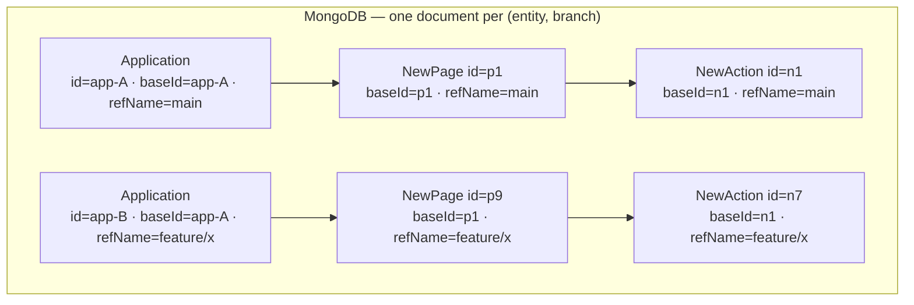
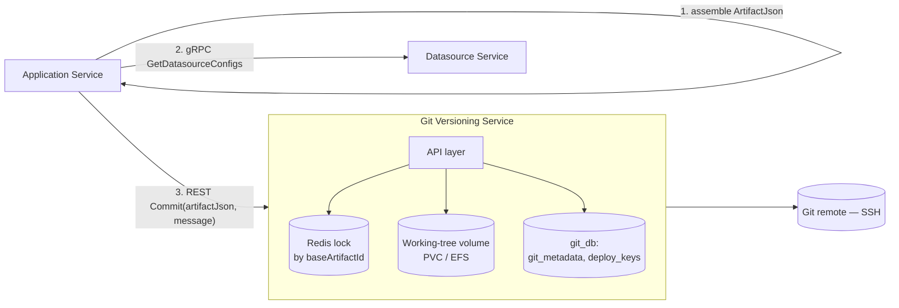

# Current System — Git Versioning

[← Index](../README.md) · [← Plugin & Execution Engine](06-plugin-execution-engine.md)

---

Appsmith can connect an application to a git remote, so the whole app versions like source code. Two things make this architecturally significant:

1. It forces the **entire application tree to be serialisable** to a stable file format — that serialiser is also what powers import/export and fork.
2. It **duplicates every entity per branch** in the database, which changes the shape of every table in the target schema.

---

## 1. The module

`app/server/appsmith-git/` — a standalone Maven module wrapping **JGit** (plus `commons-exec` for a few shell-out operations).

```
appsmith-git/
├── handler/FSGitHandlerImpl          — high-level operations (clone, commit, push, pull, merge)
├── service/GitExecutorImpl           — JGit calls
├── files/FileUtilsImpl               — artifact JSON ⇄ file tree
├── helpers/RepositoryHelper          — path resolution
├── helpers/SshTransportConfigCallback— SSH auth
└── configurations/GitServiceConfig   — root path for local repos
```

**It has zero dependencies back into `appsmith-server`.** That one-way dependency makes it the cleanest existing service boundary in the codebase and the easiest thing to extract.

## 2. How an application becomes files

`ExportService` produces an `ArtifactExchangeJson` — one object tree containing the application, pages, actions, action collections, datasources, theme and JS libs. `FileUtilsImpl` then explodes that tree into a directory layout:

```
<repo-root>/
├── application.json          — application metadata, theme, app layout
├── metadata.json             — schema/DSL versions
├── pages/
│   └── <PageName>/
│       ├── <PageName>.json   — page metadata
│       └── canvas.json       — the DSL for that page
├── queries/
│   └── <QueryName>.json      — one file per action
├── jsobjects/
│   └── <ObjectName>/
│       ├── <ObjectName>.json — metadata
│       └── <ObjectName>.js   — the actual JS source, as a real .js file
├── datasources/
│   └── <DatasourceName>.json — config with SECRETS STRIPPED
└── jslibs/
```

Directory names come from `GitDirectoriesCE`: `pages`, `queries`, `jsobjects`, `datasources`, `jslibs`.

Two deliberate design points worth preserving:
- **JS objects are written as real `.js` files**, so they diff and review like code.
- **The page DSL is a separate `canvas.json`**, so a widget change diffs independently of page metadata.
- **Secrets are stripped**, so a cloned repo yields unconfigured datasources — the same sanitisation used by export and fork.

Deterministic serialisation matters enormously here: custom Gson converters (`GsonUnorderedToOrderedConverter`, `GsonDoubleToLongConverter`) exist purely to stop key ordering and numeric formatting from producing spurious diffs. **Any .NET reimplementation must reproduce byte-stable output** or every commit becomes a whole-file diff.

## 3. How branches are modelled in the database

This is the part that shapes the target schema.



From `RefAwareDomain`:

| Field | Meaning |
|---|---|
| `id` | Unique per branch. What the API takes — note every endpoint parameter named `branchedApplicationId`, `branchedPageId` |
| `baseId` | Stable identity of "the same entity" across branches. Git metadata and some caches key on this |
| `refName` | Branch (or tag) name |
| `refType` | `branch` \| `tag` |
| `branchName` | Deprecated alias of `refName`, still populated |

**Creating a branch copies the entire entity tree.** An application with 20 pages, 60 queries and 5 branches is 5 × (1 + 20 + 60) rows. Storage and write amplification scale with branch count.

This replaced an older `DefaultResources` embedded-object approach — a live precedent that this team has already migrated an identity model on production data.

## 4. Operations and their shape

| Operation | Endpoint | Notes |
|---|---|---|
| Connect | `POST /git/connect/app/{id}` | Generates an SSH keypair (stored in `gitDeployKeys`), user installs the deploy key on the remote, first clone |
| Commit | `POST /git/commit/app/{branchedApplicationId}` | Export → write files → `git add` → `git commit`. Optional `doPush` |
| Push | `POST /git/push/app/{id}` | SSH transport |
| Pull | `GET /git/pull/app/{id}` | Fetch + merge + **re-import into the database** |
| Create / checkout branch | `POST /git/create-branch/...`, `GET /git/checkout-branch/...` | Checkout **duplicates the entity tree** for the new branch |
| Status | `GET /git/status/app/{id}` | Diffs the current DB state against the working tree |
| Merge + merge status | `POST /git/merge/...`, `POST /git/merge/status/...` | Conflict detection before attempting |
| Discard | `PUT /git/discard/app/{id}` | Reset the DB state from the last commit |
| Protected branches | `POST|GET /git/branch/app/{id}/protected` | Blocks direct commits |
| Auto-commit | `POST /git/auto-commit/...`, `GET .../progress/...` | Background commit after DSL/schema migrations, with progress polling |
| Import from git | `POST /git/import/{workspaceId}` | Clone a repo into a new application |

### Concurrency

Every mutating operation takes a **Redis lock keyed on `baseArtifactId`** via `GitRedisUtils`, with retry/backoff. That lock uses a **dedicated Redis connection** (`appsmith.redis.git.url`) — a strong signal that git contention was painful enough to isolate from the general cache.

Commit-then-push reuses the commit's lock rather than re-acquiring it.

### Auto-commit

When Appsmith upgrades a DSL or JSON schema version, git-connected apps would otherwise show a huge diff on the user's next manual commit. Auto-commit does it for them in the background, driven by Spring `ApplicationEventPublisher` events under `git/autocommit/`. It is the only place in the codebase using an in-process event bus.

## 5. Constraints this places on any deployment

| Constraint | Why |
|---|---|
| **Local disk required** | JGit works against a real working tree under `GitServiceConfig`'s root path |
| **Sticky or shared storage** | Two pods cannot share a working tree over ordinary object storage |
| **Long, blocking requests** | Commit/push run synchronously in the request thread; a large repo or slow remote holds the connection open |
| **CPU-heavy** | Diff, merge and serialisation are compute-bound, unlike the CRUD around them |
| **Distinct failure modes** | Network SSH failures, auth failures, merge conflicts — none of which resemble a database error |

Those five bullets are a textbook argument for a separate deployable, which is exactly what the target does.

## 6. The target design



Decisions:

| Decision | Reason |
|---|---|
| **Application Service assembles the artifact, Git Service does git** | Git Service must not know the domain model. It receives a serialised artifact and a target repo/branch. This preserves today's clean one-way dependency |
| **Keep the Redis lock, keyed on `baseArtifactId`** | It already works, and it's the correct granularity. Don't reinvent it |
| **Git Service owns only `git_metadata` and `deploy_keys`** | Branch tracking, protection rules, last-commit info, SSH keys. The application data stays in Application Service |
| **Long operations become async with progress** | `Commit` stays sync (users wait), but `Import from git`, `Merge` and auto-commit move to a job + progress endpoint — auto-commit already has a progress endpoint today, so the pattern exists |
| **Deploy keys move to the secrets manager** | Private keys currently sit encrypted in the database next to everything else |
| **Serialisation must be byte-stable** | Port the Gson ordering/number-format behaviour deliberately; add a golden-file test suite comparing .NET output against Java output for a corpus of real applications |

### The one thing to be careful about

`git pull` **re-imports into the database**, which means the Git Service's response has to be turned back into Application Service writes. Keep the direction of control clear: Git Service returns the artifact JSON, Application Service performs the import. Git Service never writes application data.

---

[← Plugin & Execution Engine](06-plugin-execution-engine.md) · [Next: Frontend Architecture →](08-frontend-architecture.md)
