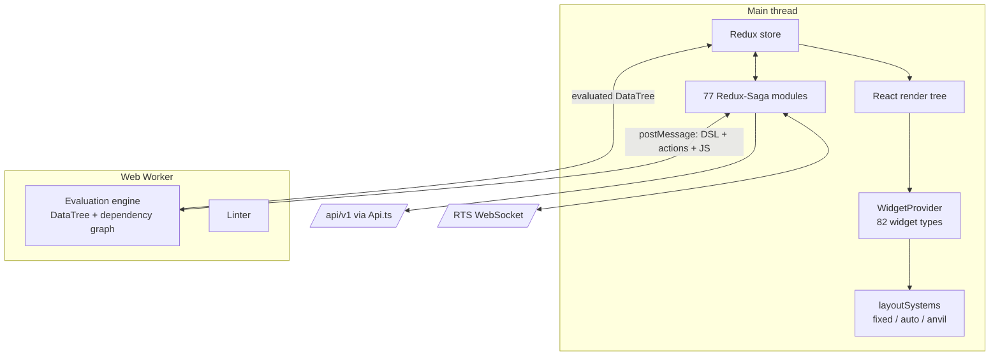

# Current System — Frontend Architecture

[← Index](../README.md) · [← Git Versioning](07-git-versioning.md)

---

> **~708,000 LOC across ~5,200 files — 4× the size of the entire Java backend.** If your plan treats the UI as "the last phase", the plan is wrong. Read [Angular Frontend](../02-target-architecture/08-angular-frontend.md) alongside this.

---

## 1. Stack

| Concern | Technology |
|---|---|
| Framework | React 18, TypeScript |
| State | Redux + **Redux-Saga** (77 saga modules) |
| Build | CRACO over CRA, Yarn 3 workspaces |
| Styling | styled-components + Tailwind + two in-house design systems (`@appsmith/ads`, `@appsmith/wds`) |
| HTTP | axios, one shared `Api.ts` base client with interceptors, `withCredentials: true` |
| Realtime | Socket.IO client, `path: "/rts"` |
| Heavy compute | **Web Workers** — the evaluation engine and the linter run off the main thread |
| E2E tests | Cypress + Playwright |

Workspace packages (`app/client/packages/`): `ast` (JS parsing, shared with RTS), `dsl` (DSL schema + migrations), `design-system`, `wds`, `rts`, `utils`, `icons`.

## 2. The four subsystems that actually matter

Most of the 708k LOC is widget implementations and design-system components. The architecturally load-bearing parts are these four.



### 2.1 The DSL — the canvas as one JSON tree

A page's canvas is a single nested JSON object. Every widget is a node:

```jsonc
{
  "widgetName": "Table1",
  "type": "TABLE_WIDGET_V2",
  "widgetId": "abc123",
  "topRow": 4, "bottomRow": 44, "leftColumn": 0, "rightColumn": 64,
  "tableData": "{{ GetUsers.data }}",        // ← a binding, not a value
  "onRowSelected": "{{ GetOrders.run() }}",  // ← an event handler
  "children": [ /* nested widgets */ ]
}
```

Facts that constrain the rewrite:

- The DSL is **stored server-side** inside `NewPage.unpublishedPage.layouts[0].dsl` and travels over the API verbatim.
- It is **versioned**, with client-side migrations in `packages/dsl` (`Application.applicationVersion`, `evaluationVersion`, and a DSL version in `metadata.json` for git).
- The **server parses it too** — `UpdateLayoutService` walks the DSL to extract `{{ }}` bindings and compute the on-load action plan ([Golden Paths §6](05-golden-paths.md#6-edit-the-canvas--save-layout)).

**Treat the DSL as a frozen contract across the rewrite.** Angular renders the same JSON that React renders today; the server keeps the same parsing responsibilities. Changing the DSL and changing the framework at the same time would make every bug ambiguous.

### 2.2 The evaluation engine — the genuinely novel part

`src/workers/Evaluation/` runs in a **Web Worker**. On every change it:

1. Builds a **DataTree** — a single object graph of every widget, action result, and JS object on the page.
2. Parses every `{{ }}` binding with the shared `packages/ast` (Acorn-based) to find which entities it references.
3. Builds a **dependency graph** across all bindings, detects cycles.
4. Topologically sorts and **evaluates only what changed** (`evalTreeWithChanges.ts`), in a sandboxed `indirectEval` context with a curated global API (`fns/`, `domApis.ts`).
5. Posts the updated DataTree back to Redux, which re-renders exactly the affected widgets.

This is a reactive spreadsheet engine. It is the product's core differentiation, it is ~15–20k LOC of subtle code, and it is **framework-independent** — it communicates over `postMessage` with plain JSON.

**Consequence: it should be ported as-is, not rewritten.** It has no React dependency. Wrap it in an Angular service that owns the worker and pushes results into a signal/observable store. This is the single highest-leverage decision in the client plan.

### 2.3 Widgets — 82 of them

`src/widgets/<WidgetName>/` each contain:
- `index.ts` — registration
- `widget/index.tsx` — the React component
- `config/propertyPaneConfig` — the property-panel schema shown in the editor
- `config/defaultsConfig`, `autocompleteConfig`, `settersConfig`, `derivedProperties`

The **property-pane config and derived-property definitions are data, not rendering**. They can be ported mechanically. The React component is what gets rewritten.

Rough split per widget: ~30% portable config/metadata, ~70% rendering code that must be rewritten in Angular.

### 2.4 Layout systems

Three coexisting layout engines under `src/layoutSystems/`:

| System | Status |
|---|---|
| `fixedlayout` | Original grid — absolute rows/columns, still the default for older apps |
| `autolayout` | Responsive flex-based |
| `anvil` | Newest system, section/zone based |

`CanvasFactory.tsx` picks one per application. **Scope decision required before the Angular work starts**: supporting all three in the new client roughly triples the canvas effort. See [Angular Frontend](../02-target-architecture/08-angular-frontend.md).

## 3. How the client talks to the server

- **One axios client** (`src/api/Api.ts`) with a single base URL and centralised request/response interceptors. Per-domain wrappers: `ActionAPI`, `PageApi`, `DatasourcesApi`, `GitSyncAPI`, `PluginApi`, `AppThemingApi`, `LibraryAPI`, `TemplatesApi`, `ImportApi`, `SearchApi`.
- **`withCredentials: true` everywhere** — cookie session plus `XSRF-TOKEN`.
- **Login is an HTML form POST**, not an API call (`src/pages/UserAuth/Login.tsx`).
- **Editor boot is one call** to `/api/v1/consolidated-api/edit`; published-app boot is `/consolidated-api/view`.
- **Query execution is `multipart/form-data`**, not JSON, so blobs can ride along.
- **WebSocket** to `/rts` for presence.

The centralised client is good news: **the API surface the Angular app must reimplement is already enumerated in `src/api/`**, and swapping the base URL to the new gateway is a small change in one file.

## 4. What is server contract vs. what is UI

This table decides what the Angular rewrite is allowed to change.

| Thing | Server contract? | Rewrite freedom |
|---|---|---|
| DSL JSON shape | **Yes** — server parses it, git stores it | None. Frozen |
| Widget `type` strings and property names | **Yes** — inside the DSL | None |
| `{{ }}` binding syntax and evaluation semantics | **Yes** — server extracts bindings for the on-load plan | None |
| `layoutOnLoadActions` structure | **Yes** — server computes it, client executes it | None |
| API request/response shapes | **Yes** | Only via a deliberate contract change at the gateway |
| Evaluation engine internals | No | Port as-is; don't rewrite |
| Redux/Saga architecture | No | Replace entirely with Angular signals + services |
| Widget rendering components | No | Rewrite |
| Design system components | No | Rewrite or replace |
| Layout systems | Partly — coordinates live in the DSL | Rendering rewritten; coordinate semantics preserved |

## 5. Sizing the client work honestly

| Area | Approx. share of LOC | Strategy |
|---|---|---|
| Widgets (82) | ~35% | Mechanical config port + rendering rewrite. The long pole |
| Design system packages | ~15% | Replace with an Angular component library; port tokens/theme |
| Editor UI (property panes, IDE, debugger, entity explorer) | ~20% | Rewrite |
| Sagas / state | ~10% | Replace with Angular services + signals. Do not port saga-by-saga |
| Evaluation + AST + DSL packages | ~8% | **Port as-is.** Framework-independent TypeScript |
| Layout systems | ~7% | Rewrite; scope decision on how many to support |
| API layer | ~2% | Straight port to Angular `HttpClient` |
| Tests, tooling, misc | ~3% | Rebuild |

## 6. Things in the client you must not lose

| Behaviour | Where it lives | Risk if lost |
|---|---|---|
| DSL version migrations | `packages/dsl` | Old applications fail to open |
| Evaluation version handling | `Application.evaluationVersion` + worker | Bindings silently change meaning |
| Autocomplete/type inference for bindings | `workers/Evaluation` + widget `autocompleteConfig` | The editing experience collapses |
| Undo/redo of canvas changes | `ReplayDSL.ts` | A daily-use feature |
| Widget `derivedProperties` | Per-widget config | Widgets stop computing derived state (e.g. `Table1.selectedRow`) |
| Debugger / error surfacing | `sagas/DebuggerSagas.ts`, evaluation errors | Users lose the only way to diagnose broken bindings |
| Auto-height, reflow | `sagas/autoHeightSagas`, `src/reflow` | Canvas behaviour feels broken |

---

[← Git Versioning](07-git-versioning.md) · [Next: Cross-Cutting Concerns →](09-cross-cutting-concerns.md)
