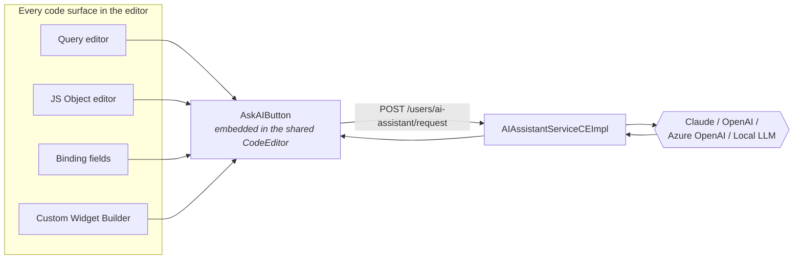
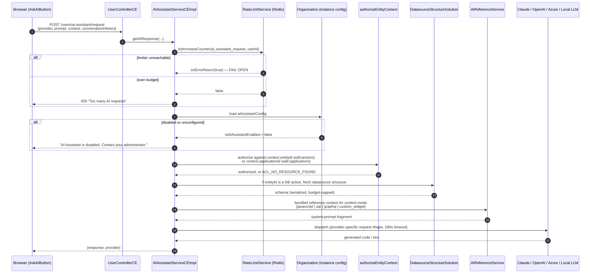

# Current System — AI Assistant (Copilot)

[← Index](../README.md) · [← API Endpoint Catalog](10-api-endpoint-catalog.md)

---

## 0. Two unrelated things share the word "AI" in this codebase

Don't conflate them — they have different owners, different data models, and different target-architecture homes.

| | **AI connector plugins** | **AI Assistant (this doc)** |
|---|---|---|
| What it is | Datasources a user configures and queries, like any other connector | An editor-time **copilot** that writes code for the user |
| Plugins/modules | `openAiPlugin`, `anthropicPlugin`, `googleAiPlugin`, `appsmithAiPlugin` | `AIAssistantServiceCEImpl`, `AIConfigServiceCEImpl`, `AIReferenceServiceCEImpl` |
| Configured by | Any user, per workspace, per datasource | An **instance administrator**, once, for the whole deployment |
| Invoked by | `POST /actions/execute`, like any query | `POST /users/ai-assistant/request`, from the code editor |
| Already covered in | [Plugin & Execution Engine](06-plugin-execution-engine.md) | **Here** |

This document is about the second one.

---

## 1. What it does

Every code-entry surface in the editor — the query editor, the JS Object editor, binding fields, and the Custom Widget Builder — carries an **"Ask AI" button** wired into the shared `CodeEditor` component (`components/editorComponents/CodeEditor/index.tsx`). Clicking it sends the user's prompt, plus editor context, to a server endpoint that forwards it to a configured LLM provider and returns generated code.

It is a **developer-productivity feature, not a runtime dependency** — nothing about running a published application touches this code path. Losing it doesn't break an application; it breaks the authoring experience.

## 2. Configuration: instance-wide, admin-only, BYOK

Configured once per deployment (`pages/AdminSettings/AI/index.tsx` on the client), stored on the single `Organization` document's `organizationConfiguration.aiAssistantConfig` — recall from [Domain Model §8](03-domain-model-and-db.md#8-known-inconsistencies-to-fix-not-carry-forward) that CE runs exactly one `Organization` per instance, so this is genuinely **instance-level config**, not workspace-level.

`AIAssistantConfig` (`domains/AIAssistantConfig.java`):

| Field group | Contents |
|---|---|
| Provider selector | `aiProvider` (`CLAUDE` \| `OPENAI` \| `AZURE_OPENAI` \| `LOCAL_LLM` \| deprecated `COPILOT`), `isAIAssistantEnabled` |
| Claude | `claudeApiKey` (encrypted), `claudeModel`, `claudeBaseUrl` |
| OpenAI | `openaiApiKey` (encrypted), `openaiModel`, `openaiBaseUrl` |
| Azure OpenAI | `azureOpenaiApiKey` (encrypted), `azureOpenaiEndpoint`, `azureOpenaiDeploymentName`, `azureOpenaiApiVersion`, `azureOpenaiMaxCompletionTokens` |
| Local LLM | `localLlmUrl`, `localLlmModel`, `localLlmContextSize` — no key, self-hosted |
| Deprecated | `copilotApiKey`/`copilotEndpoint` — superseded by Azure OpenAI, but still read as a fallback |

`AIConfigControllerCE` (`/api/v1/tenants/ai-config`) exposes `PUT`/`GET` for the config plus `POST .../test-connection`, `.../fetch-models`, `.../test-api-key` — the settings-page probes that let an admin verify a key works and populate a model dropdown before saving.

### The encryption story is worth reading closely

`@Encrypted` is declared on the key fields but — per a comment directly in `AIAssistantConfig.java` — **that annotation never actually took effect** for this class; the real encryption is a separate, hand-written mechanism (`helpers/ce/AIConfigSecretsCE.java`) doing the work explicitly:

- Every stored value is prefixed `enc:v1:` on write. That marker, not "can this be decrypted", is what distinguishes ciphertext from cleartext — decrypt-and-see-if-it-throws gets both directions wrong (a real ciphertext can spuriously fail to decrypt after a key rotation; real cleartext can spuriously succeed).
- **`Migration076EncryptAIAssistantApiKeys`** exists specifically to sweep up keys written by earlier builds before the marker existed and encrypt them in place — a genuine "we shipped a bug, here's the migration that fixes it retroactively" example, and useful evidence for [Roadmap §9](../03-execution/02-roadmap-and-sequencing.md#9-risk-checkpoints)'s point about reading every Mongock changelog before finalising the target schema.
- `PUT /organizations` (the generic organization-update endpoint) can *also* reach these fields, because `@JsonView` filtering only applies when a view is active on that binding path — so `AIConfigSecretsCE.encryptCredentialsInPlace` runs defensively on every write path that could touch this config, not just the dedicated `/ai-config` endpoint.
- **A key is bound to the destination URL it was entered for.** `unbindCredentialsWithChangedDestination` clears a stored key whenever its base URL/endpoint changes in the same write, unless the same request also supplies a fresh key. Why: the settings UI masks a saved key so an admin with *manage* rights (but not the ability to read the key back) can't repoint it at an attacker-controlled URL and have the server exfiltrate it there.

None of this is decorative. It's a small, self-contained lesson in secret-handling that the target's `ISecretStore` abstraction should absorb as a property of the store, not something every consumer re-derives.

## 3. The request flow

`POST /api/v1/users/ai-assistant/request` (note: lives on `UserController`, not `AIConfigController` — an authenticated-user action, not an admin one).

Points worth calling out individually:

### Authorization is "edit", not "execute" — and it's a hard denial, not a soft one
The assistant is an authoring tool: it rewrites the query or JS *behind* an entity, so the bar is the permission for **changing** that entity, matching `MANAGE_ACTIONS`/`MANAGE_APPLICATIONS` from [Permissions & ACL](04-permissions-and-acl.md), not the weaker `EXECUTE_ACTIONS` a view-only member would hold. And — deliberately, per an inline comment — **authorization is separated from schema enrichment**: enrichment degrades gracefully (a missing/unreadable datasource just costs the prompt its schema context), but a permission-filtered lookup coming back empty is a real 403-shaped failure, not a silent fallback, because a caller without edit rights spending the organization's provider credits and getting an answer anyway is the actual thing being prevented.

### Denial-of-wallet is treated as a named threat, not an afterthought
Every call to a real LLM provider costs the *organization* real money, and the endpoint is reachable by any authenticated member, including a view-only one on the `applicationId`-only path. The rate limiter is keyed **per user** (`BUCKET_KEY_FOR_AI_ASSISTANT_API`), so one caller can't exhaust the whole organization's allowance — and it **fails open** on a Redis outage, matching the platform's general posture that a cache/lock outage degrades a feature, never takes it down.

### Schema enrichment reuses the plugin execution boundary
When `context.entityId` points at a DB action, the service calls `DatasourceStructureSolution.getStructure` — the exact same schema-introspection path used by the editor's schema tree ([Plugin & Execution Engine §7](06-plugin-execution-engine.md)) — and serializes it into the prompt through `AiDatasourceSchemaSerializerCE`, budgeted to ~10,000 characters before assembly and hard-capped at 15,000 after. SQL plugins get a prompt-aware table-selection serialization; other DB plugins fall back to a simpler legacy heuristic.

### The reference content is bundled markdown, not retrieval
`AIReferenceServiceCEImpl` is **not** a RAG/vector-search system — it's a small, `@PostConstruct`-warmed in-memory cache of bundled markdown files (`src/main/resources/ai-references/`) keyed by an **explicit allowlist** of three modes (`javascript`, `sql`, `graphql`), plus a hardcoded system-prompt fallback for each if the bundled file is missing. A fourth mode, `custom_widget`, is recognized and deliberately returns empty — the Custom Widget Builder's AI tab carries its own instructions in the request context instead of relying on a bundled reference. The allowlist itself is a hardening fix: `mode` arrives from the client uncontrolled, and treating it as both a cache key and a resource-path component would have been unvalidated path construction into an unbounded, unevicted `ConcurrentHashMap`.

### Outbound calls carry the same SSRF protection as everything else
`AIConfigSecretsCE.allowsStoredCredential(url)` refuses to attach a stored provider key to any destination that isn't a well-formed `https://` URL with a host — no exceptions for `localhost`, because every one of these calls goes out through the shared `WebClientUtils`, whose `RestrictedHostFilter` already blocks loopback and link-local destinations at the transport layer regardless (the same mechanism [Security & AuthZ §5](../02-target-architecture/06-security-and-authz.md#5-plugin--execution-sandboxing) recommends for the target's connector workers — it already exists here, for this feature and for the REST/GraphQL/SaaS/Elasticsearch/Redis plugins).

### Errors are deliberately not swallowed into a 200
Both `AIConfigControllerCE.updateAIConfig` and `UserControllerCE.requestAIResponse` carry explicit `onErrorMap` blocks whose comments call out the same bug pattern twice: returning `Mono.just(...)` for an error path makes the **wire status 200** even though the payload describes a failure, which defeats any client that branches on HTTP status and keeps failures out of server-error metrics. `INVALID_CREDENTIALS` gets remapped to a 4xx with a friendly message; rate-limit and provider-outage errors keep their real status (429 / 5xx) rather than being flattened to one generic code.

## 4. Client surfaces

| Surface | Where | What |
|---|---|---|
| **Ask AI button** | `ce/components/editorComponents/GPT/AskAIButton.tsx`, mounted inside `components/editorComponents/CodeEditor/index.tsx` | Reachable from *every* code-entry point that uses the shared editor — queries, JS Objects, bindings |
| **Redux slice** | `ce/actions|reducers|selectors/aiAssistant*.ts`, orchestrated by `ce/sagas/AIAssistantSagas.ts` | Request lifecycle, conversation history, retry-classification (`isRetriableFailure` — an invalid key or malformed request is never retried; a network-level throw is) |
| **Custom Widget Builder AI tab** | `pages/Editor/CustomWidgetBuilder/Editor/AIAssistant/` | A dedicated AI-assisted authoring tab for hand-built custom widgets (HTML/JS/CSS) — its own `NotConfigured.tsx` empty state and a `codeApply` step that patches generated code into the widget source |
| **Admin settings page** | `pages/AdminSettings/AI/index.tsx` | The instance-admin config screen behind `/ai-config` — provider selection, key entry (masked), test-connection, fetch-models |

## 5. What this means for the target architecture

Summarized here; the actual design decisions live in [Service Inventory](../02-target-architecture/01-service-inventory.md#reconciling-the-original-hld), [Database per Service](../02-target-architecture/03-database-per-service.md), [Security & AuthZ](../02-target-architecture/06-security-and-authz.md) and [ADR-011](../03-execution/04-risks-and-adrs.md).

| Today | Target |
|---|---|
| Config lives on the single `Organization` document | Folds into Identity & Access's `instances` config, matching the existing Tenant/Organization → `Instance` collapse |
| Dispatch runs in-process in the API server, calling the provider directly over `WebClient` | Routed through **Query Execution Service's existing `Workers.Ai` pool** — the same isolation, timeout and worker-process boundary already designed for the `openAiPlugin`/`anthropicPlugin`/`googleAiPlugin` connectors, reused rather than duplicated |
| Entity authorization + schema enrichment done in-process against Mongo | Stays an **Application Service** responsibility — it already owns action/application authorization and the schema-fetch call to Execution |
| Bundled reference content is a classpath resource | Ported as static content owned by Application Service, alongside the other prompt-assembly logic |
| Rate limiting is a single Redis bucket, fail-open | Same shape, enforced at the Gateway *and* mirrored in Application Service's orchestration — see [Security & AuthZ](../02-target-architecture/06-security-and-authz.md) |
| Secrets are a hand-rolled marker-and-encrypt scheme | Moves into the standard `ISecretStore` — the URL-rebinding and masked-key protections become properties of the store, not re-implemented per feature |

---

[← API Endpoint Catalog](10-api-endpoint-catalog.md) · [Index](../README.md)
