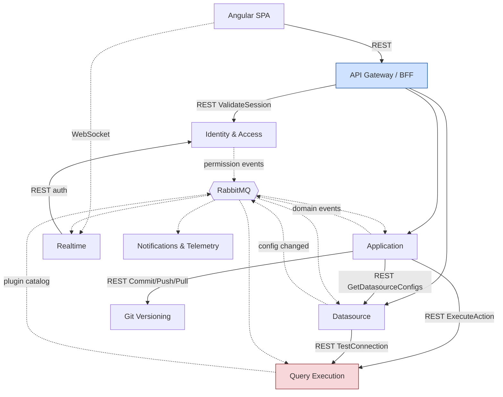

# Target — Service Inventory

[← Index](../README.md) · [← API Endpoint Catalog](../01-current-system/10-api-endpoint-catalog.md)

---

**Eight deployables: one edge layer + seven domain services.** Every split below is justified by a genuinely different risk, scaling or failure-isolation profile found in the current code — not by package boundaries. Where two things could plausibly be separate services, the default is to keep them together.

---

## 1. The inventory at a glance

| # | Service | Bounded context | Database | Owns (authoritative) | Must never own |
|---|---|---|---|---|---|
| 0 | **API Gateway / BFF**<br/>`Appsmith.Gateway` | Edge — not a domain | *none* (Redis only) | Routing, session validation, rate limiting, page-load composition, the response envelope | Any domain data or business rule |
| 1 | **Identity & Access**<br/>`Appsmith.Identity` | Who exists, who belongs where, who may do what | `identity_db` | Users, credentials, sessions, instance config, workspaces, memberships, roles, permission grants | Application content; datasource configs |
| 2 | **Application**<br/>`Appsmith.Application` | The authoring artifact | `application_db` | Applications, pages, layouts/DSL, actions, JS objects, themes, JS libraries, snapshots, publish state | Query *execution*; user/role truth; git plumbing |
| 3 | **Datasource**<br/>`Appsmith.Datasource` | Connection *configuration* | `datasource_db` | Datasources, per-environment storage, secret references, plugin-catalog replica | Executing anything; the plugin implementations |
| 4 | **Query Execution**<br/>`Appsmith.Execution` | Running untrusted work against external systems | `execution_db` | Connector implementations, connection pools, execution audit, plugin catalog (source of truth) | Datasource config truth; action definitions |
| 5 | **Git Versioning**<br/>`Appsmith.Git` | Version control of artifacts | `git_db` | Repos, branches, commit metadata, protection rules, deploy keys | Application content (it receives a serialised artifact) |
| 6 | **Realtime Collaboration**<br/>`Appsmith.Realtime` | Ephemeral presence | *none* (Redis backplane) | Room membership, cursors, presence, push notifications | Anything persisted |
| 7 | **Notifications & Telemetry**<br/>`Appsmith.Notifications` | Async side effects | `notifications_db` | Email templates, delivery log + retry state, product alerts, usage events | Anything on a user-facing critical path |

---

## 2. Service detail

### 0. API Gateway / BFF — `Appsmith.Gateway`

**Purpose.** One public entry point for the Angular client. Everything the browser talks to goes through here.

**Bounded context.** None — this is an edge layer, deliberately. It holds no business rules. If you find yourself writing a domain decision in the gateway, it belongs in a service.

**Responsibilities**
- Reverse proxy (YARP) to the seven services.
- Session validation against Identity & Access; mints a short-lived internal token for downstream calls.
- **Composition endpoints** — generalising today's `ConsolidatedAPIController`: `/consolidated-api/edit`, `/consolidated-api/view`, `/applications/home`, `/search-entities`. Parallel fan-out, per-slice error isolation.
- Rate limiting, CORS, CSRF, request-id/correlation-id injection, the `responseMeta` envelope.
- Static asset proxying to object storage.

**Database.** None. Redis for rate-limit counters and session lookup only.

**Why separate.** Keeps the client independent of internal topology, preserves the `/api/v1` contract shape, and gives one place to enforce auth and observe traffic. This is not speculative — the composition pattern already exists in the monolith and already works.

---

### 1. Identity & Access — `Appsmith.Identity`

**Purpose.** Authenticate people and be the single source of truth for what they're allowed to do.

**Bounded context.** *Identity and authorization.* The boundary is "facts about people and their entitlements," not "facts about content."

**Owns**

| Aggregate | Tables |
|---|---|
| Instance | `instances` (collapses today's `Tenant` + `Organization` into one row) — **also holds the AI Assistant's instance-wide BYOK provider configuration**, matching today's `organizationConfiguration.aiAssistantConfig` (see [AI Assistant](../01-current-system/11-ai-assistant.md)) |
| User | `users`, `user_profiles`, `user_preferences`, `password_reset_tokens`, `email_verification_tokens`, `external_logins` |
| Workspace | `workspaces`, `workspace_members` |
| Access control | `roles` (today's `PermissionGroup`), `role_assignments`, `permission_grants` |

**Public contract**
- REST (internal): `POST /internal/v1/sessions/validate`, `GET /internal/v1/users/{id}/permissions`.
- REST (via gateway): user/workspace/member/role CRUD, signup, login, invite, password reset, AI Assistant provider configuration (`/ai-config`, admin-only).
- **Publishes**: `UserSignedUp`, `UserDeactivated`, `WorkspaceCreated`, `WorkspaceDeleted`, `WorkspaceMemberAdded`, `WorkspaceMemberRemoved`, `RoleAssignmentChanged`, `PermissionGrantChanged`, `AIAssistantConfigChanged`.

**Why separate.** Security-critical, independently auditable, and every other service's authorization projection is fed from here. A bug in high-churn editing code must not be able to reach credential storage.

**Deliberate simplification.** CE has no product need for a tenancy layer above Workspace. `Tenant`/`Organization` collapse into one `instances` row. If multi-org is ever needed it slots in *inside this service*, above `workspaces`, without touching any other service.

---

### 2. Application — `Appsmith.Application`

**Purpose.** Everything a user authors.

**Bounded context.** *The authoring artifact.* One transactional aggregate root: an Application and everything that is meaningless without it.

**Owns**

| Aggregate | Tables |
|---|---|
| Application | `applications`, `application_pages` (ordering), `application_snapshots`, `static_urls` |
| Page | `pages`, `page_layouts` (DSL as `jsonb`) |
| Action | `actions`, `action_collections` (JS objects) |
| Styling & libs | `themes`, `custom_js_libs`, `application_js_libs` |
| Projections | `authz_grants` (replica from IAM), `datasource_summaries` (replica from DS) |

**Public contract**
- REST (via gateway): the ~75 endpoints in [the catalog](../01-current-system/10-api-endpoint-catalog.md), including `POST /users/ai-assistant/request`.
- REST out: `POST execution/actions/execute`, `POST execution/assistant/generate`, `POST datasource/configs/batch`, `POST git/commit`, `POST git/push`, `POST git/pull`.
- **Publishes**: `ApplicationCreated`, `ApplicationPublished`, `ApplicationDeleted`, `ApplicationForked`, `ApplicationAccessChanged`, `PageCreated/Deleted`.
- **Consumes**: IAM permission events, `DatasourceCreated/Updated/Deleted`, `AIAssistantConfigChanged`.

**Why one service and not four.** This is decision D1 and it is the most important one in the design:

- Pages, actions, JS objects and themes are **edited together, published together, forked together, deleted together**. Splitting them manufactures cross-service joins that [do not exist today](../01-current-system/03-domain-model-and-db.md#6-there-are-no-joins--and-that-is-good-news).
- **Publish becomes atomic.** Today it's five unguarded writes that can leave an app half-published. In one database it's one transaction — an improvement, not just parity.
- `NewPage` has no `workspaceId` today; it scopes only through `applicationId`. Keeping Page inside Application Service means workspace scope is enforced once, at the application row.
- Fork/import remap ids across every entity type. Inside one service that's a local transaction plus one compensating call to Datasource Service; split up it's a five-participant saga.

**Why it holds binding analysis.** Saving a layout requires parsing `{{ }}` expressions to compute the on-load plan. Today the Java server delegates this to RTS over HTTP because it can't parse JS. In .NET this becomes an in-process concern of Application Service using a JS parser (Esprima.NET / Jint / a small AST sidecar). It is domain logic, not glue — it decides query execution order.

**Why it orchestrates the AI Assistant.** Today's `AIAssistantServiceCEImpl` already needs action/application edit-permission checks and a datasource-schema fetch before it can call an LLM provider — the same authorization and schema-lookup responsibilities Application Service holds for every other flow. It stays the orchestrator; only the actual provider call moves to Query Execution's `Workers.Ai` pool (§4), which already exists for the AI *connector* plugins. See [AI Assistant](../01-current-system/11-ai-assistant.md) and [ADR-011](../03-execution/04-risks-and-adrs.md).

**Explicitly *not* its own service:** import/export/fork orchestration, template instantiation, CRUD-page generation, snapshots. All internal workflows of this service. They touch many entities but have no independent scaling need and no separate team boundary.

---

### 3. Datasource — `Appsmith.Datasource`

**Purpose.** Manage connection *configuration* — safely, and separately from anything that runs.

**Bounded context.** *Connection configuration.* The boundary is "what we know about how to reach an external system," never "reaching it."

**Owns**

| Aggregate | Tables |
|---|---|
| Datasource | `datasources`, `datasource_storages` (per environment), `environments` |
| Schema cache | `datasource_structures` |
| Catalog replica | `plugins` (read-only replica from Execution) |
| Projection | `authz_grants` (replica from IAM) |

Secrets are **references** (`secret_ref` pointing at the secrets manager), not ciphertext in this database.

**Public contract**
- REST (via gateway): datasource CRUD, storage updates, mock catalog, OAuth callbacks.
- REST out: `POST execution/datasources/test-connection`, `POST execution/datasources/structure`.
- **Publishes**: `DatasourceCreated`, `DatasourceConfigChanged`, `DatasourceDeleted`.
- **Consumes**: `PluginCatalogUpdated` from Execution, permission events from IAM.

**Why separate from Execution.** Editing a connection string is low-risk CRUD with a predictable latency profile. Running a query against a live third-party system is high-risk with unbounded latency. **A flaky customer database must never degrade a user's ability to edit its config**, and a config-editing bug must never touch the execution runtime. Today they share a process; this is the fix.

**Why separate from Application.** Datasources are workspace-scoped and shared across applications; applications are not. Different lifecycle, different ownership, and Application Service only ever needs a summary of a datasource (name, plugin, id) — which it keeps as a projection.

---

### 4. Query Execution — `Appsmith.Execution`

**Purpose.** Run the 25 connector types against customer systems, in isolation.

**Bounded context.** *Untrusted execution.* The boundary is a trust boundary, not a data boundary.

**Owns**

| Thing | Where |
|---|---|
| Connector implementations | Code, one worker pool per family |
| Plugin catalog (**source of truth**) | `plugins`, `plugin_forms`, `plugin_templates` in `execution_db` |
| Execution audit | `execution_audit` (duration, bytes, status, error class, connector) |
| Local read cache of datasource config | Event-replicated, in-memory + Redis |
| Connection pools | Per worker pool, per `(datasourceId, environmentId)` |
| Local read cache of AI provider config | Event-replicated from Identity & Access's `AIAssistantConfigChanged`, resolved just-in-time from the secrets manager per request — never held longer than the call |

**Public contract**
- REST in: `POST /internal/v1/execution/actions/execute`, `.../datasources/test-connection`, `.../datasources/structure`, `.../datasources/trigger`, `.../assistant/generate`.
- **Publishes**: `PluginCatalogUpdated`, `ExecutionFailed` (for alerting).
- **Consumes**: `DatasourceConfigChanged`, `DatasourceDeleted`, `AIAssistantConfigChanged`.

**Architecture — this is not one process.**

```
Appsmith.Execution.Api          thin stateless REST router
  ├─ Workers.Sql                pooled: postgres, mysql, mssql, oracle, redshift, snowflake, databricks
  ├─ Workers.NoSql              pooled: mongo, arango, dynamo, firestore, elastic, redis
  ├─ Workers.Http               pooled: rest, graphql, saas
  ├─ Workers.Cloud              pooled: s3, sheets, lambda, smtp
  ├─ Workers.Ai                 pooled: openai, anthropic, googleai, appsmith-ai connectors —
  │                              AND the AI Assistant's provider dispatch (Claude/OpenAI/Azure/Local LLM)
  └─ Workers.Js                 ⚠ short-lived, ONE PER EXECUTION, torn down after
```

Each worker pool is a separately deployable container with **CPU, memory and wall-clock limits**. The JS worker is not pooled at all — it executes arbitrary user code, so state must not survive between executions.

**`Workers.Ai` carries two distinct callers on purpose.** The AI *connector* plugins (a user's datasource, invoked via `ExecuteAction`) and the AI Assistant (an editor copilot, invoked via `GenerateAssistantResponse`) hit different providers in practice today (OpenAI/Anthropic/Google AI for the former; Claude/OpenAI/Azure OpenAI/Local LLM for the latter) but share the identical risk profile this pool exists to contain: unbounded-latency calls to a third-party HTTP API, real per-request cost, and the same HTTPS-only, no-loopback egress policy `RestrictedHostFilter` already enforces for both paths today. One pool, two entry points, not two pools.

**Why separate deployable.** It is the only place untrusted third-party and user code runs. It is the only component whose latency is bounded by systems we don't control. And it is the only one that benefits from scaling per connector family.

**Why it owns the plugin catalog rather than Datasource.** The service that *implements* a connector should define its metadata. Datasource Service holds a read-only replica for form rendering and validation.

**New capability:** `execution_audit`. Today `ActionExecutionResult` is never persisted — per-connector error rates and latencies are invisible. This closes a real gap.

---

### 5. Git Versioning — `Appsmith.Git`

**Purpose.** Version-control application artifacts against a real git remote.

**Bounded context.** *Version control.* It knows about repos, branches and commits — **not** about applications, pages or actions.

**Owns**

| Aggregate | Tables |
|---|---|
| Repository | `git_repositories` (remote URL, default branch, artifact ref) |
| Branch | `git_branches` (protection, last commit, auto-commit state) |
| Credentials | `git_deploy_keys` (private key → secrets manager reference), `git_profiles` |

Plus a **working-tree volume** (PVC/EFS) and the existing **Redis lock keyed on `baseArtifactId`**.

**Public contract**
- REST in: `POST /internal/v1/git/commit`, `.../push`, `.../pull → artifactJson`, `GET .../branches`, `POST .../branches`, `.../merge`, `GET .../status`, `POST .../discard`.
- **Publishes**: `CommitCreated`, `BranchCreated`, `AutoCommitCompleted`.

**Why separate.** It already *is* the cleanest module in the Java codebase (`appsmith-git` has zero dependencies back into the server). It has a genuinely different resource profile — disk I/O, SSH, CPU-bound diff/merge — and a genuinely different failure vocabulary (auth failures, merge conflicts, network SSH). Its concurrency mechanism (Redis lock per artifact) already exists and works.

**Direction of control matters.** Application Service assembles the artifact JSON (its own data plus a sync call to Datasource Service for configs) and hands it to Git Service. On pull, Git Service returns artifact JSON and Application Service performs the import. **Git Service never writes application data.**

---

### 6. Realtime Collaboration — `Appsmith.Realtime`

**Purpose.** Show who else is in this app/page, where their cursor is, and push "a new version was published".

**Bounded context.** *Ephemeral presence.* Nothing here is persisted or authoritative.

**Owns.** Nothing durable. Room membership in memory, fanned out across instances via a **Redis backplane**.

**Public contract.** SignalR hub methods only. Rooms keyed by `applicationId` / `pageId`. Connection auth delegated to Identity & Access.

**Why separate.** It already is one (RTS is a distinct Node/Socket.IO process today), and long-lived WebSocket connections with in-memory state have a completely different runtime shape from request/response CRUD.

**Genuine improvement over today.** Current RTS has **no backplane** — presence is per-instance, so it cannot be horizontally scaled correctly. SignalR + Redis fixes that.

---

### 7. Notifications & Telemetry — `Appsmith.Notifications`

**Purpose.** Everything that happens *after* a user action and must never slow it down.

**Bounded context.** *Async side effects.*

**Owns**

| Aggregate | Tables |
|---|---|
| Templates | `notification_templates` |
| Delivery | `delivery_log` (status, attempts, next_retry_at, last_error) |
| Alerts | `product_alerts`, `alert_acknowledgements` |
| Usage | `usage_events` (today's `UsagePulse`) |

**Public contract**
- **Consumes**: every domain event from every service.
- REST in: only an admin "resend" / "send test email" action.

**Why separate.** Third-party SMTP and analytics dependencies with their own retry semantics, and it is a **pure subscriber** — nothing calls it synchronously, so it can lag or degrade without affecting any user-facing flow.

**Genuine improvement over today.** Current email is fire-and-forget with **swallowed exceptions** — there is no record that a mail failed. A broker, a delivery log, retries and a DLQ make delivery observable for the first time.

---

## 3. What deliberately does *not* become a service

Naming these explicitly prevents service sprawl.

| Candidate | Where it goes | Why not its own service |
|---|---|---|
| Import / Export / Fork | Inside Application Service | A workflow, not a bounded context. No independent scaling or ownership |
| Templates | Application Service data | Just applications with a flag |
| CRUD-page generation | Application Service (calls Execution for introspection) | A feature of the editor |
| Snapshots | Application Service | Coarse backups of one aggregate |
| Search | Gateway fan-out | Composition, not a domain |
| Assets / images | Object storage + gateway proxy | Infrastructure, not a service |
| Feature flags | Shared provider SDK | Configuration, not a domain |
| Usage pulse | Folded into Notifications & Telemetry | Too small; identical "async subscriber" shape |
| Instance admin / config | Identity & Access + platform tooling | The "restart the container" endpoint is deleted outright |
| Widget rendering, DSL evaluation, linting | **Stays in the Angular client** | Client-side compute. Server-side JS evaluation for the canvas would be a product change, not a re-architecture |
| Comments / threads | Nothing — the feature doesn't exist | No data to migrate, no evidence it's returning |

## 4. Service dependency map



Solid = synchronous (a user is waiting). Dotted = asynchronous via the broker. **Note there are no cycles in the synchronous graph** — that is a design constraint, not an accident. Full rationale per edge: [Target Topology §3](02-target-topology.md).

## 5. Reconciling the original HLD

The `Master AppSmith HLD .docx` proposed eight services. Here is the mapping and the deltas.

| HLD service | This design | Verdict |
|---|---|---|
| API Gateway / BFF | **Gateway** | ✅ Kept. Strengthened with the `ConsolidatedAPIController` precedent |
| Authentication Service | Merged into **Identity & Access** | ⚠️ Merged. Splitting auth from user profile creates a two-service round trip for signup, login and invite — flows that in the current code write user + workspace + role together. Security isolation is achieved by *module* boundaries and separate credential tables, not a separate deployable |
| User Service | Merged into **Identity & Access** | ⚠️ Same reason |
| Workspace Service | Merged into **Identity & Access** | ⚠️ Same reason. The HLD itself calls Workspace "the central authority for who can do what" — that *is* the identity boundary |
| Application Service | **Application** | ✅ Kept, and widened to include actions/JS objects, which the HLD wrongly placed under Datasource |
| Datasource Service | Split into **Datasource** + **Query Execution** | ❌ Changed. The HLD's own rationale ("editing config is low risk, executing queries is high risk") argues for exactly this split, but it then puts both in one service. Execution is where the actual risk lives |
| Notification Service | **Notifications & Telemetry** | ✅ Kept |
| UI / Frontend | **Angular SPA** | ✅ Kept (Angular, not React) |
| *(absent)* | **Git Versioning** | ➕ Added. Git is a first-class, already-decoupled subsystem the HLD omits entirely |
| *(absent)* | **Realtime Collaboration** | ➕ Added. RTS already runs as a separate process today |

**Net: 8 → 8**, but a materially different eight. The two biggest corrections: **actions belong to Application, not Datasource** (an action references a datasource, it isn't owned by one), and **execution must be separated from config**, which is where the real isolation problem lives.

---

[← API Endpoint Catalog](../01-current-system/10-api-endpoint-catalog.md) · [Next: Target Topology →](02-target-topology.md)
