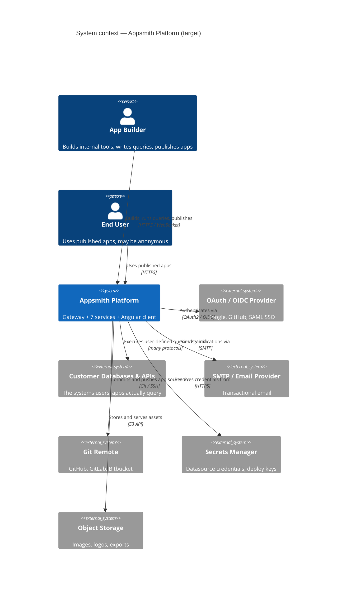
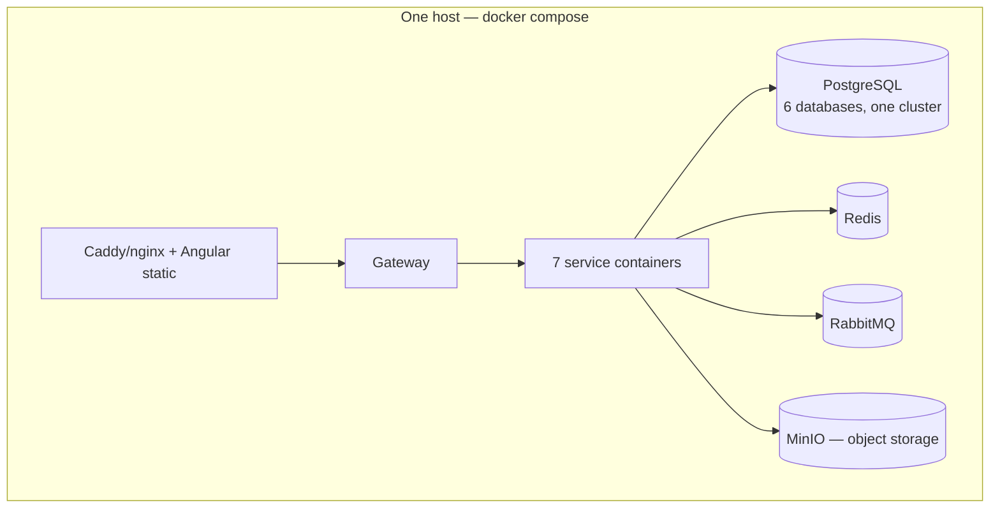

# Target — Topology

[← Index](../README.md) · [← Service Inventory](01-service-inventory.md)

---

## 1. System context

## 2. Container diagram

```mermaid
C4Container
    title Container diagram — Appsmith Platform (target)

    Person(builder, "App Builder")

    System_Boundary(appsmith, "Appsmith Platform") {
        Container(spa, "Angular SPA", "Angular + TypeScript", "Editor and app viewer; hosts the evaluation Web Worker")
        Container(gateway, "API Gateway / BFF", ".NET 10, YARP", "Entry point, auth, rate limit, page-load composition")

        Container(identity, "Identity &amp; Access", ".NET 10", "AuthN, users, workspaces, RBAC truth")
        Container(application, "Application", ".NET 10", "Apps, pages, DSL, actions, themes, publish, fork/import/export")
        Container(datasource, "Datasource", ".NET 10", "Connection configs, plugin catalog replica")
        Container(execrouter, "Query Execution API", ".NET 10, REST", "Routes to connector workers, audits")
        Container(workers, "Connector Workers", ".NET 10, isolated processes", "SQL / NoSQL / HTTP / Cloud / AI pools + per-execution JS worker")
        Container(git, "Git Versioning", ".NET 10 + LibGit2Sharp", "Commit, push, pull, merge, deploy keys")
        Container(realtime, "Realtime Collaboration", ".NET 10, SignalR", "Presence, cursors, version push")
        Container(notify, "Notifications &amp; Telemetry", ".NET 10", "Email with retry + DLQ, alerts, usage")

        ContainerDb(identity_db, "identity_db", "PostgreSQL")
        ContainerDb(app_db, "application_db", "PostgreSQL")
        ContainerDb(ds_db, "datasource_db", "PostgreSQL")
        ContainerDb(exec_db, "execution_db", "PostgreSQL")
        ContainerDb(git_db, "git_db", "PostgreSQL")
        ContainerDb(notify_db, "notifications_db", "PostgreSQL")

        ContainerQueue(broker, "Message Broker", "RabbitMQ + MassTransit")
        ContainerDb(redis, "Redis", "Sessions, git lock, SignalR backplane, caches")
    }

    Rel(builder, spa, "Uses", "HTTPS")
    Rel(spa, gateway, "REST", "HTTPS, cookie session")
    Rel(spa, realtime, "Presence", "WebSocket")

    Rel(gateway, identity, "ValidateSession", "REST")
    Rel(gateway, application, "CRUD + composition", "REST")
    Rel(gateway, datasource, "CRUD", "REST")

    Rel(application, execrouter, "ExecuteAction", "REST sync")
    Rel(application, datasource, "GetDatasourceConfigs", "REST sync")
    Rel(application, git, "Commit / Push / Pull", "REST sync")
    Rel(datasource, execrouter, "TestConnection / GetStructure", "REST sync")
    Rel(execrouter, workers, "Dispatch", "IPC / REST")

    Rel(identity, broker, "Permission + membership events", "AMQP")
    Rel(datasource, broker, "DatasourceConfigChanged", "AMQP")
    Rel(application, broker, "Domain events", "AMQP")
    Rel(broker, application, "Permission events", "AMQP")
    Rel(broker, datasource, "Permission + catalog events", "AMQP")
    Rel(broker, execrouter, "Config changed", "AMQP")
    Rel(broker, notify, "All domain events", "AMQP")
    Rel(broker, realtime, "ApplicationPublished", "AMQP")

    Rel(identity, identity_db, "SQL")
    Rel(application, app_db, "SQL")
    Rel(datasource, ds_db, "SQL")
    Rel(execrouter, exec_db, "SQL")
    Rel(git, git_db, "SQL")
    Rel(notify, notify_db, "SQL")

    Rel(gateway, redis, "Sessions, rate limits")
    Rel(git, redis, "Lock by artifact id")
    Rel(realtime, redis, "Backplane")
```

## 3. Communication design

**Default is async.** Every synchronous edge below has to justify itself with either "a user is waiting for this result" or "an existing behaviour breaks if this becomes eventual." **Every synchronous edge is REST/JSON; every asynchronous edge is an event via RabbitMQ.** There is no third option and no gRPC anywhere in this system — see [ADR-012](../03-execution/04-risks-and-adrs.md) for why, and [.NET 10 Standards §4](04-dotnet-10-standards.md#4-internal-communication--rest) for how a REST call gets the deadline/retry/circuit-breaker behaviour a gRPC call would normally provide.

| From → To | Interaction | Pattern | Why this and not the other |
|---|---|---|---|
| Angular → Gateway | Everything | Sync REST | Browser |
| Angular → Realtime | Presence | WebSocket (SignalR) | Push semantics |
| Gateway → Identity | Validate session | **Sync REST** | Every request needs an auth decision. Cached in Redis with a short TTL to keep this off the hot path |
| Gateway → Application/Datasource | CRUD + composition fan-out | **Sync REST**, parallel | Mirrors `ConsolidatedAPIController`. Per-slice error isolation preserved |
| Application → Query Execution | `POST execution/actions/execute` | **Sync REST** | The user clicked Run and is watching a spinner. An async callback has no meaning here |
| Application → Query Execution | `POST execution/assistant/generate` | **Sync REST** | Same reason — the Ask AI caller is watching a spinner, up to a 180s timeout |
| Datasource → Query Execution | `POST .../test-connection`, `.../structure` | **Sync REST** | Interactive "Test" click; schema tree render |
| Application → Datasource | `POST datasource/configs/batch` (for git export) | **Sync REST** | Needs a point-in-time consistent snapshot at commit time. Low volume — only on commit, not on every read |
| Application → Datasource | `POST datasource/clone` during Fork | **Sync REST + compensation** | Part of the Fork saga; needs a definitive success/fail to decide commit or rollback |
| Application → Git | `POST git/commit`, `/push`, `/pull` | **Sync REST** | User-triggered, needs immediate status |
| Identity → everyone | Permission / membership changed | **Async event** | Avoids a network hop on the *most frequent operation in the system*. Each service keeps a local authorization projection ([D3](../00-orientation/01-executive-summary.md#d3--authorization-is-replicated-not-called)) |
| Identity → Execution | `AIAssistantConfigChanged` | **Async event** | Same reasoning as `DatasourceConfigChanged` — keeps the AI dispatch hot path local |
| Datasource → Execution | `DatasourceConfigChanged` | **Async event** | Keeps the execution hot path local, mirroring today's in-process cache |
| Execution → Datasource | `PluginCatalogUpdated` | **Async event** | Rare, and never blocks a user action |
| Everyone → Notifications | Domain events | **Async event** | Must never add latency or a failure mode to the originating flow |
| Application → Realtime | `ApplicationPublished` | **Async event** | Notifying connected clients must not block publish |

---

## 3a. Service Dependency Matrix

The complete inter-service dependency graph: **every** caller/callee pair in the system, with **when** it fires, **what** data crosses the wire, and **how** (REST endpoint or broker event). This is the reference to update first whenever a new cross-service call is introduced — every other doc's mention of a specific call should trace back to a row here.

### Synchronous (REST) dependencies

| # | Caller → Callee | When (trigger) | What (payload) | How (endpoint) | Response |
|---|---|---|---|---|---|
| S1 | Gateway → Identity | Every incoming request | Session/token | `POST /internal/v1/sessions/validate` | `UserContext` (userId, roleIds) — Redis-cached at the Gateway |
| S2 | Gateway → Identity | Hard revocation (member removed, user deactivated) | userId | `POST /internal/v1/sessions/revoke` | 204 — clears the Gateway's session cache for that user |
| S3 | Gateway → Application | Browser hits any `/api/v1/applications\|pages\|actions\|...` route | Proxied request body, internal JWT swapped in for the cookie | Pass-through REST proxy (YARP) to Application's own public-shaped routes | Proxied response |
| S4 | Gateway → Datasource | Browser hits any `/api/v1/datasources\|plugins` route | Same as S3 | Pass-through REST proxy | Proxied response |
| S5 | Gateway → Identity/Application/Datasource | Editor or viewer boot (`/consolidated-api/edit\|view`) | Application id, page id, workspace id | Parallel `HttpClient` calls, one per service, zipped | Per-slice `ResponseDTO`, independently erroring |
| S6 | Application → Query Execution | User clicks **Run** on a query | Action config, substituted params, view mode | `POST /internal/v1/execution/actions/execute` | `ActionExecutionResult` (body, headers, stats) |
| S7 | Application → Query Execution | User clicks **Ask AI** | Prompt, entity id, editor mode, conversation history | `POST /internal/v1/execution/assistant/generate` | `AssistantResponse` (generated code + provider) |
| S8 | Application → Query Execution | Editor loads the schema tree; CRUD-page generation | Datasource id, environment id | `POST /internal/v1/execution/datasources/structure` | `DatasourceStructure` |
| S9 | Application → Query Execution | A dynamic dropdown is opened in the editor | Datasource/plugin id, trigger key | `POST /internal/v1/execution/datasources/trigger` | Trigger result (list of options) |
| S10 | Datasource → Query Execution | User clicks **Test Connection** | Datasource config (unsaved, from the form) | `POST /internal/v1/execution/datasources/test-connection` | Pass/fail + human-readable reason |
| S11 | Application → Datasource | Git commit — assembling the artifact | List of datasource ids referenced by the application | `POST /internal/v1/datasources/configs/batch` | Configs with secrets stripped (matches export/git sanitisation) |
| S12 | Application → Datasource | Fork saga, step 2 | Source datasource ids, target workspace id | `POST /internal/v1/datasources/clone` | `{oldId → newId}` remap |
| S13 | Application → Datasource | Fork saga compensation, only on failure | New (cloned) datasource ids | `POST /internal/v1/datasources/clone/rollback` | 204 — idempotent, safe to retry |
| S14 | Application → Git | User clicks **Commit** (+ optional push) | Assembled artifact JSON, message, author, `doPush` | `POST /internal/v1/git/commit` | `{sha, status}` |
| S15 | Application → Git | User clicks **Push** (after a commit without push) | Artifact/branch id | `POST /internal/v1/git/push` | Push status |
| S16 | Application → Git | User clicks **Pull** | Artifact/branch id | `POST /internal/v1/git/pull` | Artifact JSON — Application then performs the import (S-nothing; it's a local write) |
| S17 | Application → Git | Branch panel: list/create branch, merge, status, discard | Artifact/branch id, (branch name for create) | `GET/POST /internal/v1/git/branches`, `/merge`, `/status`, `/discard` | Branch list / status / result |
| S18 | Realtime → Identity | A browser opens a SignalR connection | Connection token | `POST /internal/v1/sessions/validate` (same endpoint as S1) | `UserContext`, used to authorize the room join |
| S19 | Any service → Any service (rare) | A projection needs to be rebuilt from scratch | None (or a resume cursor) | Service-specific admin `POST /internal/v1/.../rebuild` | Rebuild status |

### Asynchronous (RabbitMQ) dependencies

| # | Publisher → Consumer(s) | When (trigger) | What (event payload) | How | Effect |
|---|---|---|---|---|---|
| A1 | Identity → Application, Datasource | A grant or role assignment changes | `PermissionGrantChanged` / `RoleAssignmentChanged` (roleId, resourceType, resourceId, permissions) | Broker, outbox-published | Consumer updates its local `authz_grants` projection |
| A2 | Identity → Application, Datasource, Git | Workspace deleted | `WorkspaceDeleted` (workspaceId, sagaId) | Broker | Each consumer cascade-deletes its own data, acknowledges |
| A3 | Identity → Application, Datasource, Gateway | Member removed from a workspace / user deactivated | `WorkspaceMemberRemoved` / `UserDeactivated` | Broker | Projection update; Gateway also does the synchronous S2 fast path |
| A4 | Identity → Query Execution | AI Assistant provider config changes | `AIAssistantConfigChanged` (instanceId, provider, config, secretRef, version) | Broker | Execution refreshes `ai_provider_config_cache` |
| A5 | Datasource → Application | A datasource is created/reconfigured/deleted | `DatasourceCreated` / `DatasourceConfigChanged` / `DatasourceDeleted` | Broker | Application updates its `datasource_summaries` projection |
| A6 | Datasource → Query Execution | A datasource's config changes | `DatasourceConfigChanged` (datasourceId, environmentId, config, secretRef, version) | Broker | Execution refreshes `datasource_config_cache` — the hot-path read for S6 |
| A7 | Query Execution → Datasource | The plugin catalog changes (new connector version) | `PluginCatalogUpdated` (plugins[]) | Broker | Datasource refreshes its read-only `plugins` replica |
| A8 | Application → Identity | Application created/deleted, forked | `ApplicationCreated` / `ApplicationDeleted` / `ApplicationForked` | Broker | Identity seeds/drops `permission_grants` for the new/removed resources |
| A9 | Application → Realtime, Notifications | Application published | `ApplicationPublished` | Broker | Realtime pushes "new version" to connected editors; Notifications logs it |
| A10 | Git → Realtime, Notifications | A commit lands | `CommitCreated` | Broker | Same as A9 |
| A11 | Everyone → Notifications | Every domain event listed above, plus signup/invite/reset | All of the above | Broker | Notifications writes the audit log and/or sends email, independent of the originating flow |

**Reading the matrix**: rows S1–S19 are synchronous REST calls; rows A1–A11 are asynchronous broker events. If you're adding a new cross-service dependency, add a row here first — the endpoint list in [Service Contracts & Events §2](05-service-contracts-and-events.md#2-synchronous-contracts-rest) and the event catalog in [§3](05-service-contracts-and-events.md#3-integration-event-catalog) are the detailed specs this matrix summarises.

**Staffing this in parallel:** each row here is what [Parallel Delivery & Dependency Management](../04-delivery-tracking/03-parallel-delivery-and-dependencies.md) uses to decide whether a downstream feature can start immediately against a mock of this row, or has to wait for the real thing.

### Rules for the synchronous graph

1. **No cycles.** If service A calls B synchronously, B never calls A synchronously. Currently satisfied.
2. **Depth ≤ 2** from the gateway. Gateway → Application → Execution is the deepest chain.
3. **Every sync call has a timeout, a retry policy, and a circuit breaker** (Polly / `Microsoft.Extensions.Resilience`).
4. **Every sync call degrades explicitly.** If Datasource Service is down, the editor still opens — the datasource panel shows an error. Per-slice degradation, exactly as the current consolidated API does it.

## 4. Deployment shape

Two supported profiles, one architecture.

### 4.1 Self-hosted / single-node (matches today's ethos)

One Postgres cluster with **six logically isolated databases**. No service ever has credentials for another's database. Physically consolidating them is a *deployment* choice, not an architectural compromise.

### 4.2 Cloud / Kubernetes

- Each service a Deployment with its own HPA. Connector worker pools scale independently.
- Managed Postgres (separate instances or one instance with separate databases + separate roles), managed Redis, managed AMQP.
- Git Service needs a `ReadWriteMany` volume or per-pod clone-on-demand.
- Angular build on a CDN.

### 4.3 Local development

**.NET Aspire** as the developer inner loop: `dotnet run` on the AppHost project starts all services, Postgres, Redis and RabbitMQ in containers, wires connection strings and service discovery automatically, and gives a dashboard with traces and logs across all eight services. This replaces the current "one giant container with supervisord" developer experience and is a meaningful quality-of-life improvement — see [.NET 10 Standards §9](04-dotnet-10-standards.md).

## 5. Resilience posture

| Failure | Behaviour |
|---|---|
| Identity & Access down | Gateway serves requests with cached session validations until TTL expiry, then 503. No new logins |
| Application Service down | Editor and viewer unavailable. Everything else fine |
| Datasource Service down | Editor opens; the datasource panel degrades. **Query execution still works** (Execution has a local config replica) |
| Query Execution down | Editing works; running queries fails with a clear error. Published apps degrade to static |
| A single connector worker pool down | Only that connector family fails. Others unaffected — this is the point of the split |
| Git Service down | Git operations fail; everything else fine |
| Realtime down | Presence indicators vanish. No functional impact |
| Notifications down | Events queue in the broker. Nothing user-facing breaks |
| Broker down | Sync flows all work. Projections go stale — bounded and monitored. Outbox retains unpublished events |
| Redis down | Sessions lost (users re-login), git operations blocked (lock unavailable), presence degraded |

**Read that table as the design's thesis:** in the current monolith, every one of those rows is "the whole platform is down."

## 6. Observability

- **OpenTelemetry throughout** — already the standard in the current codebase, carried forward rather than replaced.
- **Traces** propagate across HTTP headers (`traceparent`, W3C Trace Context) *and* broker message headers, so a Fork saga is one trace.
- **Correlation id** minted at the gateway, stamped on every log line and every message.
- **Metrics that matter**: per-connector execution latency and error rate (new — invisible today), projection lag per service, saga completion/compensation counts, broker queue depth and DLQ size, gateway composition slice failure rate.
- **The gateway's `responseMeta` envelope is preserved**, so client error handling doesn't change.

---

[← Service Inventory](01-service-inventory.md) · [Next: Database per Service →](03-database-per-service.md)
