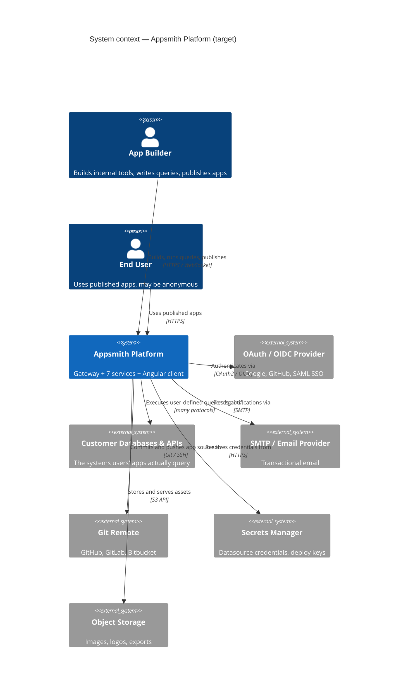
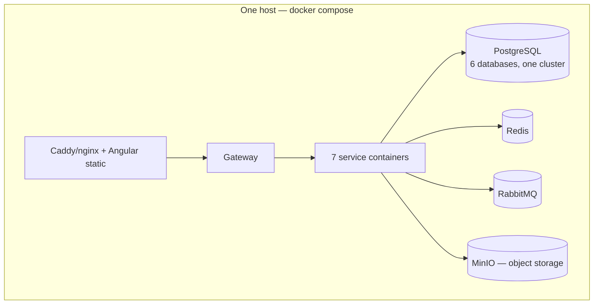

# Target — Topology

[← Index](../README.md) · [← Service Inventory](01-service-inventory.md)

---

## 1. System context

## 2. Container diagram

## 3. Communication design

**Default is async.** Every synchronous edge below has to justify itself with either "a user is waiting for this result" or "an existing behaviour breaks if this becomes eventual."

| From → To | Interaction | Pattern | Why this and not the other |
|---|---|---|---|
| Angular → Gateway | Everything | Sync REST | Browser |
| Angular → Realtime | Presence | WebSocket (SignalR) | Push semantics |
| Gateway → Identity | Validate session | **Sync gRPC** | Every request needs an auth decision. Cached in Redis with a short TTL to keep this off the hot path |
| Gateway → Application/Datasource | CRUD + composition fan-out | **Sync gRPC**, parallel | Mirrors `ConsolidatedAPIController`. Per-slice error isolation preserved |
| Application → Query Execution | `ExecuteAction` | **Sync gRPC** | The user clicked Run and is watching a spinner. An async callback has no meaning here |
| Datasource → Query Execution | `TestConnection`, `GetStructure` | **Sync gRPC** | Interactive "Test" click; schema tree render |
| Application → Datasource | `GetDatasourceConfigs` (for git export) | **Sync gRPC** | Needs a point-in-time consistent snapshot at commit time. Low volume — only on commit, not on every read |
| Application → Datasource | Clone datasources during Fork | **Sync gRPC + compensation** | Part of the Fork saga; needs a definitive success/fail to decide commit or rollback |
| Application → Git | Commit / Push / Pull | **Sync gRPC** | User-triggered, needs immediate status |
| Identity → everyone | Permission / membership changed | **Async event** | Avoids a network hop on the *most frequent operation in the system*. Each service keeps a local authorization projection ([D3](../00-orientation/01-executive-summary.md#d3--authorization-is-replicated-not-called)) |
| Datasource → Execution | `DatasourceConfigChanged` | **Async event** | Keeps the execution hot path local, mirroring today's in-process cache |
| Execution → Datasource | `PluginCatalogUpdated` | **Async event** | Rare, and never blocks a user action |
| Everyone → Notifications | Domain events | **Async event** | Must never add latency or a failure mode to the originating flow |
| Application → Realtime | `ApplicationPublished` | **Async event** | Notifying connected clients must not block publish |

### Rules for the synchronous graph

1. **No cycles.** If service A calls B synchronously, B never calls A synchronously. Currently satisfied.
2. **Depth ≤ 2** from the gateway. Gateway → Application → Execution is the deepest chain.
3. **Every sync call has a timeout, a retry policy, and a circuit breaker** (Polly / `Microsoft.Extensions.Resilience`).
4. **Every sync call degrades explicitly.** If Datasource Service is down, the editor still opens — the datasource panel shows an error. Per-slice degradation, exactly as the current consolidated API does it.

## 4. Deployment shape

Two supported profiles, one architecture.

### 4.1 Self-hosted / single-node (matches today's ethos)

One Postgres cluster with **six logically isolated databases**. No service ever has credentials for another's database. Physically consolidating them is a *deployment* choice, not an architectural compromise.

### 4.2 Cloud / Kubernetes

- Each service a Deployment with its own HPA. Connector worker pools scale independently.
- Managed Postgres (separate instances or one instance with separate databases + separate roles), managed Redis, managed AMQP.
- Git Service needs a `ReadWriteMany` volume or per-pod clone-on-demand.
- Angular build on a CDN.

### 4.3 Local development

**.NET Aspire** as the developer inner loop: `dotnet run` on the AppHost project starts all services, Postgres, Redis and RabbitMQ in containers, wires connection strings and service discovery automatically, and gives a dashboard with traces and logs across all eight services. This replaces the current "one giant container with supervisord" developer experience and is a meaningful quality-of-life improvement — see [.NET 10 Standards §9](04-dotnet-10-standards.md).

## 5. Resilience posture

| Failure | Behaviour |
|---|---|
| Identity & Access down | Gateway serves requests with cached session validations until TTL expiry, then 503. No new logins |
| Application Service down | Editor and viewer unavailable. Everything else fine |
| Datasource Service down | Editor opens; the datasource panel degrades. **Query execution still works** (Execution has a local config replica) |
| Query Execution down | Editing works; running queries fails with a clear error. Published apps degrade to static |
| A single connector worker pool down | Only that connector family fails. Others unaffected — this is the point of the split |
| Git Service down | Git operations fail; everything else fine |
| Realtime down | Presence indicators vanish. No functional impact |
| Notifications down | Events queue in the broker. Nothing user-facing breaks |
| Broker down | Sync flows all work. Projections go stale — bounded and monitored. Outbox retains unpublished events |
| Redis down | Sessions lost (users re-login), git operations blocked (lock unavailable), presence degraded |

**Read that table as the design's thesis:** in the current monolith, every one of those rows is "the whole platform is down."

## 6. Observability

- **OpenTelemetry throughout** — already the standard in the current codebase, carried forward rather than replaced.
- **Traces** propagate across gRPC metadata *and* broker message headers, so a Fork saga is one trace.
- **Correlation id** minted at the gateway, stamped on every log line and every message.
- **Metrics that matter**: per-connector execution latency and error rate (new — invisible today), projection lag per service, saga completion/compensation counts, broker queue depth and DLQ size, gateway composition slice failure rate.
- **The gateway's `responseMeta` envelope is preserved**, so client error handling doesn't change.

---

[← Service Inventory](01-service-inventory.md) · [Next: Database per Service →](03-database-per-service.md)
