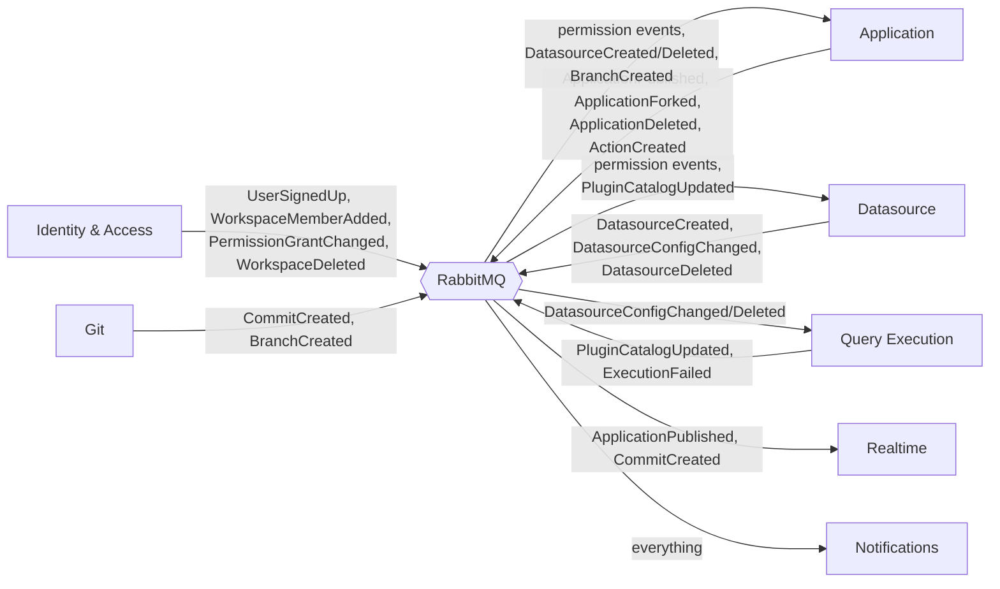

# Target — Service Contracts & Events

[← Index](../README.md) · [← .NET 10 Standards](04-dotnet-10-standards.md)

---

The published interface of each service. **Anything not on this page is internal** and may change freely; anything on it is a contract with versioning obligations.

---

## 1. Contract rules

1. **Contracts live in `*.Contracts` projects** and reference nothing but primitives. Other services reference the `Contracts` package, never the implementation.
2. **`.proto` files are the source of truth** for sync contracts; C# is generated from them.
3. **Events are additive-only.** Adding an optional field is fine. Removing or retyping one means a new `V2` message consumed alongside `V1` until every consumer has migrated.
4. **Every message carries** `MessageId`, `CorrelationId`, `OccurredAt`, and the aggregate id.
5. **No service exposes its entity types.** DTOs are separate records, always.
6. **Every sync call has a deadline.** No exceptions.

---

## 2. Synchronous contracts (gRPC)

### 2.1 Identity & Access

```protobuf
package appsmith.identity.v1;

service SessionValidation {
  // Called by the Gateway on every request. Result cached in Redis, short TTL.
  rpc ValidateSession (ValidateSessionRequest) returns (UserContext);
  rpc RevokeUserSessions (RevokeUserSessionsRequest) returns (RevokeResult);
}

message UserContext {
  string  user_id      = 1;
  string  instance_id  = 2;
  string  email        = 3;
  repeated string role_ids = 4;      // every role the user holds, any scope
  bool    is_anonymous = 5;
  bool    is_instance_admin = 6;
}

service WorkspaceQuery {
  rpc GetWorkspace       (GetWorkspaceRequest)       returns (Workspace);
  rpc ListUserWorkspaces (ListUserWorkspacesRequest) returns (WorkspaceList);
  rpc GetDefaultRoles    (GetDefaultRolesRequest)    returns (RoleList);   // for grant generation on create
}
```

`ValidateSession` is on the path of every request, so: Redis-cached at the gateway with a short TTL, `ListUserWorkspaces` never called on the hot path, and a gateway circuit breaker that serves cached validations if Identity is briefly unavailable.

### 2.2 Query Execution

```protobuf
package appsmith.execution.v1;

service QueryExecution {
  rpc ExecuteAction  (ExecuteActionRequest)  returns (ActionExecutionResult);
  rpc TestConnection (TestConnectionRequest) returns (TestConnectionResult);
  rpc GetStructure   (GetStructureRequest)   returns (DatasourceStructure);
  rpc Trigger        (TriggerRequest)        returns (TriggerResult);
}

message ExecuteActionRequest {
  string action_id        = 1;
  string datasource_id    = 2;
  string environment_id   = 3;
  string plugin_id        = 4;
  bytes  action_config    = 5;    // JSON — the connector-specific ActionConfiguration
  repeated Param params   = 6;    // already substituted values from the client
  bool   view_mode        = 7;
  ExecutionContext ctx    = 8;    // workspace/app/user ids for audit and limits
  int32  timeout_ms       = 9;
}

message ActionExecutionResult {
  bool   is_execution_success = 1;
  bytes  body                 = 2;   // JSON result
  repeated Header headers     = 3;
  string status_code          = 4;
  ErrorInfo error             = 5;
  ExecutionStats stats        = 6;   // duration, bytes, worker pool, connector
  repeated RequestParam request_params = 7;   // what the UI shows in the "Request" tab
}
```

Notes:
- `action_config` and `body` are `bytes` holding JSON deliberately — connector payloads are schemaless and forcing them into protobuf messages would couple this contract to all 25 connectors.
- **`ExecuteAction` is the highest-QPS call in the system.** Streaming variants for large result sets are a deliberate future extension, not v1.
- Blobs in query parameters (today's multipart upload) are handled by the gateway writing to object storage and passing a reference — the execution contract stays clean.

### 2.3 Datasource

```protobuf
package appsmith.datasource.v1;

service DatasourceQuery {
  rpc GetDatasource        (GetDatasourceRequest)        returns (Datasource);
  rpc GetDatasourceConfigs (GetDatasourceConfigsRequest) returns (DatasourceConfigList); // git export
  rpc CloneDatasources     (CloneDatasourcesRequest)     returns (CloneResult);          // Fork saga
  rpc DeleteClonedDatasources (DeleteClonedRequest)      returns (DeleteResult);         // compensation
}
```

`CloneDatasources` and its compensating `DeleteClonedDatasources` exist purely to make the Fork saga correct. Compensation must be **idempotent** — it may be retried.

### 2.4 Git Versioning

```protobuf
package appsmith.git.v1;

service GitOperations {
  rpc Connect      (ConnectRequest)      returns (ConnectResult);
  rpc Commit       (CommitRequest)       returns (CommitResult);      // artifact JSON in
  rpc Push         (PushRequest)         returns (PushResult);
  rpc Pull         (PullRequest)         returns (PullResult);        // artifact JSON out
  rpc ListBranches (ListBranchesRequest) returns (BranchList);
  rpc CreateBranch (CreateBranchRequest) returns (BranchResult);
  rpc Merge        (MergeRequest)        returns (MergeResult);
  rpc GetStatus    (GetStatusRequest)    returns (GitStatus);
  rpc Discard      (DiscardRequest)      returns (DiscardResult);
}

message CommitRequest {
  string artifact_id  = 1;
  string ref_name     = 2;
  bytes  artifact_json = 3;   // serialised by Application Service — Git never builds it
  string message      = 4;
  GitAuthor author    = 5;
  bool   do_push      = 6;
}
```

**The direction of control is the contract.** Application Service assembles `artifact_json`; Git Service writes files and commits. On `Pull`, Git returns `artifact_json` and Application Service performs the import. Git Service never touches application data.

---

## 3. Integration event catalog

All published via RabbitMQ through the transactional outbox. Naming: `<Aggregate><PastTenseVerb>`.

### 3.1 Identity & Access → everyone

| Event | Payload | Consumers | Why |
|---|---|---|---|
| `UserSignedUp` | userId, email, instanceId | Notifications | Welcome email |
| `UserEmailVerificationRequested` | userId, email, token, expiresAt | Notifications | Verification email |
| `UserPasswordResetRequested` | userId, email, token, expiresAt | Notifications | Reset email |
| `UserDeactivated` | userId | Application, Datasource, Notifications | Revoke grants, stop mail |
| `WorkspaceCreated` | workspaceId, instanceId, name, defaultRoleIds | Application, Datasource | Seed local role knowledge |
| `WorkspaceDeleted` | workspaceId, sagaId | Application, Datasource, Git | **Cascade-delete saga** |
| `WorkspaceMemberAdded` | workspaceId, userId, roleId, invitedBy | Notifications | Invite email |
| `WorkspaceMemberRemoved` | workspaceId, userId, roleId | Application, Datasource, Gateway | Update projections; **kill sessions** |
| `RoleAssignmentChanged` | roleId, userId, added/removed | Gateway, Application, Datasource | Invalidate the role-set cache |
| `PermissionGrantChanged` | roleId, resourceType, resourceId, permissions, added/removed | Application, Datasource | **Update `authz_grants` projection** |

### 3.2 Application → everyone

| Event | Payload | Consumers |
|---|---|---|
| `ApplicationCreated` | applicationId, workspaceId, name, createdBy | Identity (seed grants), Notifications |
| `ApplicationPublished` | applicationId, workspaceId, publishedAt, publishedBy | Realtime (push "new version"), Notifications |
| `ApplicationDeleted` | applicationId, workspaceId | Identity (drop grants), Git (disconnect repo), Notifications |
| `ApplicationForked` | sourceId, newId, targetWorkspaceId | Identity, Notifications |
| `ApplicationAccessChanged` | applicationId, isPublic | Identity (anon-role grants) |
| `PageCreated` / `PageDeleted` | pageId, applicationId | Identity (grants) |
| `ActionCreated` / `ActionDeleted` | actionId, applicationId, datasourceId | Identity (grants) |

### 3.3 Datasource → everyone

| Event | Payload | Consumers |
|---|---|---|
| `DatasourceCreated` | datasourceId, workspaceId, pluginId, name | Application (`datasource_summaries`), Identity (grants) |
| `DatasourceConfigChanged` | datasourceId, environmentId, pluginId, config, secretRef, version | **Query Execution** (config cache), Application (summary) |
| `DatasourceDeleted` | datasourceId, workspaceId | Application, Query Execution (evict cache + pool), Identity |

`DatasourceConfigChanged` carries a monotonic `version` so Query Execution can detect out-of-order delivery and discard stale updates.

### 3.4 Query Execution → everyone

| Event | Payload | Consumers |
|---|---|---|
| `PluginCatalogUpdated` | plugins[] with form schemas | Datasource (replica) |
| `ExecutionFailed` | actionId, pluginId, errorClass, workspaceId | Notifications (alerting thresholds) |

### 3.5 Git → everyone

| Event | Payload | Consumers |
|---|---|---|
| `CommitCreated` | artifactId, refName, sha, author | Realtime, Notifications |
| `BranchCreated` / `BranchDeleted` | artifactId, refName | Application (duplicate / delete the entity tree) |
| `AutoCommitCompleted` | artifactId, refName, sha | Realtime |

---

## 4. Event flow diagram



---

## 5. Projection contracts

Three replicated read models. Each has a named owner, a feeding event, and a staleness budget.

| Projection | Lives in | Owner of truth | Fed by | Staleness budget | If stale |
|---|---|---|---|---|---|
| `authz_grants` | Application, Datasource | Identity & Access | `PermissionGrantChanged`, `RoleAssignmentChanged`, `WorkspaceMemberRemoved` | **< 5s p99** | A revoked user may retain access briefly. Hard revocations additionally kill sessions at the gateway |
| `datasource_summaries` | Application | Datasource | `DatasourceCreated/ConfigChanged/Deleted` | < 30s | The editor shows a stale datasource name. Cosmetic |
| `datasource_config_cache` | Query Execution | Datasource | `DatasourceConfigChanged` | **< 5s p99** | A query runs against the previous config. Version field lets Execution detect and refetch synchronously if the version is behind what the caller expects |
| `plugins` | Datasource | Query Execution | `PluginCatalogUpdated` | < 1h | A new connector doesn't appear in the picker yet. Acceptable |

**Every projection is rebuildable from scratch.** Each consumer exposes an admin endpoint to replay from the owner's current state — required, because "the projection drifted" is a *when*, not an *if*.

Projection lag is a first-class metric with an alert. See [Target Topology §6](02-target-topology.md#6-observability).

---

## 6. Versioning & compatibility

| Change | How |
|---|---|
| Add an optional field to an event | Just do it. Consumers ignore unknown fields |
| Add a new event | Just do it. No consumer is required |
| Add a gRPC method | Additive; safe |
| Change a field's type or meaning | New `V2` message type. Publish both until every consumer has migrated, then retire `V1`. Track retirement explicitly |
| Remove a field | Deprecate first, remove after all consumers confirm. Never in one step |
| Remove a gRPC method | Same: deprecate, verify no callers via telemetry, then remove |

`.proto` files are checked into `Contracts` and diffed in CI against the previous release; a breaking change fails the build unless the PR carries an explicit `contract-break` label and an ADR.

---

## 7. Contract ownership

| Contract | Owning team | Consumers to notify on change |
|---|---|---|
| `identity.v1` | Identity | Gateway, Application, Datasource, Realtime |
| `application.v1` | Application | Gateway |
| `datasource.v1` | Datasource | Gateway, Application, Execution |
| `execution.v1` | Execution | Application, Datasource |
| `git.v1` | Git | Application |
| Integration events | Publishing service | All consumers listed in §3 |
| The public `/api/v1` REST surface | Gateway | The Angular client |

---

[← .NET 10 Standards](04-dotnet-10-standards.md) · [Next: Security & AuthZ →](06-security-and-authz.md)
