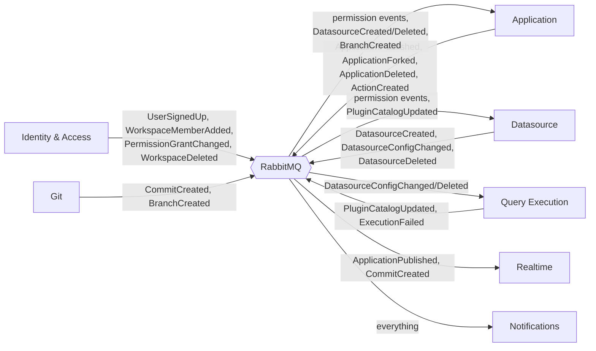

# Target — Service Contracts & Events

[← Index](../README.md) · [← .NET 10 Standards](04-dotnet-10-standards.md)

---

The published interface of each service. **Anything not on this page is internal** and may change freely; anything on it is a contract with versioning obligations.

---

## 1. Contract rules

1. **Every service publishes an OpenAPI 3.1 document** at `/internal/v1/openapi.json`, generated from its Minimal API endpoint definitions (`Microsoft.AspNetCore.OpenApi`) — this is the source of truth for sync contracts, playing the role `.proto` files would in a gRPC design.
2. **Typed C# clients are generated from that OpenAPI document** (via `Microsoft.Extensions.ApiDescription.Client` / Kiota) into each caller's `*.Contracts` project, so callers still get compile-time-checked request/response types rather than hand-typed HTTP calls — REST doesn't give this for free the way protobuf does, so it's generated deliberately.
3. **DTOs are separate records, always.** No service exposes its EF Core entity types over the wire.
4. **Internal endpoints live under `/internal/v1/...`** on each service, distinct from the public `/api/v1/...` surface the Gateway exposes to the browser. They are reachable only from other services — enforced by network policy, not just convention — and authenticated by the internal JWT (§ [Security & AuthZ §1](06-security-and-authz.md#1-authentication-at-the-edge)), never the browser session cookie.
5. **Every sync call has a timeout.** Set on the `HttpClient` and enforced again by `Microsoft.Extensions.Http.Resilience`'s timeout policy. No exceptions.
6. **Events are additive-only.** Adding an optional field is fine. Removing or retyping one means a new `V2` message consumed alongside `V1` until every consumer has migrated.
7. **Every event carries** `MessageId`, `CorrelationId`, `OccurredAt`, and the aggregate id.

**Why REST and not gRPC.** gRPC offers compile-time contract safety and binary-transport performance — real advantages on a path like `ExecuteAction`. But using it internally while the Gateway still speaks REST/JSON to the browser means every service carries a second protocol stack (`Grpc.AspNetCore`/`Grpc.Net.ClientFactory`, `.proto` tooling, code-gen in the build) on top of the REST/OpenAPI stack the Gateway needs anyway, plus a debugging story where an internal call can't be inspected with curl or browser devtools the way the public API can. Standardising on REST/JSON everywhere removes that second stack entirely: one HTTP client story (`HttpClientFactory` + Polly) for every call in the system, edge or internal, and a Gateway YARP proxy that can forward straightforward CRUD calls to a service's own REST surface with no protocol translation. The cost — no protobuf-enforced wire contract — is addressed by generating typed clients from OpenAPI (rule 2) and by consumer-driven contract tests in CI (§6), rather than by a schema compiler. Full reasoning: [ADR-012](../03-execution/04-risks-and-adrs.md).

---

## 2. Synchronous contracts (REST)

Internal calls are plain HTTPS REST/JSON, `POST` for anything that isn't a pure lookup, `GET` for reads. Every endpoint below lives under the callee's own `/internal/v1/` prefix and is never routed through the Gateway's public table.

### 2.1 Identity & Access

| Endpoint | Called by | Purpose |
|---|---|---|
| `POST /internal/v1/sessions/validate` | Gateway, on every request | Resolve a session/token to a `UserContext`. Result cached at the Gateway in Redis, short TTL |
| `POST /internal/v1/sessions/revoke` | Gateway | Immediately invalidate a user's cached sessions — the hard-revocation fast path |
| `GET /internal/v1/workspaces/{id}` | Any service needing workspace metadata | |
| `GET /internal/v1/users/{userId}/workspaces` | Gateway (home screen composition) | |
| `GET /internal/v1/workspaces/{id}/default-roles` | Application, Datasource | Roles to derive `authz_grants` from on resource creation |

```json
// POST /internal/v1/sessions/validate
// Request
{ "token": "opaque-session-or-cookie-token" }

// 200 Response — UserContext
{
  "userId": "b4b8...",
  "instanceId": "1a2b...",
  "email": "dev@acme.com",
  "roleIds": ["role-1", "role-7"],
  "isAnonymous": false,
  "isInstanceAdmin": false
}
```

`ValidateSession` is on the path of every request, so: Redis-cached at the gateway with a short TTL, `ListUserWorkspaces` never called on the hot path, and a gateway circuit breaker (Polly) that serves cached validations if Identity is briefly unavailable.


### 2.2 Query Execution

| Endpoint | Called by | Purpose |
|---|---|---|
| `POST /internal/v1/execution/actions/execute` | Application Service | Run an action against a connector. **The highest-QPS internal call in the system** |
| `POST /internal/v1/execution/datasources/test-connection` | Datasource Service | Interactive "Test" click |
| `POST /internal/v1/execution/datasources/structure` | Datasource, Application | Schema introspection |
| `POST /internal/v1/execution/datasources/trigger` | Application Service | Dynamic dropdown data |
| `POST /internal/v1/execution/assistant/generate` | Application Service | AI Assistant dispatch — routed to `Workers.Ai`, the same pool as the AI connector plugins |

```json
// POST /internal/v1/execution/actions/execute
// Request
{
  "actionId": "act-1", "datasourceId": "ds-1", "environmentId": "env-1", "pluginId": "plugin-postgres",
  "actionConfig": { "...": "connector-specific ActionConfiguration, opaque JSON" },
  "params": [{ "key": "userId", "value": "42" }],
  "viewMode": false,
  "context": { "workspaceId": "ws-1", "applicationId": "app-1", "userId": "u-1" },
  "timeoutMs": 30000
}

// 200 Response — ActionExecutionResult
{
  "isExecutionSuccess": true,
  "body": { "...": "connector result, opaque JSON" },
  "headers": { "Content-Type": ["application/json"] },
  "statusCode": "200",
  "error": null,
  "stats": { "durationMs": 84, "bytes": 2048, "workerPool": "sql", "connector": "postgres" },
  "requestParams": [ { "label": "SQL Query", "value": "SELECT * FROM users WHERE id = $1" } ]
}
```

```json
// POST /internal/v1/execution/assistant/generate
// Request
{
  "provider": "Claude", "prompt": "write a query that joins orders and users",
  "entityId": "act-1", "applicationId": "app-1", "mode": "sql",
  "databaseSchema": "table users(id, email) ...", "conversationHistory": [],
  "userId": "u-1", "timeoutMs": 180000
}

// 200 Response — AssistantResponse
{ "response": "SELECT ... FROM orders JOIN users ...", "provider": "Claude" }
```

Notes:
- `actionConfig` and `body` are opaque JSON deliberately — connector payloads are schemaless and forcing them into a fixed schema would couple this contract to all 25 connectors.
- **`actions/execute` is the highest-QPS call in the system.** A streaming response variant for large result sets (chunked transfer or Server-Sent Events) is a deliberate future extension, not v1.
- Blobs in query parameters (today's multipart upload) are handled by the gateway writing to object storage and passing a reference — the execution contract stays clean JSON.
- **`assistant/generate` is a separate endpoint from `actions/execute` on purpose**, despite sharing `Workers.Ai`: its request shape (prompt, conversation history, editor mode) has nothing to do with an `ActionConfiguration`, and its authorization already happened in Application Service before the call — the router trusts `entityId`/`applicationId` as already-verified context, not as something to re-check. Full behavioural detail: [AI Assistant](../01-current-system/11-ai-assistant.md).
- **Timeouts are enforced on both sides**: the caller's `HttpClient` timeout (30s default for `execute`, 180s for `assistant/generate`, matching today's provider-response timeout) and the worker's own wall-clock limit — a REST call has no built-in deadline propagation the way a gRPC call does, so this has to be set explicitly on every client rather than inherited automatically. See [.NET 10 Standards §4](04-dotnet-10-standards.md#4-internal-communication--rest).


### 2.3 Datasource

| Endpoint | Called by | Purpose |
|---|---|---|
| `GET /internal/v1/datasources/{id}` | Application Service | Read a datasource's identity fields |
| `POST /internal/v1/datasources/configs/batch` | Application Service | Bulk-fetch configs for git export (`{"datasourceIds": [...]}`  → configs with secrets stripped) |
| `POST /internal/v1/datasources/clone` | Application Service | Fork saga: clone a set of datasources into a target workspace |
| `POST /internal/v1/datasources/clone/rollback` | Application Service | Fork saga compensation — **must be idempotent**, it may be retried |

`clone` and its compensating `clone/rollback` exist purely to make the Fork saga correct.

### 2.4 Git Versioning

| Endpoint | Called by | Purpose |
|---|---|---|
| `POST /internal/v1/git/connect` | Application Service | Connect an artifact to a remote |
| `POST /internal/v1/git/commit` | Application Service | Artifact JSON **in** — Git never builds it |
| `POST /internal/v1/git/push` | Application Service | |
| `POST /internal/v1/git/pull` | Application Service | Artifact JSON **out** — Application Service performs the import |
| `GET /internal/v1/git/branches` | Application Service | List branches |
| `POST /internal/v1/git/branches` | Application Service | Create a branch |
| `POST /internal/v1/git/merge` | Application Service | |
| `GET /internal/v1/git/status` | Application Service | |
| `POST /internal/v1/git/discard` | Application Service | |

```json
// POST /internal/v1/git/commit
// Request
{
  "artifactId": "app-1", "refName": "main",
  "artifactJson": { "...": "serialised by Application Service" },
  "message": "Add users table query",
  "author": { "name": "Jane Dev", "email": "jane@acme.com" },
  "doPush": true
}

// 200 Response
{ "sha": "a1b2c3d", "status": "Committed and pushed" }
```

**The direction of control is the contract.** Application Service assembles `artifactJson`; Git Service writes files and commits. On `pull`, Git returns `artifactJson` and Application Service performs the import. Git Service never touches application data.

---

## 3. Integration event catalog

All published via RabbitMQ through the transactional outbox. Naming: `<Aggregate><PastTenseVerb>`.

### 3.1 Identity & Access → everyone

| Event | Payload | Consumers | Why |
|---|---|---|---|
| `UserSignedUp` | userId, email, instanceId | Notifications | Welcome email |
| `UserEmailVerificationRequested` | userId, email, token, expiresAt | Notifications | Verification email |
| `UserPasswordResetRequested` | userId, email, token, expiresAt | Notifications | Reset email |
| `UserDeactivated` | userId | Application, Datasource, Notifications | Revoke grants, stop mail |
| `WorkspaceCreated` | workspaceId, instanceId, name, defaultRoleIds | Application, Datasource | Seed local role knowledge |
| `WorkspaceDeleted` | workspaceId, sagaId | Application, Datasource, Git | **Cascade-delete saga** |
| `WorkspaceMemberAdded` | workspaceId, userId, roleId, invitedBy | Notifications | Invite email |
| `WorkspaceMemberRemoved` | workspaceId, userId, roleId | Application, Datasource, Gateway | Update projections; **kill sessions** |
| `RoleAssignmentChanged` | roleId, userId, added/removed | Gateway, Application, Datasource | Invalidate the role-set cache |
| `PermissionGrantChanged` | roleId, resourceType, resourceId, permissions, added/removed | Application, Datasource | **Update `authz_grants` projection** |
| `AIAssistantConfigChanged` | instanceId, provider, configuration (non-secret), secretRef, isEnabled, version | Query Execution | Keeps `ai_provider_config_cache` warm — same reason `DatasourceConfigChanged` exists, applied to the AI Assistant's config |

### 3.2 Application → everyone

| Event | Payload | Consumers |
|---|---|---|
| `ApplicationCreated` | applicationId, workspaceId, name, createdBy | Identity (seed grants), Notifications |
| `ApplicationPublished` | applicationId, workspaceId, publishedAt, publishedBy | Realtime (push "new version"), Notifications |
| `ApplicationDeleted` | applicationId, workspaceId | Identity (drop grants), Git (disconnect repo), Notifications |
| `ApplicationForked` | sourceId, newId, targetWorkspaceId | Identity, Notifications |
| `ApplicationAccessChanged` | applicationId, isPublic | Identity (anon-role grants) |
| `PageCreated` / `PageDeleted` | pageId, applicationId | Identity (grants) |
| `ActionCreated` / `ActionDeleted` | actionId, applicationId, datasourceId | Identity (grants) |

### 3.3 Datasource → everyone

| Event | Payload | Consumers |
|---|---|---|
| `DatasourceCreated` | datasourceId, workspaceId, pluginId, name | Application (`datasource_summaries`), Identity (grants) |
| `DatasourceConfigChanged` | datasourceId, environmentId, pluginId, config, secretRef, version | **Query Execution** (config cache), Application (summary) |
| `DatasourceDeleted` | datasourceId, workspaceId | Application, Query Execution (evict cache + pool), Identity |

`DatasourceConfigChanged` carries a monotonic `version` so Query Execution can detect out-of-order delivery and discard stale updates.

### 3.4 Query Execution → everyone

| Event | Payload | Consumers |
|---|---|---|
| `PluginCatalogUpdated` | plugins[] with form schemas | Datasource (replica) |
| `ExecutionFailed` | actionId, pluginId, errorClass, workspaceId | Notifications (alerting thresholds) |

### 3.5 Git → everyone

| Event | Payload | Consumers |
|---|---|---|
| `CommitCreated` | artifactId, refName, sha, author | Realtime, Notifications |
| `BranchCreated` / `BranchDeleted` | artifactId, refName | Application (duplicate / delete the entity tree) |
| `AutoCommitCompleted` | artifactId, refName, sha | Realtime |

---

## 4. Event flow diagram



---

## 5. Projection contracts

Four replicated read models. Each has a named owner, a feeding event, and a staleness budget.

| Projection | Lives in | Owner of truth | Fed by | Staleness budget | If stale |
|---|---|---|---|---|---|
| `authz_grants` | Application, Datasource | Identity & Access | `PermissionGrantChanged`, `RoleAssignmentChanged`, `WorkspaceMemberRemoved` | **< 5s p99** | A revoked user may retain access briefly. Hard revocations additionally kill sessions at the gateway |
| `datasource_summaries` | Application | Datasource | `DatasourceCreated/ConfigChanged/Deleted` | < 30s | The editor shows a stale datasource name. Cosmetic |
| `datasource_config_cache` | Query Execution | Datasource | `DatasourceConfigChanged` | **< 5s p99** | A query runs against the previous config. Version field lets Execution detect and refetch synchronously if the version is behind what the caller expects |
| `plugins` | Datasource | Query Execution | `PluginCatalogUpdated` | < 1h | A new connector doesn't appear in the picker yet. Acceptable |
| `ai_provider_config_cache` | Query Execution | Identity & Access | `AIAssistantConfigChanged` | < 30s | An admin's just-changed AI key takes a few seconds to apply. Not user-facing enough to need a synchronous fast path — unlike `authz_grants`, nobody is blocked waiting on it |

**Every projection is rebuildable from scratch.** Each consumer exposes an admin endpoint to replay from the owner's current state — required, because "the projection drifted" is a *when*, not an *if*.

Projection lag is a first-class metric with an alert. See [Target Topology §6](02-target-topology.md#6-observability).

---

## 6. Versioning & compatibility

| Change | How |
|---|---|
| Add an optional field to an event or a REST response | Just do it. Consumers ignore unknown JSON fields, and `System.Text.Json` deserialisation is forward-compatible by default |
| Add a new event | Just do it. No consumer is required |
| Add a new REST endpoint | Additive; safe |
| Change a field's type or meaning | New versioned route (`/internal/v2/...`) or a new event type. Publish both until every consumer has migrated, then retire the old one. Track retirement explicitly |
| Remove a field | Deprecate first, remove after all consumers confirm. Never in one step |
| Remove a REST endpoint | Same: deprecate, verify no callers via telemetry (a REST call has no compiler to catch a missed caller the way a removed gRPC method would), then remove |

Each service's generated OpenAPI document is checked into `Contracts` and diffed in CI against the previous release using an OpenAPI-diff tool (e.g. `oasdiff`); a breaking change (removed/retyped field, removed endpoint, narrowed enum) fails the build unless the PR carries an explicit `contract-break` label and an ADR. This is the REST equivalent of `.proto` diffing — **it has to be run explicitly in CI, since REST gives no compile-time guarantee the way protobuf-generated stubs do.** Consumer-driven contract tests (each caller asserts the shape it actually depends on, run against the callee's real OpenAPI doc in CI) close the remaining gap.

---

## 7. Contract ownership

| Contract | Owning team | Consumers to notify on change |
|---|---|---|
| `identity.v1` | Identity | Gateway, Application, Datasource, Realtime |
| `application.v1` | Application | Gateway |
| `datasource.v1` | Datasource | Gateway, Application, Execution |
| `execution.v1` | Execution | Application, Datasource |
| `git.v1` | Git | Application |
| Integration events | Publishing service | All consumers listed in §3 |
| The public `/api/v1` REST surface | Gateway | The Angular client |

---

[← .NET 10 Standards](04-dotnet-10-standards.md) · [Next: Security & AuthZ →](06-security-and-authz.md)
