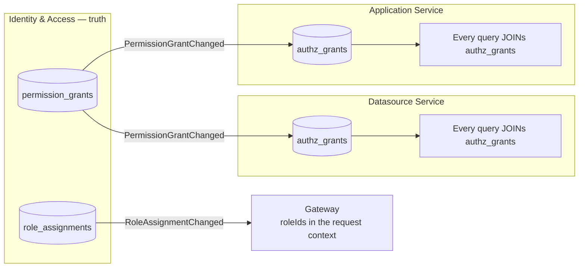
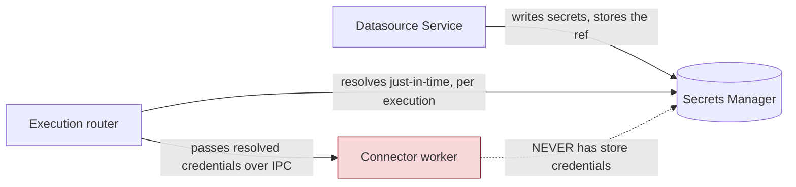

# Target — Security & Authorization

[← Index](../README.md) · [← Service Contracts & Events](05-service-contracts-and-events.md)

---

## 1. Authentication at the edge

**Decision: keep cookie-session semantics; do not move to browser-held bearer tokens.**

Reasoning:
- The current client already relies on a cookie session + CSRF token with `withCredentials: true` on every call. Keeping it means the Angular rewrite doesn't also have to absorb a token-refresh state machine.
- An SPA behind a single gateway origin gains nothing from bearer tokens and loses the `HttpOnly` protection — a token in `localStorage` is readable by any XSS.
- Server-side sessions can be **revoked instantly**, which is the fast path that makes the eventually-consistent authorization model (§3) safe.

```mermaid
sequenceDiagram
    autonumber
    participant B as Browser
    participant GW as API Gateway
    participant R as Redis
    participant IAM as Identity &amp; Access
    participant SVC as Any service

    B->>GW: POST /api/v1/login (credentials + CSRF token)
    GW->>IAM: Authenticate(email, password)
    IAM->>IAM: verify hash (Argon2id), check enabled/verified
    IAM-->>GW: UserContext (userId, instanceId, roleIds[])
    GW->>R: store session, TTL sliding
    GW-->>B: Set-Cookie __Host-session (HttpOnly, Secure, SameSite=Lax)<br/>+ XSRF-TOKEN cookie

    B->>GW: GET /api/v1/applications/... (cookie + X-XSRF-TOKEN)
    GW->>GW: validate CSRF (double-submit)
    GW->>R: look up session
    alt session cached
        R-->>GW: UserContext
    else expired / miss
        GW->>IAM: ValidateSession (gRPC)
        IAM-->>GW: UserContext
        GW->>R: re-cache
    end
    GW->>GW: mint internal JWT (60s TTL): sub, instance, roleIds[], correlationId
    GW->>SVC: gRPC/HTTP + Authorization: Bearer <internal JWT>
    SVC->>SVC: validate signature, populate IUserContext
```

Rules:
- **Services never see the browser cookie.** They trust only the short-lived internal token, validated against a shared JWKS.
- The internal token's TTL is ~60 seconds. It is minted per request, never stored.
- The browser cookie is `__Host-`-prefixed, `HttpOnly`, `Secure`, `SameSite=Lax`; CSRF is double-submit, unchanged from today's model.
- OAuth/OIDC/SAML terminate at **Identity & Access**, not the gateway, so provider config lives with the identity data.

### Anonymous access

Published public applications must work with no session. Preserved exactly as today: an **anonymous role** exists per instance, and making an app public writes grants for that role. The gateway allows unauthenticated requests through to a fixed allow-list of routes ([API Catalog](../01-current-system/10-api-endpoint-catalog.md#anonymous-accessible-routes)) with `roleIds = [anonymousRoleId]`. **Authorization is not bypassed — it is evaluated with the anonymous role.**

---

## 2. Authorization model

Identity & Access is the **source of truth**: `roles`, `role_assignments`, `permission_grants`.

Every service that owns protected resources keeps a **local `authz_grants` projection** and applies it as a **join predicate on every query** — preserving today's zero-extra-round-trip property.



Two halves, deliberately split:

| Half | Where it travels | Refresh |
|---|---|---|
| **Which roles does this user hold?** | In the request context, minted by the gateway | Redis-cached, invalidated on `RoleAssignmentChanged` |
| **Which roles may do what to this resource?** | `authz_grants`, local to the owning service | Event-fed projection from `PermissionGrantChanged` |

Neither half requires a call to Identity & Access on the hot path.

### The permission hierarchy

The [policy graph](../01-current-system/04-permissions-and-acl.md#4-the-policy-graph-how-permissions-cascade) is ported into `BuildingBlocks.Authorization` as a **pure function** — no database, no I/O, fully unit-testable:

```csharp
public static class PermissionGraph
{
    // Workspace-level grant → grants implied on child resources
    public static IReadOnlySet<Permission> CascadeToChild(ResourceType parent, ResourceType child, Permission granted);

    // Same resource: holding X implies holding Y (Manage ⇒ Read, Manage ⇒ Execute …)
    public static IReadOnlySet<Permission> Implied(Permission granted);
}
```

Applied at two moments:
1. **On resource creation** — the owning service writes `authz_grants` rows derived from the workspace's roles.
2. **On `PermissionGrantChanged`** — the projection updater recomputes affected rows.

Because it's a pure function shared by every service, drift between services is a compile-time impossibility rather than a runtime hazard. **Drift between services disagreeing about access is a security bug**, and this is how we prevent it.

### Query shape

```csharp
// Application.Infrastructure — the only way resources are read
public IQueryable<T> Authorized<T>(IQueryable<T> source, Permission permission)
    where T : IProtectedResource
    => from resource in source
       join grant in _db.AuthzGrants
         on new { Type = resource.ResourceType, Id = resource.Id, permission }
         equals new { grant.ResourceType, grant.ResourceId, grant.Permission }
       where _user.RoleIds.Contains(grant.RoleId)
       select resource;
```

Zero rows → **404, never 403**, preserving today's no-existence-leak behaviour. This is enforced centrally, not per handler.

---

## 3. The eventual-consistency window — and how it's contained

**Honest statement of the risk:** between a grant being revoked in Identity & Access and every service's projection catching up, a user may still be able to act. Budget: **p99 < 5 seconds**, measured and alerted.

Mitigations, layered:

| Revocation type | Handling |
|---|---|
| **User removed from workspace / deactivated** | Gateway **immediately invalidates that user's sessions** in Redis on `WorkspaceMemberRemoved` / `UserDeactivated`. Synchronous fast path — the user is logged out before the projection catches up |
| **Role assignment changed** | Gateway invalidates the cached role set for that user. The next request carries the new `roleIds` — so a removed role stops matching `authz_grants` immediately, even before projections update |
| **Grant changed on a role** (rarer: changing what a role can do) | Projection-dependent. This is the genuine window, and it applies to a role definition change, not to removing a person's access |
| **Application made private** | `ApplicationAccessChanged` removes anonymous grants. Additionally, the gateway drops the route from its public allow-list cache immediately |

The important observation: **the two most common revocations — removing a person from a workspace, and changing their role — are both handled on the synchronous fast path** via session and role-set invalidation. The eventually-consistent path only carries the rarer "redefine what this role can do" case.

For comparison, today's system has a Redis `permissionGroupsForUser` cache with the *same* staleness characteristic. **The window is not new; it is now measured.**

---

## 4. Secrets

**No secret material lives in any service database.**

| Secret | Today | Target |
|---|---|---|
| Datasource credentials | `@Encrypted` fields in Mongo, symmetric key from env | `secret_ref` in `datasource_storages` → secrets manager |
| Git deploy keys (SSH private) | Encrypted in Mongo | `private_key_ref` in `git_deploy_keys` → secrets manager |
| OAuth client secrets | Env / Mongo | Secrets manager |
| User passwords | bcrypt in Mongo | **Argon2id** in `identity_db` (an upgrade; bcrypt hashes are migrated lazily on next login) |
| Signing keys (internal JWT) | n/a | Secrets manager, rotated |

Behind one abstraction so the provider is a deployment choice:

```csharp
public interface ISecretStore
{
    Task<SecretValue> GetAsync(string reference, CancellationToken ct);
    Task<string>      SetAsync(string path, SecretValue value, CancellationToken ct); // returns a reference
    Task              DeleteAsync(string reference, CancellationToken ct);
}
```

Implementations: HashiCorp Vault, AWS Secrets Manager, Azure Key Vault, and a **Postgres-backed envelope-encryption implementation for the self-hosted single-node profile** (so the lean docker-compose deployment doesn't require an extra dependency).

### Who can resolve a secret



**The connector worker — the process running untrusted code — has no access to the secrets manager.** It receives only the resolved credentials for the one execution it is performing. This directly fixes today's situation, where the decryption key lives in the same JVM as all 25 plugins.

Key rotation is a first-class operation: secrets are versioned, and rotating one does not require touching any service's database.

---

## 5. Plugin / execution sandboxing

The largest security improvement in the programme. Today: 25 connectors, in-process, no limits ([Plugin Engine §4](../01-current-system/06-plugin-execution-engine.md#4-loading-pf4j-in-process)).

| Control | Implementation |
|---|---|
| **Process isolation** | Connector workers are separate containers, not `AssemblyLoadContext` |
| **CPU / memory limits** | Container-level (cgroups). A runaway connector is throttled or OOM-killed without touching anything else |
| **Wall-clock timeout** | Enforced by the router *and* the worker. Deadline propagated from the gRPC call |
| **Network egress policy** | Workers may reach customer systems; **workers may not reach internal services or the secrets manager**. Enforced with network policies |
| **No filesystem persistence** | Workers run read-only rootfs with a tmpfs scratch |
| **JS worker is per-execution** | Arbitrary user code gets a fresh, short-lived worker, torn down after each call. No state survives between users |
| **Jint sandbox for JS** | Constrained global object, no `fs`/`net`/`process`, memory and statement-count limits |
| **Result size caps** | Enforced at the router; a query returning 2GB fails cleanly instead of OOMing the platform |
| **Per-workspace concurrency limits** | One workspace cannot starve the worker pool |

### SSRF

Users legitimately configure arbitrary URLs — that is the product. So the control is not a blanket block but a policy:
- A configurable deny-list for link-local, loopback and private ranges (default-on for cloud deployments, default-off for self-hosted where reaching internal systems *is* the use case).
- DNS re-resolution before connect, to defeat rebinding.
- Egress from the worker network segment only, so an SSRF cannot reach the platform's own services.

---

## 6. Multi-tenancy & isolation

`Workspace` is the isolation boundary. Enforced in two layers:

1. **Application-level** — every query filters on `workspace_id`, and `authz_grants` is workspace-scoped by construction.
2. **Database-level (defence in depth)** — Postgres **Row-Level Security** keyed on a `app.workspace_id` session variable set by the request pipeline:

```sql
ALTER TABLE applications ENABLE ROW LEVEL SECURITY;
CREATE POLICY applications_workspace_isolation ON applications
    USING (workspace_id = current_setting('app.workspace_id', true)::uuid);
```

RLS catches the "someone forgot a `WHERE`" class of bug, which is exactly the bug class that costs the most when it happens.

**This closes a real current gap:** `NewPage` today has no `workspaceId` at all and scopes only through `applicationId`. In the target, Page lives inside Application Service where workspace scope is enforced once at the application row.

---

## 7. Audit

Today there is **no audit trail** — nothing records who changed a permission, a datasource, or an instance setting.

The event stream provides it by construction. Notifications & Telemetry consumes every domain event and writes an append-only audit log:

| Recorded | From |
|---|---|
| Permission grants and revocations | `PermissionGrantChanged`, `RoleAssignmentChanged` |
| Workspace membership changes | `WorkspaceMemberAdded/Removed` |
| Datasource creation and config change | `DatasourceCreated`, `DatasourceConfigChanged` (metadata only, never values) |
| Application publish / delete / fork | Application events |
| Query execution | `execution_audit` in `execution_db` — who ran what, against which datasource, when, with what outcome |
| Git operations | `CommitCreated`, `BranchCreated` |

`execution_audit` is the one that matters most for a low-code platform: **for the first time it is possible to answer "who ran a query against the production customer database last Tuesday."**

---

## 8. Security checklist per service

Every service must, before it ships:

- [ ] Validate the internal JWT; never read `HttpContext` outside the shared middleware
- [ ] Apply `Authorized<T>()` to **every** protected-resource read and write
- [ ] Return 404, not 403, for authorization failures
- [ ] Own exactly one database, with a role that has no grants elsewhere
- [ ] Store zero secret material; hold references only
- [ ] Enable RLS on every workspace-scoped table
- [ ] Publish domain events through the transactional outbox, never inline
- [ ] Make every consumer idempotent (inbox table)
- [ ] Expose `/health/live` and `/health/ready`
- [ ] Emit OpenTelemetry traces with the correlation id propagated
- [ ] Have an architecture test enforcing the layer rules
- [ ] Have a projection-rebuild admin endpoint if it holds a projection

---

[← Service Contracts & Events](05-service-contracts-and-events.md) · [Next: Target Golden Paths →](07-target-golden-paths.md)
