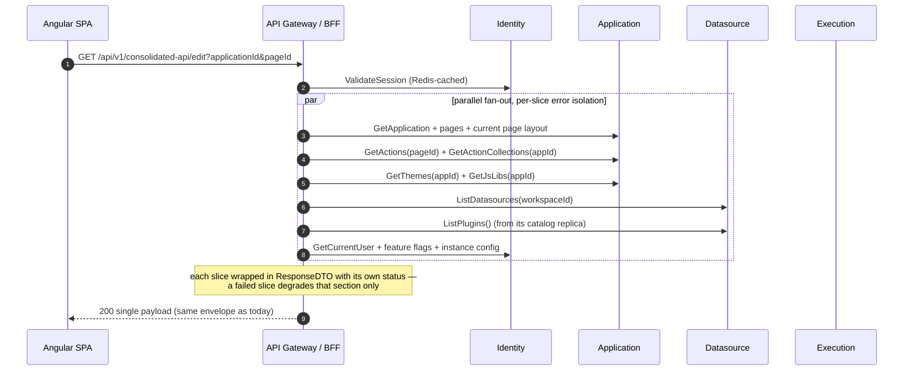
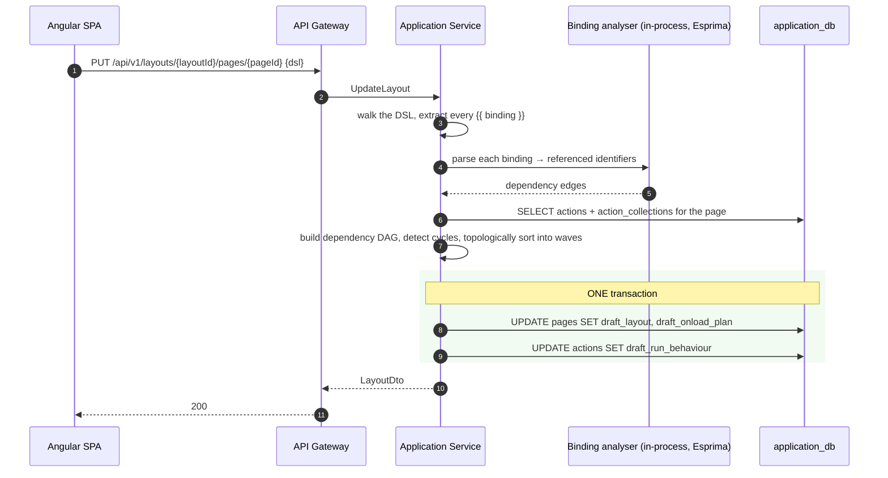
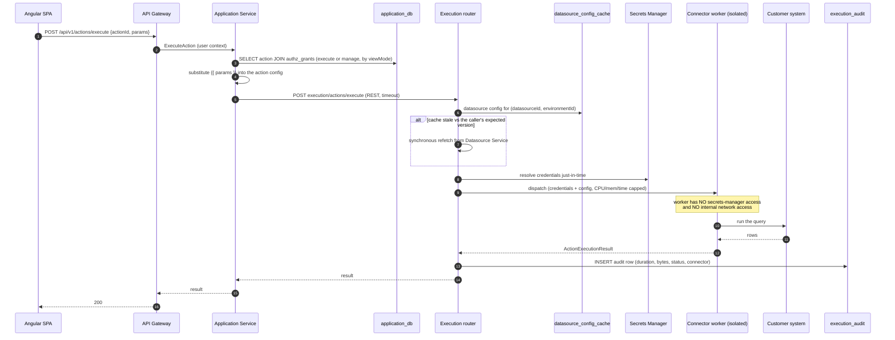
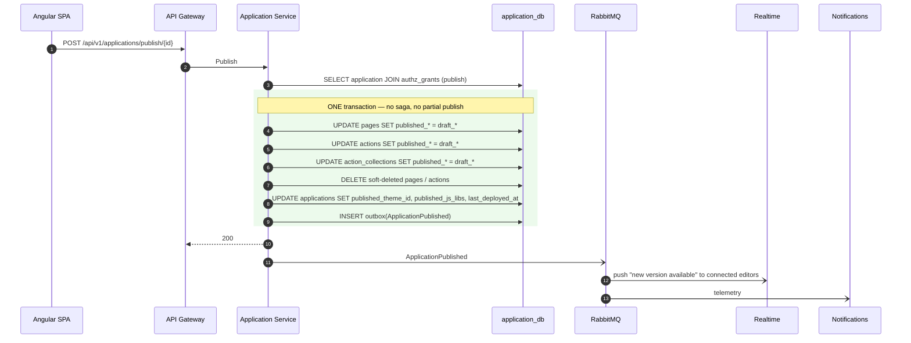
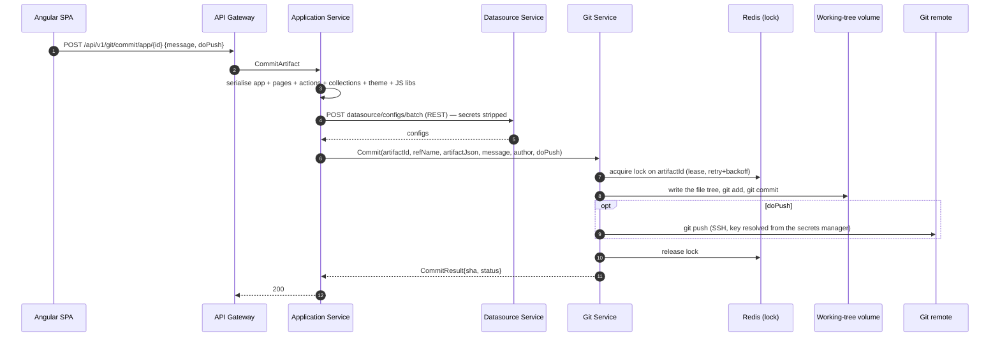
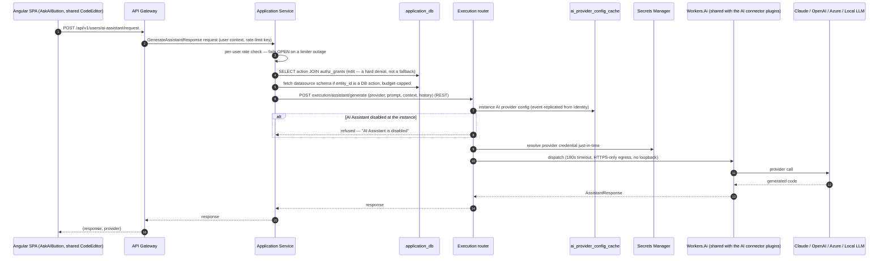

# Target — Golden Paths

[← Index](../README.md) · [← Security & AuthZ](06-security-and-authz.md)

---

The same flows as [Current Golden Paths](../01-current-system/05-golden-paths.md), redrawn across services. Read them side by side — the delta is the work.

**Summary of what changes structurally:**

| Flow | Today | Target | Net effect |
|---|---|---|---|
| Signup / login / invite | One service | One service (Identity) | Unchanged |
| Create workspace | One service | One service (Identity) | Unchanged |
| Create application | One service | One service (Application) | Unchanged |
| Editor boot | In-process fan-out | **Gateway fan-out** across 3 services | Same shape, network hops added |
| Save layout | In-process + HTTP to RTS | **Fully in-process** (Application) | **Simpler** — one fewer hop |
| Run a query | In-process | **Application → Execution (REST) → isolated worker** | Hop added, isolation gained |
| Publish | 5 unguarded writes | **1 database transaction** | **Strictly better** |
| Fork / Import | In-process, no rollback | **Saga with compensation** | More machinery, actually correct |
| Git commit | In-process | **Application → Git (REST)** | Hop added, clean boundary |
| Workspace delete | In-process cascade | **Saga across 4 services** | The genuinely hard new flow |
| Ask AI | In-process call to the provider | **Application → Execution's `Workers.Ai` pool** | Hop added, same isolation the AI connector plugins already get |

---

## 1. Login

```mermaid
sequenceDiagram
    autonumber
    participant B as Angular SPA
    participant GW as API Gateway
    participant IAM as Identity &amp; Access
    participant PG as identity_db
    participant R as Redis
    participant BR as RabbitMQ
    participant NT as Notifications

    B->>GW: POST /api/v1/login {email, password} + CSRF
    GW->>IAM: Authenticate (REST)
    IAM->>PG: SELECT user by (instance_id, email)
    IAM->>IAM: verify Argon2id, check enabled + verified
    IAM->>PG: SELECT role_ids for user
    IAM->>PG: UPDATE last_login_at + outbox(UserLoggedIn)
    IAM-->>GW: UserContext{userId, instanceId, roleIds[]}
    GW->>R: store session (sliding TTL)
    GW-->>B: 200 + Set-Cookie __Host-session, XSRF-TOKEN
    IAM-)BR: UserLoggedIn (from outbox)
    BR-)NT: telemetry
```

**Change from today:** login returns 200 with a body instead of a 302 redirect, and the client no longer needs a follow-up `/users/me`. That is a deliberate client-contract improvement made possible by the rewrite.

## 2. Create a workspace

```mermaid
sequenceDiagram
    autonumber
    participant B as Angular SPA
    participant GW as API Gateway
    participant IAM as Identity &amp; Access
    participant PG as identity_db
    participant BR as RabbitMQ

    B->>GW: POST /api/v1/workspaces {name}
    GW->>IAM: CreateWorkspace (REST, user context)
    rect rgba(200,240,200,0.25)
    note over IAM,PG: ONE local transaction
    IAM->>PG: INSERT workspaces
    IAM->>PG: INSERT roles ×3 (Administrator / Developer / App Viewer)
    IAM->>PG: INSERT permission_grants for each role
    IAM->>PG: INSERT workspace_members (creator)
    IAM->>PG: INSERT role_assignments (creator → Administrator)
    IAM->>PG: INSERT outbox(WorkspaceCreated)
    end
    IAM-->>GW: Workspace
    GW-->>B: 201
    IAM-)BR: WorkspaceCreated
    BR-)IAM: (Application &amp; Datasource seed local role knowledge)
```

**Unchanged in substance** — all this data belongs to one service, so it stays one transaction. This is the payoff for merging the HLD's separate Auth/User/Workspace services.

## 3. Open the editor (BFF composition)



**Contract preserved exactly.** The client sees the same payload shape. What changed is that the fan-out crosses process boundaries — so each call gets a deadline, a circuit breaker, and its own error slot, which is what the current implementation already does in-process.

## 4. Save the layout (and recompute the on-load plan)



**This flow gets simpler, not harder.** Today it makes an HTTP round trip to the Node RTS service because the Java server can't parse JavaScript. In .NET, Esprima parses the bindings in-process — one fewer network hop and one fewer deployable on the critical path of every canvas edit.

The `layoutOnLoadActions` output format is unchanged: `List<Set<DslExecutableDTO>>`, outer = waves, inner = parallelisable within a wave. **It is a client contract.**

## 5. Run a query



Changes worth noting:
- **One network hop added** (Application → Execution). Justified by process isolation, enforceable limits, and per-connector scaling.
- **Credentials are resolved per execution** and never reach a process running untrusted code.
- **Every execution is audited** — completely new capability.
- **Blobs** in query params are written to object storage by the gateway; the execution contract carries references, so the multipart complexity stays at the edge.

## 6. Publish — now atomic



**This is the flow that gets strictly better.** Today it is five independent write sequences with no transaction, and a mid-sequence failure leaves an app half-published. Keeping pages, actions, collections and themes in one service makes it one `BEGIN … COMMIT`.

## 7. Fork an application — a saga

The first genuinely new machinery. Orchestrated by Application Service (a fork has one owner and a definitive success/fail the user is waiting on).

```mermaid
sequenceDiagram
    autonumber
    participant B as Angular SPA
    participant GW as API Gateway
    participant APP as Application Service (orchestrator)
    participant PG as application_db
    participant DS as Datasource Service
    participant IAM as Identity &amp; Access
    participant BR as RabbitMQ

    B->>GW: POST /api/v1/applications/{id}/fork/{targetWorkspaceId}
    GW->>APP: ForkApplication
    APP->>PG: verify read on source, create:applications on target workspace

    rect rgba(200,240,200,0.25)
    note over APP,PG: Step 1 — local transaction
    APP->>PG: INSERT application, pages, actions, collections, themes<br/>with fresh ids and a remap table
    end

    APP->>DS: POST datasource/clone (sourceIds[], targetWorkspaceId) (REST)
    alt clone succeeded
        DS-->>APP: {oldId → newId}
        rect rgba(200,240,200,0.25)
        note over APP,PG: Step 2 — local transaction
        APP->>PG: UPDATE actions SET datasource_id = remapped
        APP->>PG: INSERT outbox(ApplicationForked)
        end
        APP-->>GW: 201 new application
        APP-)BR: ApplicationForked
        BR-)IAM: seed default grants on the new resources
    else clone failed
        rect rgba(255,200,200,0.3)
        note over APP,DS: COMPENSATION
        APP->>DS: DeleteClonedDatasources(newIds[]) — idempotent
        APP->>PG: DELETE the new application tree
        end
        APP-->>GW: 502 with a clear failure reason
    end
```

Import follows the same shape (the source is uploaded JSON rather than an existing application). Both are **orchestrated, synchronous sagas with compensation** — not long-running async workflows — because the user is waiting for a definitive outcome, exactly as today.

## 8. Git commit — clean boundary



**The Redis lock keyed on the artifact id is carried over unchanged** — it already works and it is the right granularity. Git Service never touches `application_db`; it receives a serialised artifact and returns a status. On `Pull`, the direction reverses: Git returns artifact JSON and Application Service performs the import.

## 9. Delete a workspace — the hard saga

The one flow that is genuinely harder than today, and the reason a saga framework is in the stack at all.

```mermaid
sequenceDiagram
    autonumber
    participant B as Angular SPA
    participant GW as API Gateway
    participant IAM as Identity &amp; Access (orchestrator)
    participant BR as RabbitMQ
    participant APP as Application
    participant DS as Datasource
    participant GIT as Git

    B->>GW: DELETE /api/v1/workspaces/{id}
    GW->>IAM: DeleteWorkspace
    IAM->>IAM: mark workspace deleting, start saga
    IAM-)BR: WorkspaceDeleted{workspaceId, sagaId}

    par each owner cascades its own data
        BR-)APP: WorkspaceDeleted
        APP->>APP: soft-delete applications, pages, actions, themes
        APP-)BR: WorkspaceResourcesDeleted{sagaId, service:"application"}
    and
        BR-)DS: WorkspaceDeleted
        DS->>DS: delete datasources + storages; release secret refs
        DS-)BR: WorkspaceResourcesDeleted{sagaId, service:"datasource"}
    and
        BR-)GIT: WorkspaceDeleted
        GIT->>GIT: disconnect repos, delete working trees + deploy keys
        GIT-)BR: WorkspaceResourcesDeleted{sagaId, service:"git"}
    end

    BR-)IAM: all three acknowledgements
    IAM->>IAM: finalise — delete workspace, roles, memberships, grants
    Note over IAM: timeout → alert + a resumable admin retry.<br/>Never silently half-deleted.
```

Design notes:
- **Choreographed, not orchestrated with synchronous calls** — deletion has no user waiting on sub-second latency, and each service knows best how to clean up its own data.
- The saga has a **timeout and an operator-visible state**. A stuck deletion alerts; it does not silently leave orphans.
- Every participant's cleanup is **idempotent** — the event may be redelivered.
- The workspace is marked `deleting` immediately, so it disappears from the UI at once even though cleanup is in flight.

## 10. Permission change propagation

```mermaid
sequenceDiagram
    autonumber
    participant Admin as Admin (SPA)
    participant GW as API Gateway
    participant IAM as Identity &amp; Access
    participant PG as identity_db
    participant R as Redis
    participant BR as RabbitMQ
    participant APP as Application
    participant DS as Datasource

    Admin->>GW: PUT /workspaces/{id}/permissionGroup {userId, roleId}
    GW->>IAM: ChangeRoleAssignment
    IAM->>PG: UPDATE role_assignments + outbox(RoleAssignmentChanged)
    IAM-->>GW: 200
    IAM-)BR: RoleAssignmentChanged

    par fast path — synchronous effect
        BR-)GW: invalidate cached role set for that user
        Note over GW: the user's NEXT request carries the new roleIds —<br/>a removed role stops matching authz_grants immediately
    and eventual path — only for role-definition changes
        BR-)APP: PermissionGrantChanged → update authz_grants projection
        BR-)DS:  PermissionGrantChanged → update authz_grants projection
    end
```

The distinction matters: **changing who holds a role takes effect on the user's next request** (via the role-set cache). Only changing *what a role can do* goes through the eventually-consistent projection. Hard revocations (`WorkspaceMemberRemoved`, `UserDeactivated`) additionally kill the user's sessions at the gateway. Detail: [Security & AuthZ §3](06-security-and-authz.md#3-the-eventual-consistency-window--and-how-its-contained).

## 11. Ask AI in the editor



Changes worth noting:
- **Authorization moves to Application Service but keeps the exact same rule**: edit rights on the entity being worked on, checked as a hard denial rather than degrading gracefully — the one place in this flow that must *not* fail open.
- **Dispatch reuses `Workers.Ai`**, the same isolated worker pool already designed for the `openai`/`anthropic`/`googleai` connector plugins ([Service Inventory §4](01-service-inventory.md)) — one more network hop than today's in-process call, in exchange for the same process isolation, timeout enforcement and egress policy every other third-party call gets.
- **Config resolution is a local cache read**, not a call back to Identity & Access — mirrors `datasource_config_cache` exactly, for the same reason: don't add a network hop to a path that's already paying for one third-party call.
- **The credential never reaches Application Service or the Execution router's own memory beyond the call** — resolved by the worker, just-in-time, matching the connector-worker secrets model in [Security & AuthZ §4](06-security-and-authz.md#4-secrets).

Full current-system behaviour this preserves: [AI Assistant](../01-current-system/11-ai-assistant.md). Design rationale for keeping this out of a dedicated service: [ADR-011](../03-execution/04-risks-and-adrs.md).

---

## 12. Saga inventory

Exactly three. Anything not on this list must not be built as a saga.

| Saga | Orchestrator | Style | Participants | Compensation |
|---|---|---|---|---|
| **Fork / Clone** | Application | Orchestrated, sync | Application, Datasource, (Identity async) | Delete cloned datasources + the new application tree |
| **Import** | Application | Orchestrated, sync | Application, Datasource, (Identity async) | Same |
| **Workspace deletion** | Identity & Access | Choreographed, async | Application, Datasource, Git | None — deletion is idempotent and retried until complete |

**Explicitly not sagas:** Publish (one local transaction, by design), application deletion (one local transaction — all its data is in Application Service), page/action CRUD, query execution.

---

[← Security & AuthZ](06-security-and-authz.md) · [Next: Angular Frontend →](08-angular-frontend.md)
