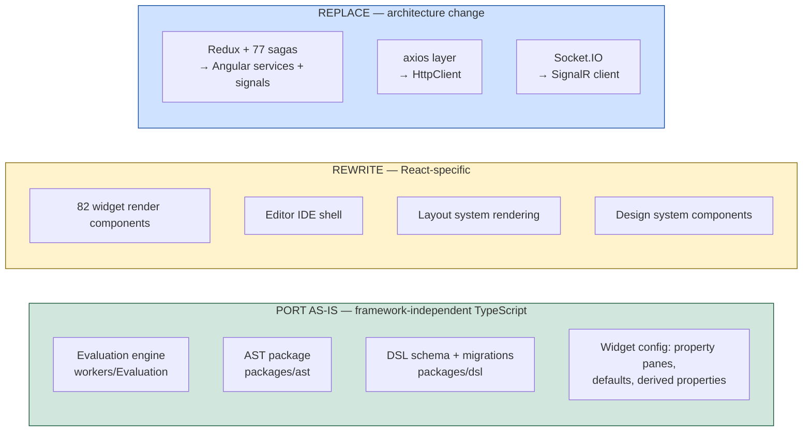

# Target — Angular Frontend

[← Index](../README.md) · [← Target Golden Paths](07-target-golden-paths.md)

---

> **The client is ~708,000 LOC — 4× the backend.** This is the largest single body of work in the programme. Plan it as a parallel workstream starting in Phase B, not as a phase at the end.

---

## 1. The three-way split

Not everything in `app/client` is equal. Sort every file into one of three buckets before estimating anything.



### Port as-is — roughly 8% of the code, ~40% of the intellectual value

`src/workers/Evaluation/`, `packages/ast`, `packages/dsl`, and every widget's `config/` directory are **plain TypeScript with no React dependency**. The evaluation engine communicates with the app over `postMessage` with plain JSON.

**Copy these files. Do not rewrite them.** The evaluation engine is a reactive spreadsheet dependency-graph evaluator with years of accumulated correctness work — cycle detection, incremental re-evaluation, the sandboxed global API, evaluation-version compatibility. Rewriting it would be the single most likely way to sink this project.

In Angular it is wrapped in one service:

```typescript
@Injectable({ providedIn: 'root' })
export class EvaluationService {
  private worker = new Worker(new URL('./evaluation.worker', import.meta.url), { type: 'module' });
  readonly dataTree = signal<DataTree>({});
  readonly evalErrors = signal<EvalError[]>([]);

  evaluate(dsl: DSLNode, actions: ActionEntity[], jsObjects: JSCollection[]): void {
    this.worker.postMessage({ type: 'EVAL_TREE', payload: { dsl, actions, jsObjects } });
  }
}
```

### Rewrite — roughly 60% of the code

Widget rendering, the editor IDE, layout rendering, the design system. This is real work, but it is *ordinary* work: known inputs (the DSL), known outputs (rendered DOM), and a reference implementation to compare against.

**The AI Assistant's client surfaces belong in this bucket, not the "port as-is" one** — easy to overlook because they're small individually, but real: an "Ask AI" button embedded in the *shared* code-editor component (so it's reachable from every query editor, JS editor and binding field, not a standalone panel), a dedicated AI tab inside the Custom Widget Builder, and an instance-admin settings screen for the BYOK provider configuration. None of it is framework-independent the way the evaluation engine is — it's ordinary React UI wired to a Redux slice, all of which gets rewritten against the target contract in [AI Assistant](../01-current-system/11-ai-assistant.md#3-the-request-flow). Sequence it alongside the shared code-editor component in Stage C4 (§5) — it has no reason to land earlier, since it depends on the editor shell existing first.

### Replace — roughly 12% of the code

Redux + 77 sagas become Angular services with signals. **Do not port saga-by-saga.** Sagas exist to sequence async side effects in a Redux world; Angular services with `async`/`await` and signals express the same intent in a fraction of the code. Porting them one-to-one would import an architecture that doesn't belong.

---

## 2. Angular architecture

```
client/appsmith-web/
├── projects/
│   ├── appsmith/                     the application
│   │   ├── src/app/
│   │   │   ├── core/                 auth, http interceptors, error handling, config
│   │   │   ├── shared/               UI primitives, pipes, directives
│   │   │   ├── features/
│   │   │   │   ├── auth/             login, signup, reset, verify
│   │   │   │   ├── home/             workspace + application list
│   │   │   │   ├── editor/           the IDE — the big one
│   │   │   │   │   ├── canvas/       widget rendering host
│   │   │   │   │   ├── property-pane/
│   │   │   │   │   ├── entity-explorer/
│   │   │   │   │   ├── query-editor/
│   │   │   │   │   ├── js-editor/
│   │   │   │   │   └── debugger/
│   │   │   │   ├── viewer/           published-app runtime
│   │   │   │   ├── datasources/
│   │   │   │   ├── git/
│   │   │   │   └── settings/
│   │   │   └── state/                signal stores per domain
│   ├── widgets/                      one library, 82 widget components
│   ├── evaluation/                   PORTED worker + AST + DSL packages
│   └── ui-kit/                       the design system
```

Decisions:

| Decision | Choice | Why |
|---|---|---|
| Components | **Standalone, no NgModules** | The modern Angular default; simpler lazy loading |
| Change detection | **Zoneless + signals** | The canvas re-renders on nearly every keystroke. Zone.js change detection over an 82-widget tree is exactly the wrong tool. Signals give precise, targeted updates |
| State | **Signal stores** (`signal`, `computed`, `linkedSignal`), one per domain | Replaces Redux. The evaluation engine already owns the hard reactive state |
| Async | `async`/`await` + `resource()` / `httpResource()` | Replaces sagas |
| Routing | Lazy-loaded routes per feature; editor and viewer are separate bundles | The published-app viewer must load fast and must not ship the editor |
| Forms | Reactive forms, typed | Property panes are dynamically generated forms |
| Styling | CSS custom properties driven by the theme JSON | Themes are user data; they must map to runtime-swappable variables |
| HTTP | `HttpClient` + interceptors (`withCredentials`, CSRF, envelope unwrap, correlation id) | One place, mirroring today's single `Api.ts` |
| Realtime | `@microsoft/signalr` | Replaces Socket.IO |
| i18n | Angular i18n from the start | Retrofitting is painful |

### Dynamic widget rendering

The canvas renders a JSON tree into components. Use a **registry keyed on the DSL `type` string** plus `NgComponentOutlet`:

```typescript
export const WIDGET_REGISTRY: Record<string, WidgetDefinition> = {
  TABLE_WIDGET_V2: {
    component: () => import('./table/table.widget').then(m => m.TableWidget),
    config: tableWidgetConfig,        // ← ported unchanged from React
  },
  // …81 more
};
```

The `config` half comes across as-is. Only `component` is new. That is the whole widget-porting strategy, and it is why the config/rendering split in the current codebase is worth respecting.

---

## 3. Scope decisions to make before starting

These change the size of the work by large multiples. Decide them explicitly.

| Question | Options | Recommendation |
|---|---|---|
| **How many layout systems?** | All three (`fixedlayout`, `autolayout`, `anvil`), or one | **Support `fixedlayout` + `autolayout`; drop `anvil` unless product says otherwise.** Three layout engines roughly triples canvas effort |
| **All 82 widgets at v1?** | All, or a prioritised subset | **Ship the top ~25 by usage first**, then the tail. Table, Text, Button, Input, Select, Container, Form, List, Chart, Modal, Tabs, JSON Form cover the overwhelming majority of real applications |
| **Port the design system or adopt one?** | Port `@appsmith/ads`+`wds`, or build on an Angular library | **Build a thin `ui-kit` over an existing Angular component library**, porting only tokens and the widget-facing primitives. Porting two whole design systems is a project of its own |
| **Editor and viewer: one app or two?** | One bundle, or separate | **Separate lazy routes, one repo.** Published apps must not download the IDE |
| **Server-side JS evaluation?** | Keep client-side, or move to the server | **Keep client-side.** Moving it is a product change, not a re-architecture, and would put arbitrary user JS on the server for the canvas as well as for queries |

---

## 4. Contracts the client must not change

Restating from [Frontend Architecture §4](../01-current-system/08-frontend-architecture.md#4-what-is-server-contract-vs-what-is-ui), because it is the most common source of accidental breakage:

| Frozen | Why |
|---|---|
| DSL JSON shape, widget `type` strings, property names | The server parses the DSL; git stores it; old applications must still open |
| `{{ }}` binding syntax and evaluation semantics | The server extracts bindings to compute the on-load plan |
| `layoutOnLoadActions` structure (waves of parallelisable actions) | Server-computed, client-executed |
| DSL and evaluation version numbers + their migrations | Old applications break otherwise |
| The `{responseMeta, data}` envelope | Kept deliberately so the HTTP layer is a straight port |

**A rewrite that also changes the DSL is two risky projects at once.** Change the framework; keep the data.

---

## 5. Sequencing

Runs in parallel with backend Phases B–G.

| Stage | Content | Depends on |
|---|---|---|
| **C0 — Skeleton** | Angular workspace, `ui-kit` foundations, HTTP layer + interceptors, auth flows, routing shell | Gateway walking skeleton (backend Phase A) |
| **C1 — Evaluation port** | Copy `workers/Evaluation`, `packages/ast`, `packages/dsl`; wrap in `EvaluationService`; prove it against real DSL fixtures **with no UI at all** | Nothing. **Start this first** — it de-risks the biggest unknown |
| **C2 — Viewer** | Published-app runtime: render DSL, run on-load actions, handle bindings. Read-only, no editing | C1 + Application/Execution services (Phases B–C) |
| **C3 — Core widgets** | Top ~25 widgets with property panes | C2 |
| **C4 — Editor** | Canvas editing, drag/drop/resize, entity explorer, query editor, JS editor, debugger | C3 |
| **C5 — Remaining widgets** | The tail | C4, parallelisable |
| **C6 — Peripherals** | Git UI, datasource UI, settings, admin, templates | C4 |
| **C7 — Hardening** | Playwright suite ported and green, performance work, a11y | All |

**Why C1 first, before any UI:** if the evaluation engine cannot be lifted cleanly, everything downstream changes. Prove it in week one against a corpus of real page DSLs, comparing outputs against the React implementation. That test harness then becomes a permanent regression gate.

**Why the viewer before the editor:** it is a strict subset (render + execute, no editing), it exercises the full backend path end to end, and it delivers something demonstrable early.

---

## 6. Migrating user applications

Existing users' applications are **data, not code** — the DSL travels unchanged. But:

| Risk | Mitigation |
|---|---|
| A widget renders differently in Angular | Visual regression testing against a corpus of real applications, React vs Angular, screenshot-diffed |
| A binding evaluates differently | Impossible if the evaluation engine is ported rather than rewritten — the reason that decision matters |
| A layout positions differently | Coordinate semantics (`topRow`/`leftColumn`/grid units) are DSL data. Port the geometry maths exactly; test with fixtures |
| An unported widget is used by an existing app | Scan the application corpus before choosing the v1 widget set. Let real usage decide the priority order, not intuition |

**Build the corpus early.** A few hundred real page DSLs, exported as fixtures, drive the evaluation harness, visual regression, and widget prioritisation all at once.

---

## 7. Performance targets

The current client is heavy; the rewrite should not reproduce that.

| Metric | Target | How |
|---|---|---|
| Published-app first contentful paint | < 1.5s | Viewer bundle excludes the editor; SSR/prerender the shell |
| Editor time-to-interactive | < 4s | Lazy-load property panes, debugger, git UI |
| Canvas re-render on a property change | < 16ms | Zoneless + signals; only the affected widget updates |
| Evaluation cycle for a 200-widget page | < 100ms | Ported incremental evaluator (`evalTreeWithChanges`) |
| Editor bundle | < 2MB gzipped initial | Route-level code splitting, per-widget lazy loading |

---

[← Target Golden Paths](07-target-golden-paths.md) · [Next: Decomposition Strategy →](../03-execution/01-decomposition-strategy.md)
