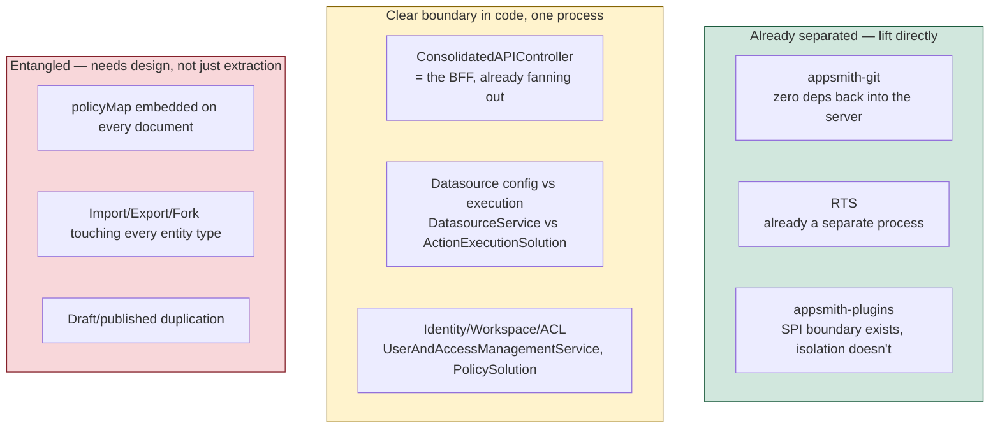
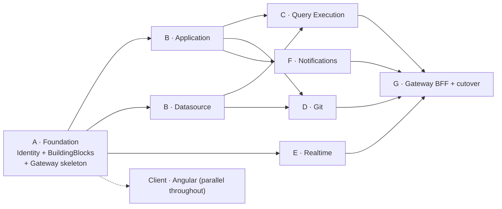

# Execution — Decomposition Strategy

[← Index](../README.md) · [← Angular Frontend](../02-target-architecture/08-angular-frontend.md)

---

## 1. The strategic choice: parallel build, not strangler fig

Two approaches were considered.

| Approach | What it means here | Verdict |
|---|---|---|
| **Strangler fig** — extract services from the Java monolith one at a time, routing traffic progressively | Requires the Java monolith to keep running and to co-exist with .NET services sharing (or syncing) MongoDB | ❌ **Rejected** |
| **Parallel build + one cutover** — build the .NET system alongside, migrate data once, switch | Java system stays untouched as the behavioural reference until cutover | ✅ **Chosen** |

**Why strangler fig is wrong for this specific project** — and it usually is the right answer, so the reasons matter:

1. **The language boundary makes co-existence expensive.** A strangler needs shared session state, shared authorization, and shared data access between Java and .NET. You would build a Mongo-reading .NET data layer *and* a Postgres one, then throw the first away.
2. **The database is changing too.** Mongo → Postgres is not a "move a service" change; it is a model change. Running both stores in sync during a long extraction is the highest-risk thing on the table.
3. **There is no installed base to protect.** The current deployment contract is "here is a docker-compose." There is no fleet of production tenants requiring zero-downtime incremental migration. This is the freedom that makes the parallel build safe.
4. **The client is being rewritten anyway.** With a new Angular client, there is no long period during which the old client must talk to a half-migrated backend.

**What we borrow from strangler fig:** the *discipline*. Every service is built against a real contract, verified against the Java system's observed behaviour, and shippable independently. We do not build for eighteen months and integrate at the end.

---

## 2. The seams, ranked

Where the existing system is already cut, ordered by how cleanly it separates.

| Seam | Quality | Notes |
|---|---|---|
| `appsmith-git` | **Excellent** | One-way dependency, distinct resource profile. Extract as-is |
| RTS | **Excellent** | Already a separate deployable. In .NET it partly *disappears* — binding analysis moves in-process to Application Service; only presence remains as a service |
| Plugin SPI | **Good interface, no isolation** | `PluginExecutor` is the right shape. The fix is process boundaries, not interface redesign |
| `ConsolidatedAPIController` | **Good** | Already the BFF. Generalise, don't invent |
| Datasource config vs execution | **Good** | Two clearly different classes in the code today |
| Identity / Workspace / ACL | **Good** | Cohesive; merge into one service rather than the HLD's three |
| Embedded `policyMap` | **Hard** | The design problem, solved by projections ([Security §2](../02-target-architecture/06-security-and-authz.md#2-authorization-model)) |
| Fork / Import / Export | **Hard** | Touches everything. Solved by keeping it *inside* Application Service with one compensating call |
| Draft/published pairs | **Medium** | Two columns on one row ([DB §3](../02-target-architecture/03-database-per-service.md#3-the-draftpublished-decision)) |

---

## 3. Extraction order and why

Ordered by **dependency**, not by risk or size. Each phase must produce something testable against a real contract.

| Phase | Why here |
|---|---|
| **A — Identity & Access + BuildingBlocks + Gateway skeleton** | Everything downstream needs authentication and the event bus to exist. Building the messaging/outbox/observability packages first means no service invents its own |
| **B — Application + Datasource, in parallel** | Both depend only on Identity's event stream, not on each other. Genuinely parallelisable once Phase A's contracts are stable |
| **C — Query Execution** | Needs Datasource's config contract and Application's action contract. Cannot be meaningfully tested before both exist |
| **D — Git** | Needs Application's export contract and Datasource's config contract. Runs in parallel with C |
| **E — Realtime** | Only depends on Identity for connection auth. Could start in Phase A, but has no product value until there is an editor to collaborate in |
| **F — Notifications** | Pure subscriber. Nothing to consume until the others publish |
| **G — Gateway BFF hardening + cutover** | The composition endpoint needs stable contracts from B–F |

**The client starts at Phase A** and runs the whole duration ([Angular §5](../02-target-architecture/08-angular-frontend.md#5-sequencing)).

---

## 4. Capturing behaviour before rewriting it

The biggest risk in this programme is **losing behaviour nobody wrote down**. Three specific mechanisms, all of which must be in place before the corresponding rewrite starts.

### 4.1 Connector golden files — blocking for Phase C

For each connector, capture from the **running Java system**: datasource configuration + action configuration in, serialised `ActionExecutionResult` out — including error shapes, type coercion, null handling, pagination, and header behaviour.

These become the .NET connector's test suite. **No connector is rewritten without its golden files first.** Years of edge-case handling live in those plugins and are documented nowhere.

### 4.2 The application corpus — blocking for the client work

A few hundred real page DSLs exported as fixtures. Drives:
- The evaluation-engine port harness (React output vs Angular output, same input).
- Visual regression testing.
- Widget prioritisation — let actual usage choose the v1 widget set.

### 4.3 The E2E suites — the acceptance gate

The existing Cypress and Playwright suites are **framework-agnostic behavioural specifications of the product**. They are the single most valuable asset for this rewrite.

- Keep them running against the Java system as the reference.
- Port them to Playwright against the new system, feature by feature.
- **A phase is not done until its slice of the E2E suite is green against the new system.**

### 4.4 Read the Mongock changelogs

83 migration classes encode defaulting rules, backfills and data fixes that exist nowhere else. Read them before finalising the schema. Several will become one-off transforms in the [data migration](03-data-migration.md) rather than EF Core migrations.

---

## 5. What we deliberately do *not* carry forward

Each of these is a decision, not an oversight.

| Dropped | Reason |
|---|---|
| **The CE/EE inheritance split** (`XxxImpl extends XxxCEImpl`) | A licensing build-time seam. It doubles the class count for no runtime benefit here |
| **Reactive/Reactor programming style** | `async`/`await` on Kestrel is non-blocking too, with a fraction of the cognitive load. Porting `Mono` chains would produce bad C# |
| **`policies` (Set) alongside `policyMap`** | Two representations of the same thing |
| **`deleted` boolean alongside `deletedAt`** | Redundant |
| **`Tenant` and `Organization` as separate collections** | Collapsed into one `instances` row |
| **Mongo field-name escaping in the DSL** | `jsonb` has no illegal key characters. Delete the escape/unescape code entirely |
| **`Asset.data` as `byte[]` in the database** | Object storage |
| **`POST /admin/restart`** | An application must not restart its own container |
| **`cleanUpOldLogs`** | Log retention is a platform concern and it assumes local disk |
| **In-process `@Scheduled` jobs as the scheduling model** | Purpose survives; mechanism becomes `BackgroundService` in the owning service |
| **Comment/CommentThread** | The feature doesn't exist in this codebase |
| **RTS as a general-purpose service** | Binding analysis moves in-process; only presence remains, as SignalR |

---

## 6. What we deliberately *do* carry forward

Equally important — these are things the current system gets right.

| Kept | Reason |
|---|---|
| **The DSL format** | It is the product's data model and it works. Frozen across the rewrite |
| **`{{ }}` binding semantics and evaluation versions** | Changing them breaks every existing application |
| **The `layoutOnLoadActions` wave structure** | A good design: explicit parallelism within dependency-ordered waves |
| **The `{responseMeta, data}` envelope** | Costs nothing; avoids a whole class of client migration bug |
| **404-instead-of-403 on authorization failure** | Deliberate no-existence-leak behaviour |
| **Anonymous access as "just another role"** | Elegant. No special code path for public applications |
| **The Redis git lock keyed on artifact id** | Correct granularity, already proven |
| **The `Datasource` / `DatasourceStorage` split by environment** | The right model, even though CE only uses one environment |
| **The zero-extra-round-trip authorization check** | Preserved via `authz_grants` projections |
| **The BFF composition pattern with per-slice error isolation** | Generalised, not reinvented |
| **The `PluginExecutor` interface shape** | Right abstraction; only the isolation model changes |
| **OpenTelemetry** | Already the standard here |
| **Git's byte-stable serialisation discipline** | Must be reproduced exactly or every commit becomes a whole-file diff |

---

## 7. Team shape

The service boundaries are also ownership boundaries. Suggested allocation once Phase A is done:

| Team | Owns | Notes |
|---|---|---|
| **Platform** | BuildingBlocks, Gateway, Aspire/AppHost, CI/CD, observability | Staffed first. Everyone else depends on their output |
| **Identity** | Identity & Access | Smallest backend service, highest security bar |
| **Application** | Application Service | **Largest surface** (~75 endpoints). Likely two sub-teams: editing (pages/actions/layout) and lifecycle (publish/fork/import/git integration) |
| **Data & Execution** | Datasource + Query Execution + connector ports | The connector work is long-tail and parallelisable |
| **Client** | Angular application | **Largest team.** 4× the LOC of the backend |
| **Ancillary** | Git, Realtime, Notifications | Three small services; one team can carry all three |

**Conway's law is working for us here:** the service boundaries were chosen for risk and cohesion, and they happen to produce sensibly-sized teams. Resist the temptation to split Application Service further just to make its team smaller — that would trade a team-size problem for a distributed-systems problem.

---

## 8. Anti-patterns to watch for

| Anti-pattern | Why it will be tempting | What to do instead |
|---|---|---|
| **Splitting Application Service** | Its endpoint count looks large | Split the *team*, not the service. Publish atomicity depends on it staying whole |
| **A synchronous "permission service" call per read** | It feels more correct than a projection | It regresses the hottest path in the system from 0 hops to 1+. Use the projection |
| **Porting `Mono` chains into Rx.NET** | Mechanical translation feels safer | Write idiomatic `async`/`await`. Read the Java for *intent*, not structure |
| **Rewriting the evaluation engine** | "It's client code, we're rewriting the client" | It is framework-independent TypeScript with years of correctness work. Port it |
| **Making Publish a saga** | It touches five entity types | They are all in one database. It is one transaction |
| **A shared "common" database or schema** | Cross-service data needs feel easier that way | Projections and gRPC. There is no escape hatch |
| **Sagas for everything** | The framework is there | Exactly three sagas exist ([Target Golden Paths §11](../02-target-architecture/07-target-golden-paths.md#11-saga-inventory)) |
| **`AssemblyLoadContext` for connector isolation** | It's the closest .NET analogue to PF4J | It reproduces the current problem. Only processes give enforceable limits |
| **Changing the DSL during the rewrite** | Its warts are visible | Two risky projects at once. Change the framework, keep the data |
| **Deferring the client** | The backend feels like the "real" architecture work | The client is 4× the backend. Start it in Phase A |

---

[← Angular Frontend](../02-target-architecture/08-angular-frontend.md) · [Next: Roadmap & Sequencing →](02-roadmap-and-sequencing.md)
