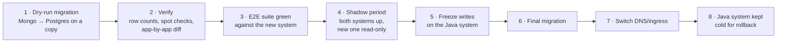

# Execution — Roadmap & Sequencing

[← Index](../README.md) · [← Decomposition Strategy](01-decomposition-strategy.md)

---

> **On durations.** The phase ordering below is a *dependency* statement and is firm. Any week counts are illustrative placeholders for shaping conversations — real estimates come from the team after Phase A, when the actual velocity on this codebase is known. Do not treat them as commitments.

> **On staffing multiple squads at once.** The phases below name the dependency order between whole services; they are not an instruction to hold a squad idle until an upstream phase finishes. Most cross-phase dependencies are a single contract, not a whole service — see [Parallel Delivery & Dependency Management](../04-delivery-tracking/03-parallel-delivery-and-dependencies.md) for exactly which features in each phase can start immediately against a mock.

---

## 1. Phase overview

```mermaid
gantt
    title Dependency-ordered build plan
    dateFormat X
    axisFormat W%s

    section Foundation
    A · BuildingBlocks + Identity + Gateway skeleton   :a, 0, 6

    section Core domain
    B1 · Application Service                           :b1, 6, 10
    B2 · Datasource Service                            :b2, 6, 6

    section Execution & versioning
    C · Query Execution + connector ports              :c, 16, 10
    D · Git Versioning                                 :d, 16, 6

    section Edges
    E · Realtime Collaboration                         :e, 22, 4
    F · Notifications & Telemetry                      :f, 26, 4
    G · Gateway BFF hardening                          :g, 26, 6

    section Client (parallel)
    C1 · Evaluation engine port                        :cl1, 2, 4
    C2 · Viewer                                        :cl2, 16, 6
    C3 · Core widgets                                  :cl3, 22, 8
    C4 · Editor                                        :cl4, 26, 10
    C5-C7 · Tail widgets, peripherals, hardening       :cl5, 32, 8

    section Cutover
    Data migration + cutover                           :cut, 36, 4
```

---

## 2. Phase A — Foundation

**Goal:** an authenticated request can reach a real service through the gateway, publish an event, and be traced end to end.

| Deliverable | Detail |
|---|---|
| `BuildingBlocks.*` packages | Abstractions, Observability (OTel + correlation ids), Messaging (MassTransit + outbox/inbox), Auth (internal JWT), Persistence (soft delete, audit interceptors), Authorization (the permission graph as a pure function) |
| `Appsmith.AppHost` | Aspire: Postgres, Redis, RabbitMQ + service wiring. `dotnet run` starts everything |
| **Identity & Access Service** | Full: signup, login, OAuth/OIDC, password reset, email verification, workspaces, memberships, roles, grants. `identity_db` schema + migrations |
| **Gateway walking skeleton** | YARP routing, cookie session + CSRF, session validation with Redis cache, internal-JWT minting, the `responseMeta` envelope, rate limiting. **No composition endpoints yet** |
| CI/CD | Build, test, container images, migration job, architecture tests, OpenAPI diff check (`oasdiff`) |
| Reference material | Connector golden-file capture harness; application DSL corpus exported from the Java system |

**Exit criteria**
- A user can sign up, log in, create a workspace, invite a member, and get correct roles — all through the gateway.
- An event published by Identity is consumed by a stub consumer, with one distributed trace spanning gateway → Identity → broker → consumer.
- Architecture tests fail the build on a layer violation.
- Integration tests run against real Postgres/Redis/RabbitMQ via Testcontainers.
- The Angular skeleton (C0) authenticates against this gateway.

**Do not start Phase B until the `BuildingBlocks` contracts are stable.** Two teams inventing their own messaging conventions is the most expensive mistake available at this point.

---

## 3. Phase B — Core domain (two teams, parallel)

### B1 — Application Service

The largest service. Sub-sequence it:

| Step | Content |
|---|---|
| B1.1 | Schema + entities: applications, pages, actions, action_collections, themes, JS libs. `authz_grants` projection consuming Identity events |
| B1.2 | CRUD for applications and pages, including the draft/published column model |
| B1.3 | Layout save + **binding analysis in-process** (Esprima) + the on-load dependency DAG. *The highest-value, highest-risk piece — do it early* |
| B1.4 | Actions and action collections CRUD, refactor/rename-with-binding-rewrite |
| B1.5 | Themes, custom JS libraries, snapshots, static URLs |
| B1.6 | **Publish** as a single transaction |
| B1.7 | Export/Import serialisation (needed by Git in Phase D) |
| B1.8 | Fork/Import saga with compensation |

### B2 — Datasource Service

| Step | Content |
|---|---|
| B2.1 | Schema: datasources, environments, storages, structures. `authz_grants` projection |
| B2.2 | CRUD + secrets-manager integration (`secret_ref`, never ciphertext) |
| B2.3 | Plugin catalog replica + `PluginCatalogUpdated` consumer |
| B2.4 | `DatasourceConfigChanged` publishing with monotonic versions |
| B2.5 | OAuth2 flows for SaaS datasources |

**Exit criteria for Phase B**
- Create an application, add pages, save a canvas DSL, get a correct on-load plan back.
- Publish is atomic — verified by a fault-injection test that kills the process mid-publish.
- Create a datasource; `DatasourceConfigChanged` is observed by a test consumer.
- `authz_grants` projections in both services converge within the 5s budget under load.
- Projection rebuild endpoints work from a cold projection table.

---

## 4. Phase C — Query Execution

| Step | Content |
|---|---|
| C.1 | REST router, `execution_db` schema, `execution_audit`, config cache consuming `DatasourceConfigChanged` |
| C.2 | Worker process model: dispatch, CPU/memory/time limits, network policy, result-size caps |
| C.3 | `IConnectorExecutor<T>` abstraction + the SQL worker pool (Postgres, MySQL, MSSQL) |
| C.4 | HTTP worker pool (REST, GraphQL) |
| C.5 | **JS worker** — Jint, per-execution lifecycle, teardown after each call |
| C.6 | NoSQL, Cloud, AI worker pools |
| C.7 | Connection pooling, schema introspection, trigger endpoints |
| C.8 | The remaining connector tail |

**Every connector is gated on its golden files existing first.**

**Exit criteria**
- Running a query end to end from Application Service.
- A deliberately hostile connector test (infinite loop, huge allocation, huge result set) is contained by the worker — verified, not assumed.
- The JS worker leaks no state between executions — verified by a test that writes a global in one execution and asserts its absence in the next.
- Per-connector latency/error metrics visible in the dashboard.
- Golden-file suites green for every ported connector.

---

## 5. Phase D — Git Versioning (parallel with C)

| Step | Content |
|---|---|
| D.1 | `git_db` schema, LibGit2Sharp wrapper, working-tree volume, Redis lock carried over |
| D.2 | **Byte-stable serialisation** — artifact JSON ⇄ file tree, matching Java's output exactly |
| D.3 | Connect, commit, push, pull |
| D.4 | Branch create/checkout/delete + the entity-tree duplication contract with Application Service |
| D.5 | Merge, conflict detection, discard, status |
| D.6 | Auto-commit with progress reporting |
| D.7 | Deploy keys via the secrets manager |

**Exit criteria**
- Round trip: connect → commit → push → clone elsewhere → import → identical application.
- **Serialisation golden test:** for a corpus of applications, .NET output is byte-identical to Java output. Non-negotiable — otherwise every user's first commit after migration is a whole-repo diff.
- Concurrent commits on one artifact serialise correctly under the lock.

---

## 6. Phases E, F, G

### E — Realtime Collaboration
SignalR hubs, Redis backplane, connection auth via Identity, presence/cursor/version-push. *Exit:* two browser instances see each other's presence across two service replicas — the thing today's RTS cannot do.

### F — Notifications & Telemetry
Consumers for every domain event, templates, `delivery_log` with retry and DLQ, product alerts, usage events, the audit log. *Exit:* an SMTP outage produces retried, then dead-lettered, then operator-visible failures — never a silent drop.

### G — Gateway BFF hardening
`/consolidated-api/edit` and `/view`, `/applications/home`, `/search-entities` — parallel fan-out with per-slice error isolation. Rate-limit policies, asset proxying, the anonymous route allow-list. *Exit:* editor boot payload is contract-identical to the Java system's, verified by response-diffing against a live Java instance.

---

## 7. Cutover

Mechanics: [Data Migration](03-data-migration.md).

**Rollback plan:** the Java system and its MongoDB stay intact and cold until the new system has run clean for an agreed period. Rollback is switching the ingress back — the migration is one-way and forward-only, so any writes made after cutover would be lost, which is why the shadow and freeze steps exist.

---

## 8. Definition of done — per service

A service is not done until **all** of these hold. Track it as a literal checklist per service.

- [ ] Owns exactly one database; its Postgres role has no grants elsewhere
- [ ] EF Core migrations run as a deploy job, not at startup
- [ ] Publishes events through the transactional outbox
- [ ] Every consumer is idempotent (inbox table)
- [ ] Holds no secret material — references only
- [ ] Every protected read/write goes through `Authorized<T>()`
- [ ] Returns 404, not 403, on authorization failure
- [ ] RLS enabled on every workspace-scoped table
- [ ] `/health/live` and `/health/ready` implemented and wired to probes
- [ ] OTel traces, metrics and structured logs emitted with correlation id
- [ ] Architecture tests enforce the layer rules
- [ ] Unit coverage: Domain ≥ 90%, Application ≥ 80%
- [ ] Integration tests against real Postgres/Redis/RabbitMQ (Testcontainers)
- [ ] OpenAPI document published at `/internal/v1/openapi.json` and diff-checked in CI (`oasdiff`)
- [ ] Projection rebuild endpoint exists (if it holds a projection)
- [ ] Its slice of the E2E suite is green against the new system
- [ ] Runbook: what breaks, what the alerts mean, how to rebuild projections

---

## 9. Risk checkpoints

Explicit go/no-go moments. Each is a place where discovering a problem is cheap and discovering it later is not.

| When | Checkpoint | If it fails |
|---|---|---|
| Week 2–6 (Phase A / C1) | **Can the evaluation engine be ported cleanly?** Prove it headless against the DSL corpus | Re-plan the entire client workstream. This is the biggest single unknown |
| End of Phase A | **Do the BuildingBlocks contracts hold up?** Two services using them without local forks | Stop and fix before parallel work multiplies the divergence |
| Phase B1.3 | **Does in-process binding analysis match the Java+RTS output?** Diff on-load plans across the corpus | Fall back to a small AST sidecar; the contract is unchanged either way |
| Phase B1.6 | **Is publish genuinely atomic under fault injection?** | Revisit the draft/published column model |
| Phase C.2 | **Do the worker limits actually contain a hostile connector?** | The isolation model is the main justification for the Datasource/Execution split — rework it before porting 25 connectors |
| Phase D.2 | **Is git serialisation byte-identical to Java's?** | Blocking. Do not migrate git-connected applications until it is |
| Phase G | **Is the editor-boot payload contract-identical?** | Client rework, or a deliberate contract change with client sign-off |
| Pre-cutover | **Is the E2E suite green and the migration dry run clean?** | Do not cut over |

---

[← Decomposition Strategy](01-decomposition-strategy.md) · [Next: Data Migration →](03-data-migration.md)
