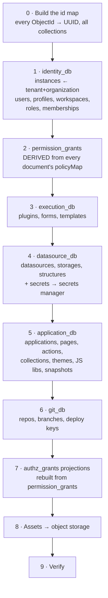

# Execution — Data Migration

[← Index](../README.md) · [← Roadmap & Sequencing](02-roadmap-and-sequencing.md)

---

Moving ~24 MongoDB collections into six PostgreSQL databases. One-way, forward-only, executed once at cutover after repeated dry runs.

---

## 1. Principles

1. **One-way.** No dual-write, no sync-back. Dual-write between a document store and six relational databases is more complex than the migration itself and would be the largest source of risk in the programme.
2. **Idempotent and resumable.** The migration can be re-run from scratch on a fresh target, or resumed from a checkpoint. Every dry run is a full rehearsal.
3. **Id remapping is explicit.** Mongo `ObjectId` strings become UUIDs via a persisted mapping table. Nothing guesses.
4. **Verification is part of the migration, not a follow-up.** Counts, referential checks, and per-application round-trip diffs run as migration steps.
5. **The source is read-only.** The migration never writes to MongoDB.

---

## 2. Tooling

A standalone **.NET console application**, `Appsmith.Migration`, versioned with the services and run as a Kubernetes Job (or `docker run`) at cutover.

```
Appsmith.Migration/
├── Extractors/         one per Mongo collection — read via the official MongoDB driver
├── Transformers/       document → relational rows, per aggregate
├── Loaders/            bulk COPY into Postgres (Npgsql binary import)
├── IdMap/              ObjectId ⇄ UUID, persisted in Postgres
├── Verifiers/          counts, orphan checks, round-trip diffs
└── Program.cs          ordered, checkpointed pipeline
```

Bulk-load with `NpgsqlBinaryImporter` (`COPY`), not EF Core — EF Core is for the application, not for moving millions of rows.

---

## 3. Order of migration

Dependencies dictate the order. Each stage checkpoints before the next begins.



---

## 4. The hard transformations

Five of the nine stages are mechanical. These four are not.

### 4.1 `Tenant` + `Organization` → `instances`

Two near-duplicate collections mid-migration in the source. In CE there is exactly one of each.

- Create **one** `instances` row.
- Prefer `Organization`'s configuration where the two disagree (it is the newer field on `User`/`Workspace`/`PermissionGroup`).
- Every `tenantId` and `organizationId` reference maps to that single instance id.
- **Log every disagreement** between the two documents for review. Do not silently pick a winner.

### 4.2 `policyMap` → `permission_grants` — the big one

Every document in the source carries an inline `policyMap: {permission → [permissionGroupIds]}`. All of it must be inverted into one authoritative table in `identity_db`.

```
for each collection C in [workspace, application, newPage, newAction,
                          actionCollection, datasource, theme, permissionGroup]:
  for each document D in C (including soft-deleted, so restores work):
    for each (permissionString, policy) in D.policyMap:
      for each groupId in policy.permissionGroups:
        emit permission_grants(
              role_id       = idMap(groupId),
              resource_type = typeOf(C),
              resource_id   = idMap(D._id),
              permission    = enumOf(permissionString))
```

Notes and traps:
- **This is the highest-volume transformation.** A large instance produces tens of millions of grant rows. Stream it; bulk-COPY in batches; do not materialise it in memory.
- **Deduplicate.** The same grant appears repeatedly via the hierarchy graph. The table's unique constraint handles it, but dedupe before COPY for speed.
- **Unknown permission strings must fail loudly**, not be skipped. A silently dropped permission is a silent security change.
- **Deprecated `policies: Set<Policy>` may be populated where `policyMap` is not.** Read `policyMap` first, fall back to `policies`, and record which was used.
- After loading, **`authz_grants` in `application_db` and `datasource_db` are rebuilt from this table** using the projection-rebuild path — the same code path that runs in production. That validates the rebuild mechanism as a side effect.

### 4.3 Draft/published pairs → columns

```
NewPage.unpublishedPage  → pages.draft_name / draft_layout / draft_onload_plan / draft_slug
NewPage.publishedPage    → pages.published_*        (NULL if never published)
NewAction.unpublishedAction → actions.draft_config / draft_name / draft_run_behaviour
NewAction.publishedAction   → actions.published_*
ActionCollection.unpublished/published → action_collections.draft_*/published_*
Application.pages / publishedPages     → application_pages rows with is_published false/true
```

Traps:
- **`Layout.dsl` needs unescaping.** Mongo forbids `.` and `$` in field names, so the DSL is escaped on write. **Unescape it during migration** and delete that code path from the application entirely — `jsonb` has no illegal keys.
- `Layout.layoutOnLoadActions` migrates as-is into `draft_onload_plan`; it is regenerated on the next layout save anyway.
- Applications never published have NULL `published_*`. The application must handle that — verify with a test, don't assume.

### 4.4 Secrets → secrets manager

```
for each datasourceStorage DS:
  decrypt DS.datasourceConfiguration @Encrypted fields    // using APPSMITH_ENCRYPTION_PASSWORD/_SALT
  split configuration into:
      non-secret  → datasource_storages.configuration (jsonb)
      secret      → secretStore.SetAsync(...) → secret_ref
  write datasource_storages(configuration, secret_ref)
```

Same for `gitDeployKeys.privateKey` → `git_deploy_keys.private_key_ref`.

**This stage must run in a hardened environment.** It is the only point at which every credential in the system is in plaintext in one process. Run it as an isolated job with no network egress except to the secrets manager, log nothing about values, and rotate the old encryption key afterwards.

### 4.5 Git branch entities

`baseId` / `refName` map directly to `base_id` / `ref_name` with a unique constraint on the pair. Two things to handle:

- Documents where `baseId` is null (the base branch itself) → `base_id = id`.
- Documents with `branchName` set but `refName` null → `ref_name = branchName`, `ref_type = 'branch'`.
- **Duplicate `(base_id, ref_name)` pairs indicate existing data corruption.** Fail the migration and report them; do not silently keep one.

### 4.6 Assets

`Asset.data` (`byte[]` in Mongo) → object storage; the row carries a URL.

```
for each asset A:
  url = objectStore.Put($"assets/{idMap(A._id)}", A.data, A.contentType)
  update the referencing row (user_profiles.photo_url, workspaces.logo_url, applications.icon_url)
```

The old `GET /api/v1/assets/{id}` route stays at the gateway, redirecting to storage, so any stored HTML or exported application referencing it still resolves.

---

## 5. Id mapping

```sql
CREATE TABLE migration.id_map (
    collection      text NOT NULL,
    mongo_id        text NOT NULL,
    new_id          uuid NOT NULL DEFAULT gen_random_uuid(),
    PRIMARY KEY (collection, mongo_id)
);
CREATE UNIQUE INDEX id_map_new_idx ON migration.id_map (new_id);
```

Built completely in **stage 0**, before any data moves. Every subsequent stage resolves references through it.

Keep this table after migration. When a user reports "application 64f2a…, which used to work", it is the only way to find the new row.

**Deterministic option:** derive UUIDs as UUIDv5 over `(namespace, collection, mongoId)` instead of random. Then re-running the migration from scratch produces identical ids, which makes dry runs directly comparable. Recommended.

---

## 6. Verification

Run as migration stages, not as a manual afterwards. Any failure aborts the run.

| Check | Method |
|---|---|
| **Row counts** | Non-deleted document count per collection == row count per table, per workspace |
| **Referential integrity** | Zero orphans: pages without applications, actions without pages, storages without datasources, grants referencing missing roles |
| **Permission fidelity** | For a sample of ~1,000 (user, resource, permission) triples, evaluate access against the **Java system** and the **new system**. Must match 100%. Any mismatch is a blocker |
| **Application round trip** | For every application: export from Java, export from .NET, normalise, diff. Structural equality expected |
| **DSL integrity** | Every `draft_layout` is valid JSON, unescaped, and parses to the same widget tree the Java system serves |
| **Git serialisation** | For git-connected applications, `git status` after migration must show **no changes**. A dirty tree means the serialisation differs — blocking |
| **Secrets** | Every `secret_ref` resolves; test-connection succeeds for a sample of datasources |
| **Assets** | Every stored URL returns the expected bytes and content type |

---

## 7. Dry runs

Rehearse at least three times before the real one.

| Run | Purpose |
|---|---|
| **1 — Correctness** | On a copy of production data. Expect failures; fix transformers. No time pressure |
| **2 — Completeness** | All verifications green. Application round-trip diffs clean |
| **3 — Timed rehearsal** | Measure wall-clock duration end to end. Determines the write-freeze window and whether staging is needed |

If run 3 exceeds the acceptable freeze window, the mitigations are, in order of preference: parallelise per workspace; pre-migrate historical/immutable data (snapshots, usage events) ahead of the freeze; and only then consider a change-data-capture catch-up phase — which is complex enough to need its own design.

---

## 8. What is deliberately *not* migrated

| Not migrated | Reason |
|---|---|
| `usagePulse` history | Telemetry. Start fresh; keep the Mongo backup for analysis if wanted |
| Spring Session records in Redis | Everyone re-authenticates at cutover. Communicate it |
| `passwordResetToken`, `emailVerificationToken` | Short-lived. In-flight tokens are re-issued on request |
| Mongock changelog history | The new system has EF Core migrations |
| `datasourceStorageStructure` (cached schema) | Rebuilds on demand from the live datasource |
| Soft-deleted rows older than the retention window | Discuss with product first, then apply consistently |
| Local git working trees | Re-cloned from the remote after cutover |

---

## 9. Cutover runbook

| # | Step | Notes |
|---|---|---|
| 1 | Announce the maintenance window | Users must re-authenticate afterwards |
| 2 | E2E suite green on the new system against staging data | Gate |
| 3 | Freeze writes on the Java system (read-only mode or ingress block) | Freeze starts here |
| 4 | Final MongoDB snapshot | The rollback artefact |
| 5 | Run `Appsmith.Migration` | Duration known from dry run 3 |
| 6 | Verification stages all green | **Abort on any failure** |
| 7 | Smoke test: log in, open an app, run a query, publish, git commit | Manual, on real data |
| 8 | Switch ingress to the new gateway | Cutover complete |
| 9 | Monitor: error rates, projection lag, execution failures, DLQ depth | First 24h at elevated attention |
| 10 | Keep the Java system + MongoDB cold for the agreed rollback period | Do not decommission early |

**Rollback:** switch the ingress back to the Java system. Any writes made to the new system after cutover are lost — which is why step 7 is a smoke test on real data and step 9 is watched closely. There is no merge-back path, by design.

---

[← Roadmap & Sequencing](02-roadmap-and-sequencing.md) · [Next: Risks & ADRs →](04-risks-and-adrs.md)
