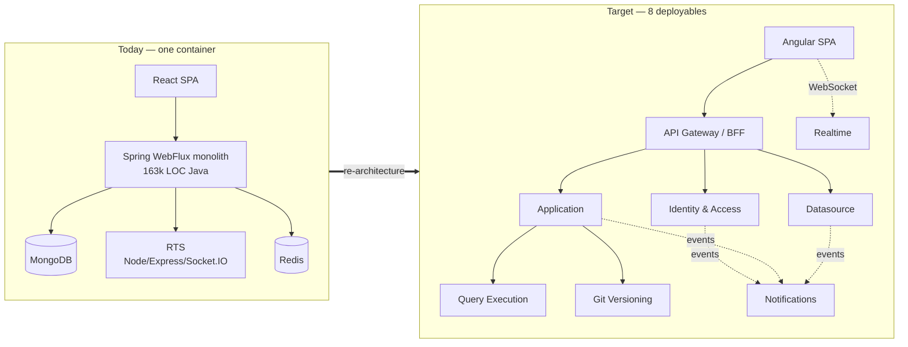

# Appsmith Re-Architecture — Monolith (Java) → Microservices (.NET 10)

**Audience:** .NET engineers who will build the new system and have never worked in Java/Spring.
**Purpose:** understand the existing Appsmith monolith well enough to decompose it confidently, then build the replacement on .NET 10 / PostgreSQL / Redis / Angular.

> **How this differs from the source repo.** Everything under `01-current-system/` is a description of the *Java code in this repository* — it is the thing being replaced, not the thing being built. Everything under `02-target-architecture/` and `03-execution/` is the *design for the new .NET system*. Read the current-system section first; the target design only makes sense once you know which couplings it is breaking.

---

## Start here

| If you are… | Read, in this order |
|---|---|
| **New to the project (any role)** | [Executive Summary](00-orientation/01-executive-summary.md) → [System Overview](01-current-system/01-system-overview.md) → [Service Inventory](02-target-architecture/01-service-inventory.md) |
| **A .NET dev who can't read Java** | [Java → .NET Primer](00-orientation/02-java-to-dotnet-primer.md) → [System Overview](01-current-system/01-system-overview.md) → [Golden Paths](01-current-system/05-golden-paths.md) |
| **Picking up a specific service** | [Service Inventory](02-target-architecture/01-service-inventory.md) → your service's section → [Database per Service](02-target-architecture/03-database-per-service.md) → [.NET 10 Standards](02-target-architecture/04-dotnet-10-standards.md) |
| **Doing data / schema work** | [Domain Model & DB](01-current-system/03-domain-model-and-db.md) → [Database per Service](02-target-architecture/03-database-per-service.md) → [Data Migration](03-execution/03-data-migration.md) |
| **Doing the Angular rewrite** | [Frontend Architecture (current)](01-current-system/08-frontend-architecture.md) → [Angular Target](02-target-architecture/08-angular-frontend.md) |
| **Planning / sequencing the work** | [Decomposition Strategy](03-execution/01-decomposition-strategy.md) → [Roadmap](03-execution/02-roadmap-and-sequencing.md) → [Risks & ADRs](03-execution/04-risks-and-adrs.md) |
| **A Scrum Master tracking this in JIRA** | [JIRA Setup Guide](04-delivery-tracking/00-jira-setup-guide.md) → [Epics, Features & User Stories](04-delivery-tracking/01-epics-features-stories.md) → [`02-jira-import.csv`](04-delivery-tracking/02-jira-import.csv) |
| **Staffing a large team in parallel** | [Parallel Delivery & Dependency Management](04-delivery-tracking/03-parallel-delivery-and-dependencies.md) — which of the 263 stories are assignable day one, which need a contract frozen first, and which are genuinely sequenced |

---

## Full index

### 00 — Orientation
| Doc | What it answers |
|---|---|
| [01 Executive Summary](00-orientation/01-executive-summary.md) | What Appsmith is, what we're doing, the shape of the answer, the honest risks |
| [02 Java → .NET Primer](00-orientation/02-java-to-dotnet-primer.md) | How to read the Java code without knowing Java. Spring↔ASP.NET Core mapping, Reactor↔async/await, Lombok, Maven, PF4J, Mongock. Includes a full cheat-sheet table |

### 01 — The current system (Java monolith)
| Doc | What it answers |
|---|---|
| [01 System Overview](01-current-system/01-system-overview.md) | What the product does, module map, size, where every capability lives |
| [02 Runtime Topology](01-current-system/02-runtime-topology.md) | What actually runs at runtime: one container, four processes, supervisord, Mongo/Redis/Postgres roles |
| [03 Domain Model & Database](01-current-system/03-domain-model-and-db.md) | Every collection, ERDs, the draft/published duplication, git branch modelling, why there are no joins |
| [04 Permissions & ACL](01-current-system/04-permissions-and-acl.md) | The `policyMap` model, permission groups, the policy graph, why this is the hardest thing to split |
| [05 Golden Paths](01-current-system/05-golden-paths.md) | 14 end-to-end flows with sequence diagrams, traced to source files |
| [06 Plugin & Execution Engine](01-current-system/06-plugin-execution-engine.md) | The 25 connectors, PF4J, connection pooling, datasource storage/environments, secret encryption |
| [07 Git Versioning](01-current-system/07-git-versioning.md) | How an app becomes files, branch-per-entity-copy, JGit, the Redis lock |
| [08 Frontend Architecture](01-current-system/08-frontend-architecture.md) | React/Redux-Saga, the DSL, the evaluation web worker, 82 widgets — and what of it is server contract vs. UI |
| [09 Cross-Cutting Concerns](01-current-system/09-cross-cutting-concerns.md) | Config, feature flags, caching, migrations, analytics, email, scheduled jobs, observability |
| [10 API Endpoint Catalog](01-current-system/10-api-endpoint-catalog.md) | Every `/api/v1` endpoint mapped to its future owning service |
| [11 AI Assistant](01-current-system/11-ai-assistant.md) | The editor copilot — BYOK provider config, request flow, secret handling, denial-of-wallet protection. Distinct from the AI connector plugins in doc 06 |

### 02 — Target architecture (.NET 10)
| Doc | What it answers |
|---|---|
| [01 Service Inventory](02-target-architecture/01-service-inventory.md) | **The core table.** Each service: purpose, bounded context, owned data, database, what it must never own |
| [02 Target Topology](02-target-architecture/02-target-topology.md) | C4 context/container diagrams, gateway design, sync vs async, deployment shape |
| [03 Database per Service](02-target-architecture/03-database-per-service.md) | Postgres schema per service with DDL, Mongo→Postgres mapping rules, JSONB policy, outbox, Redis usage |
| [04 .NET 10 Standards](02-target-architecture/04-dotnet-10-standards.md) | The opinionated stack: solution layout, Minimal APIs, EF Core, MassTransit, Aspire, testing, conventions |
| [05 Service Contracts & Events](02-target-architecture/05-service-contracts-and-events.md) | REST endpoint contracts, the integration-event catalog, versioning rules |
| [06 Security & AuthZ](02-target-architecture/06-security-and-authz.md) | Session model at the edge, authorization projections, secrets, plugin sandboxing |
| [07 Target Golden Paths](02-target-architecture/07-target-golden-paths.md) | The same 14 flows, redrawn across services, with the sagas called out |
| [08 Angular Frontend](02-target-architecture/08-angular-frontend.md) | What to port, what to rewrite, what not to touch; the honest sizing of the canvas problem |

### 03 — Executing the migration
| Doc | What it answers |
|---|---|
| [01 Decomposition Strategy](03-execution/01-decomposition-strategy.md) | Seams, extraction order, strangler vs. rebuild, and why we chose what we chose |
| [02 Roadmap & Sequencing](03-execution/02-roadmap-and-sequencing.md) | Phases, dependencies, team shapes, what "done" means per phase |
| [03 Data Migration](03-execution/03-data-migration.md) | Mongo→Postgres migration mechanics, dual-write, cutover, rollback |
| [04 Risks & ADRs](03-execution/04-risks-and-adrs.md) | Decision records, open questions, anti-patterns to avoid |

### 04 — Delivery tracking
| Doc | What it answers |
|---|---|
| [00 JIRA Setup Guide](04-delivery-tracking/00-jira-setup-guide.md) | How to load the backlog into JIRA: issue hierarchy, components, labels, story points, Kanban board workflow |
| [01 Epics, Features & User Stories](04-delivery-tracking/01-epics-features-stories.md) | Every service as an Epic, broken into Features and 263 JIRA-ready user stories (including 26 contract-stub stories) with acceptance criteria, estimates and delivery tiers |
| [02 jira-import.csv](04-delivery-tracking/02-jira-import.csv) | The same backlog as a CSV, ready for JIRA's CSV importer, with a `Tier` column |
| [03 Parallel Delivery & Dependency Management](04-delivery-tracking/03-parallel-delivery-and-dependencies.md) | The Tier model: which features a large team can start immediately, which need one contract frozen first, and which are genuinely sequenced |

### 99 — Reference
| Doc | What it answers |
|---|---|
| [01 Glossary](99-reference/01-glossary.md) | Appsmith vocabulary — DSL, action, artifact, binding, pulse, etc. |

---

## The one-paragraph version

Appsmith is a low-code platform: users drag widgets onto a canvas, connect them to datasources, write queries and JS, and publish an internal tool. Today that is a **Spring WebFlux reactive Java monolith (~163k LOC)** over **MongoDB**, plus a separate Node.js "RTS" process and a **React SPA (~708k LOC)**, all packed into **one Docker container** by supervisord. We are replacing it with **8 deployables on .NET 10** — an API Gateway/BFF plus 7 domain services — each owning its own **PostgreSQL** database, communicating synchronously over REST where a user is waiting and asynchronously over RabbitMQ everywhere else, with **Redis** for locks, sessions, and the SignalR backplane, fronted by a new **Angular** client.

---

## Provenance & related documents

- Earlier phase-1/phase-2 working notes live in [`../docs/architecture/`](../docs/architecture/) — `01-discovery.md` (ground-truth code map, cited by file:line) and `02-target.md` (first target-architecture pass). **This `microservices/` set supersedes them as the working reference**; it carries their findings forward, restates them for a .NET audience, and adds the service inventory, schema design, .NET conventions, endpoint catalog and roadmap they didn't cover. Where the two disagree, this set wins.
- `docs/architecture/00-prior-hld-critique.md` reviews the original `Master AppSmith HLD .docx` (an 8-service Node.js proposal). Its conclusions are folded into [Service Inventory §"Reconciling the original HLD"](02-target-architecture/01-service-inventory.md#reconciling-the-original-hld).
- Source of truth for all current-state claims is this repository at branch `release/01SEP2026`. Paths are repo-relative from the repo root.

---

## Visual landing page

A rendered navigation hub — service inventory, golden-path navigator, the four load-bearing decisions, and reading paths — is published at:

**https://claude.ai/code/artifact/ef82a351-9bdb-4ab1-b6d5-fc9645b239a1**

It is private until shared. This `README.md` remains the canonical, cross-linked index; the artifact is the shareable overview.
